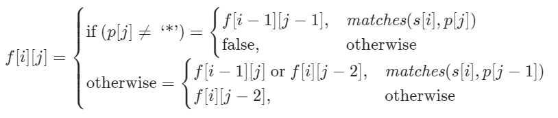

### [regex match](https://leetcode-cn.com/problems/zheng-ze-biao-da-shi-pi-pei-lcof/)

dp, dp!



```cpp
class Solution {
public:
    bool isMatch(string s, string p) {
        int m = s.size();
        int n = p.size();

        auto matches = [&](int i, int j) {
            if (i == 0) {
                return false;
            }
            if (p[j - 1] == '.') {
                return true;
            }
            return s[i - 1] == p[j - 1];
        };

        vector<vector<int>> f(m + 1, vector<int>(n + 1));
        f[0][0] = true;
        for (int i = 0; i <= m; ++i) {
            for (int j = 1; j <= n; ++j) {
                if (p[j - 1] == '*') {
                    f[i][j] |= f[i][j - 2];
                    if (matches(i, j - 1)) {
                        f[i][j] |= f[i - 1][j];
                    }
                }
                else {
                    if (matches(i, j)) {
                        f[i][j] |= f[i - 1][j - 1];
                    }
                }
            }
        }
        return f[m][n];
    }
};
```

