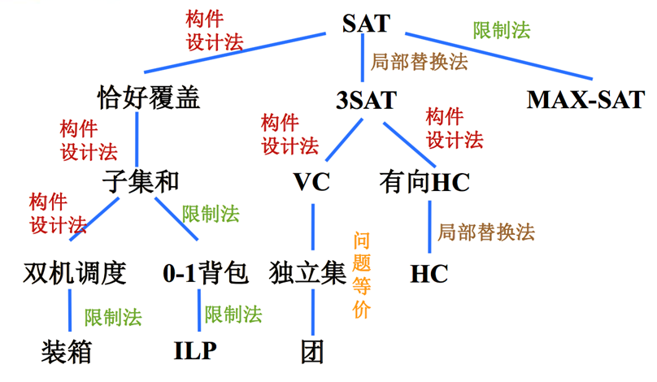
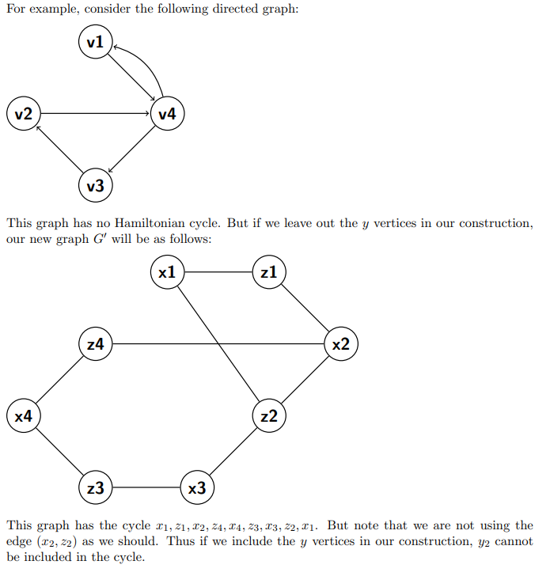
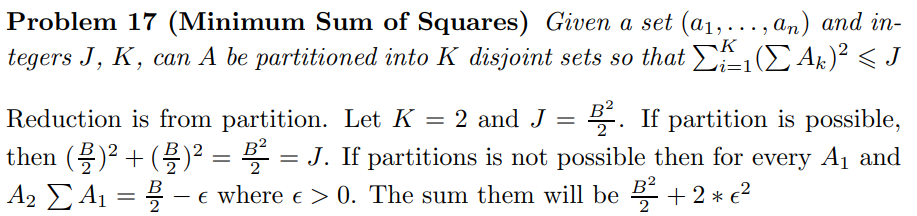

# NP

To prove a problem is NPC, we need to:

* show it belongs to NP, by showing a non-deterministic polynomial-time algorithm.
* show it is NP-hard, by reducing from a known NP-hard problem (e.g., SAT, 3-SAT, ...).

### Known NPC problems

* **[Partition](https://en.wikipedia.org/wiki/Partition_problem)**: Partition a set of numbers into two subsets with the same sum.

  Can be reduced from Subset-sum, and is a limited case of 0-1 knapsack.

### Undirected Hamiltonian Cycle

> https://www.ics.uci.edu/~goodrich/teach/cs162/hw/HW8Sols.pdf
>
> Theorem 9.13 in the book.

* First, guess an ordering of the vertices, it is easy to verify in polynomial time if it is a HC.

* Second, we reduce from **Directed Hamiltonian Cycle** (which is known to be NP-hard by reducing from 3-SAT).

  The essence is to represent directed edge through undirected edge.

  Construction: for a Directed Graph $G = <V, E>$, the correspond Undirected Graph is $G' = <V', E'>$, where
  $$
  V' = \{v^{in}, v^{mid}, v^{out} | v \in V\} \\
  E' = \{(u^{out}, v^{in})|<u,v> \in E\} \cup\{(v^{in}, v^{mid}), (v^{mid}, v^{out}) | v \in V\}
  $$
  Now we prove that G has directed HC if and only if G' has undirected HC.

  $\Rightarrow$: easy, just connect the two corresponding edges. 

  $\Leftarrow$: note that the only way to include $v^{mid}$ is to include $(v^{in}, v^{mid}), (v^{mid}, v^{out})$, so we can find the corresponding directed cycle in G.

* Side note: Can we leave out $v^{mid}$ and use $V' = \{v^{in}, v^{out} | v \in V\}$ ?

  No, a counter example is given by:

  

### Strongly Independent Set

> https://www.cse.iitd.ac.in/~amitk/SemI-2015/tut11.pdf
>
> https://cs.stackexchange.com/questions/124988/independent-set-poly-reducible-to-strongly-independent-set

The following is a version of the Independent Set problem. You are given a graph G = (V, E) and an integer k. For this problem, we will call a set I ⊆ V strongly independent if for any two nodes v, u ∈ I, the edge (v, u) does not belong to E, and there is also no path of 2 edges from u to v, i.e., there is no node w such that both (u, w) ∈ E and (w, v) ∈ E. The Strongly Independent Set problem is to decide whether G has a strongly independent set of size k. Prove that the Strongly Independent Set problem is NP-complete.

**Solution**: 

* Checking membership in NP is again straightforward. 

* We reduce from independent set. Let G, k be an input to the independent set problem. We map it to an input to the Strongly Independent Set problem. 

  For every edge e in G, we subdivide it by adding a new vertex ve, i.e., if e = (u, v) is an edge, then we replace it by two edges : (u, ve), (ve, v). 

  Further, we form a clique over all the new vertices ve. Call this new graph G0 . 

  Now check that if S is an independent set in G, then the same set of vertices is a strongly independent set in G0 . 

  Conversely, let S be a strongly independent set in G0 . First observe that k > 1 (otherwise, the reduction is trivially correct). Now S cannot contain any of the new vertices ve (because any other vertex in G0 is reachable from ve by a path of length 2). Therefore, S contains vertices which correspond to those in G. Now check that these vertices form an independent set in S.

### Minimum Sum of Squares

> http://cmcstuff.esyr.org/vmkbotva-r15/5%20%D0%BA%D1%83%D1%80%D1%81/9%20%D0%A1%D0%B5%D0%BC%D0%B5%D1%81%D1%82%D1%80/%D0%A2%D0%B8%D0%B3%D1%80%D1%8B/%D0%A2%D0%B5%D0%BE%D1%80%D0%B8%D1%8F%20%D1%81%D0%BB%D0%BE%D0%B6%D0%BD%D0%BE%D1%81%D1%82%D0%B8%20%D0%BD%D0%B0%20%D0%B0%D0%BD%D0%B3%D0%BB%D0%B8%D0%B9%D1%81%D0%BA%D0%BE%D0%BC.pdf, 17

