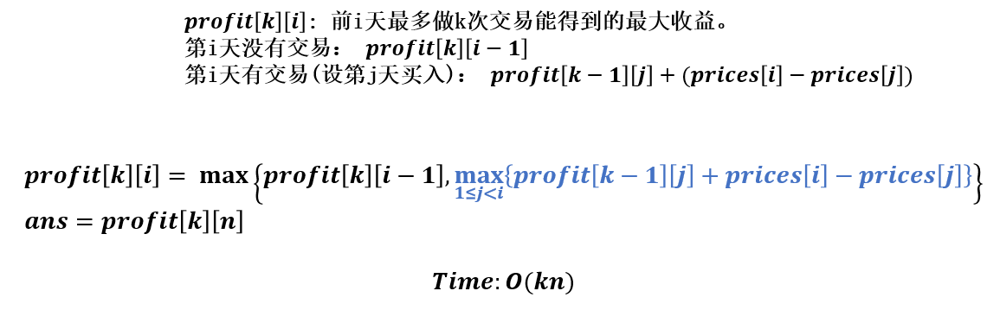

#### [买卖股票的最佳时机Ⅰ](https://leetcode.com/problems/best-time-to-buy-and-sell-stock/)

给定数组，第$i$个值为为一支股票在第$i$天的价格。

只允许完成一笔交易（买一次，卖一次）并且一天只能完成一次买或者卖，求最大利益。

贪心法，求最低点与最高点相减即可。
$$
\text{profit}[i] = \max(\text{profit}[i-1], \text{prices}[i]-\min_{1\le j\le i}\{\text{prices}[j]\}) \\
\text{profit}[1] = 0 \\
\text{ans} = \text{profit}[n]
$$

#### [买卖股票的最佳时机Ⅱ](https://leetcode.com/problems/best-time-to-buy-and-sell-stock-ii/)

允许完成多笔交易，但同时只能参与一笔交易（买入前必须全部卖出）。

贪心法，只要价格升高就卖出。
$$
\text{profit}[i] = \text{profit}[i-1] + \max\{0, \text{prices}[i] - \text{prices}[i-1]\}\\
\text{profit}[1] = 0 \\
\text{ans} = \text{profit}[n]
$$

#### [买卖股票的最佳时机Ⅲ](https://leetcode.com/problems/best-time-to-buy-and-sell-stock-iii/)

最多完成两笔交易。

遍历分界点，调用两次问题Ⅰ。

#### [买卖股票的最佳时机Ⅳ](https://leetcode.com/problems/best-time-to-buy-and-sell-stock-iv/)

最多完成K笔交易。

动态规划。

