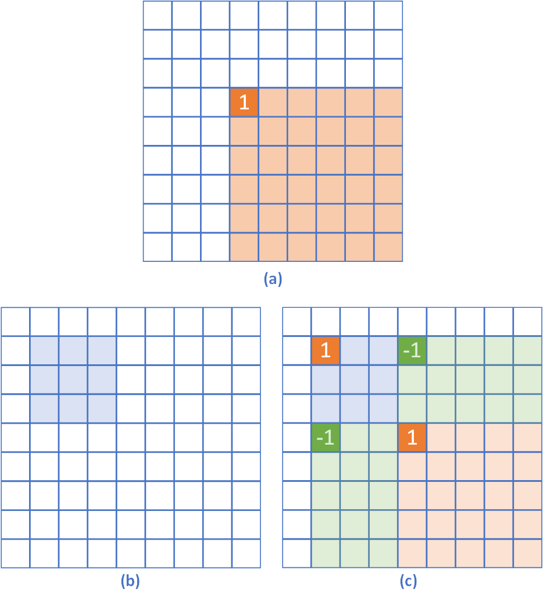

# 区间问题

### 区间求和

| 数组修改 | 查询     | 算法（最佳方案在前）     |
| -------- | -------- | ------------------------ |
| 静态     | 区间求和 | 前缀和，树状数组，线段树 |
| 单点增量 | 区间求和 | 树状数组，线段树         |
| 区间增量 | 单点     | 差分，线段树             |
| 区间增量 | 区间求和 | 线段树                   |

* 区间查询也包含单点查询。
* 线段树为最通用的方案（区间修改，区间查询），但对于更限定的场景，前缀和、差分等方法更简单。


#### 前缀和

支持$O(1)$时间的区间查询。

```cpp
// build
sums[i] = sums[i-1] + arr[i];
// query
Q[i, j] = sums[j] - sums[i-1]
```

* [1D array](https://leetcode-cn.com/problems/range-sum-query-immutable/)

  ```cpp
  class NumArray {
  public:
      vector<int> sums;
  
      NumArray(vector<int>& nums) {
          int n = nums.size();
          sums.resize(n + 1); // note: sums[0] is reserved for easy border handling.
          for (int i = 0; i < n; i++) {
              sums[i + 1] = sums[i] + nums[i];
          }
      }
  
      int sumRange(int i, int j) {
          return sums[j + 1] - sums[i];
      }
  };
  ```

* [2D array](https://leetcode-cn.com/problems/range-sum-query-2d-immutable/)

  通常用`s[i+1][j+1]`表示**左上子矩阵`x[0:i+1][0:j+1]`**的求和，这样可以正向循环计算。
  
  ```cpp
  class NumMatrix {
  public:
      vector<vector<int>> sums;
  
      NumMatrix(vector<vector<int>>& matrix) {
          int m = matrix.size();
          int n = matrix[0].size();
          sums.resize(m + 1, vector<int>(n + 1));
          for (int i = 0; i < m; i++) {
              for (int j = 0; j < n; j++) {
                  sums[i + 1][j + 1] = sums[i][j + 1] + sums[i + 1][j] - sums[i][j] + matrix[i][j];
              }
          }
  
      }
  
      int sumRegion(int row1, int col1, int row2, int col2) {
          return sums[row2 + 1][col2 + 1] - sums[row1][col2 + 1] - sums[row2 + 1][col1] + sums[row1][col1];
      }
  };
  ```
  
  

#### 差分

支持$O(1)$的区间修改，以及均摊$O(1)$的单点查询（需要查询所有单点的值）。

tips：如果区间修改与区间查询是完全分离的，即先进行所有区间修改后，再进行所有区间查询，可以先差分后前缀和，也能达到$O(n+m)$的复杂度。但如果这两种操作混合进行，则只能利用线段树$O(m\log n)$。

```cpp
// build
diff[i] = arr[i] - arr[i-1];
// modify: add x to [i, j]
diff[i] += x;
diff[j+1] -= x;
// query (must be sequential)
arr[i] = diff[i] + arr[i-1]
```


* [1D array](https://leetcode-cn.com/problems/corporate-flight-bookings/)

  ```cpp
  class Solution {
  public:
      vector<int> corpFlightBookings(vector<vector<int>>& bookings, int n) {
          // init as 0
          vector<int> nums(n, 0);
          // modify
          for (auto& v : bookings) {
              nums[v[0] - 1] += v[2];
              if (v[1] < n) nums[v[1]] -= v[2];
          }
          // query
          for (int i = 1; i < n; i++) {
              nums[i] += nums[i - 1];
          }
          return nums;
      }
  };
  ```
  
  

* [1D discretized array](https://leetcode.cn/problems/my-calendar-iii/)

  区间范围远大于区间数量时，需要使用map模拟稀疏数组。

  ```cpp
  class MyCalendarThree {
  public:
      map<int, int> m;
      MyCalendarThree() {}
      int book(int start, int end) {
          // modify
          m[start]++;
          m[end]--;
          // query max value, O(n), suboptimal to segtree O(logC)
          int ans = 0, val = 0;
          for (auto [k, v]: m) { // ordered map
              val += v; // reconstruct
              ans = max(ans, val);
          }
          return ans;
      }
  };
  ```

  


* 2D array

  通常用`s[i][j]`表示**右下子矩阵`x[i:][j:]`**的增量，这样可以正向循环求原始矩阵值。

  

  ```cpp
  // init as 0
  vector<vector<int>> diff(m + 1, vector<int>(n + 1, 0));
  
  // modify original mat (e.g., add x to mat[i:i+ii][j:j+jj])
  diff[i][j] += x;
  diff[i][j+jj] -= x;
  diff[i+ii][j] -= x;
  diff[i+ii][j+jj] += x;
  
  // query (saved mat[i][j] to res[i+1][j+1] for easy border condition)
  vector<vector<int>> res(m + 1, vector<int>(n + 1, 0));
  for (int i = 1; i <= m; i++) {
      for (int j = 1; j <= n; j++) {
          res[i][j] = res[i][j-1] + res[i-1][j] - res[i-1][j-1] + diff[i-1][j-1];
      }
  }
  ```

  


#### 树状数组

支持$O(\log n)$时间的单点更新与区间求和。

**默认下标从1开始！！！**


* [1D array](https://leetcode-cn.com/problems/range-sum-query-mutable/)

  ```cpp
  class NumArray {
  public:
      int lowbit(int x) { return x & (-x); }
      vector<int> bit, arr; // arr is to record the single point value.
  	
      // arr[i] += v
      void add(int i, int v) {
          for (i; i < bit.size(); i += lowbit(i)) bit[i] += v;
      }
  	
      // prefix sum of arr[1, ..., i]
      int query(int i) {
          int res = 0;
          for (i; i > 0; i -= lowbit(i)) res += bit[i];
          return res;
      }
  
      NumArray(vector<int>& nums) {
          bit.resize(nums.size() + 1);
          arr.resize(nums.size() + 1);
          for (int i = 0; i < nums.size(); i++) {
              add(i + 1, nums[i]);
              arr[i + 1] = nums[i];
          }
      }
    	
      // note: this is modify, not add!
      void update(int index, int val) {
          add(index + 1, val - arr[index + 1]);
          arr[index + 1] = val;
      }
      
      int sumRange(int left, int right) {
          return query(right + 1) - query(left);
      }
  };
  ```

  


#### 线段树

支持$O(\log n)$时间的区间更新与区间求和，但常数较大。

* [1D array](https://leetcode-cn.com/problems/corporate-flight-bookings/)

  ```cpp
  class Solution {
  public:
  
      #define ll long long // in case of overflow
  	
      // must use traditional memory allocation.
      const static int maxn = 20000;
  
      struct node {
          int l, r;
          ll sum, inc;
          int mid() { return (l + r) / 2; }
      } tr[maxn<<2];
  
      #define lc 2*rt+1
      #define rc 2*rt+2
  
      void pushup(int rt) {
          tr[rt].sum = tr[lc].sum + tr[rc].sum;
      }
  
      void pushdown(int rt) {
          if (tr[rt].inc) {
              tr[rt].sum += (tr[rt].r - tr[rt].l + 1)*tr[rt].inc;
              tr[lc].inc += tr[rt].inc;
              tr[rc].inc += tr[rt].inc;
              tr[rt].inc = 0;
          }
      }
  
      void build(int rt, int l, int r) {
          tr[rt].l = l;
          tr[rt].r = r;
          tr[rt].inc = 0;
          if (l == r) {
              //tr[rt].sum = arr[l]; // if init is not all 0, support init from an arr.
              return;
          }
          int m = (l + r) / 2;
          build(lc, l, m);
          build(rc, m + 1, r);
          pushup(rt);
      }
  
  
      void add(int rt, int l, int r, int v) {
          if (tr[rt].l == l && tr[rt].r == r) {
              tr[rt].inc += v;
              return;
          }
          tr[rt].sum += (r - l + 1)*v;
          int m = tr[rt].mid();
          if (l > m) add(rc, l, r, v);
          else if (r <= m) add(lc, l, r, v);
          else {
              add(lc, l, m, v);
              add(rc, m + 1, r, v);
          }
      }
  
  
      ll query(int rt, int l, int r) {
          if (tr[rt].l == l && tr[rt].r == r) return tr[rt].sum + tr[rt].inc*(r - l + 1);
          pushdown(rt);
          int m = tr[rt].mid();
          if (l > m) return query(rc, l, r);
          else if (r <= m) return query(lc, l, r);
          else return query(lc, l, m) + query(rc, m + 1, r);
      }
  
      vector<int> corpFlightBookings(vector<vector<int>>& bookings, int n) {
          build(0, 0, n-1);
          for (auto v: bookings) add(0, v[0]-1, v[1]-1, v[2]);
          vector<int> ans;
          for (int i = 0; i < n; i++) ans.push_back(query(0, i, i));
          return ans;
      }
  };
  ```


### 区间最值

| 数组修改               | 算法             |
| :--------------------- | ---------------- |
| 静态                   | ST表，线段树     |
| 区间增量               | 线段树           |
| 区间替换（无原始数组） | 线段树           |
| 单点替换               | 线段树，树状数组 |


#### ST表

```cpp
```


#### 扩展树状数组

支持单点替换，区间查询

```cpp
// maximum BIT
const int maxn = 100;
int N;
int arr[maxn], bit[maxn];

int lowbit(int x) { return x & (-x); }

void init(int n) {
	for (int i = 1; i <= n; i++) {
		bit[i] = arr[i];
		for (int j = 1; j < lowbit(i); j *= 2) 
			bit[i] = max(bit[i], bit[i - j]);
	}
}

// O(lg^2n)
void update(int i, int x) {
	arr[i] = x;
	for (i; i <= N; i += lowbit(i)) {
		bit[i] = x;
		for (int j = 1; j < lowbit(i); j *= 2)
			bit[i] = max(bit[i], bit[i - j]);
	}
}

// O(lg^2n)
int query(int i, int j) {
	int ans = 0;
	while (j >= i) {
		ans = max(ans, arr[j]);
		for (j-=1; j - lowbit(j) >= i; j -= lowbit(j))
			ans = max(ans, bit[j]);
	}
	return ans;
}

```


#### 线段树

* 替换

  ```cpp
  const static int maxn = 10005;
  
  struct node {
      int l, r;
      int mx, lazy;
      int m() { return (l + r) / 2; }
  } seg[4 * maxn];
  
  void build(int rt, int l, int r) {
      seg[rt].l = l;
      seg[rt].r = r;
      seg[rt].mx = 0;
      seg[rt].lazy = 0;
      if (l == r) return;
      build(2 * rt + 1, l, (l + r) / 2);
      build(2 * rt + 2, (l + r) / 2 + 1, r);
  }
  
  void pushup(int rt){
      seg[rt].mx = max(seg[2 * rt + 1].mx, seg[2 * rt + 2].mx);
  }
  
  void pushdown(int rt) {
      if (seg[rt].lazy) {
          //cout<<"push down "<<rt<<" "<< seg[rt].l << "-" << seg[rt].r << endl;
          seg[2 * rt + 1].mx = seg[rt].mx;
          seg[2 * rt + 2].mx = seg[rt].mx;
          seg[2 * rt + 2].lazy = seg[2 * rt + 1].lazy = 1;
          seg[rt].lazy = 0;
      }
  }
  
  int query(int rt, int l, int r) {
      if (l == seg[rt].l && r == seg[rt].r)
          return seg[rt].mx;
      // push down
      pushdown(rt);
      int m = seg[rt].m();
      if (r <= m) return query(2 * rt + 1, l, r);
      else if (l > m) return query(2 * rt + 2, l, r);
      else return max(query(2 * rt + 1, l, m), query(2 * rt + 2, m + 1, r));
  }
  
  void modify(int rt, int l, int r, int v) {
      if (l == seg[rt].l && r == seg[rt].r) {
          seg[rt].mx = v; // set to v, not add v.
          seg[rt].lazy = 1;
          return;
      }
      // push down
      pushdown(rt);
      // interval decomp
      int m = seg[rt].m();
      if (r <= m) modify(2 * rt + 1, l, r, v);
      else if (l > m) modify(2 * rt + 2, l, r, v);
      else {
          modify(2 * rt + 1, l, m, v);
          modify(2 * rt + 2, m + 1, r, v);
      }
      // push up
      pushup(rt);
  }
  ```

  

* [增量](https://leetcode.cn/problems/my-calendar-iii/)

  ```cpp
  
  ```
  
  
  
* 动态

  ```cpp
  ```

  