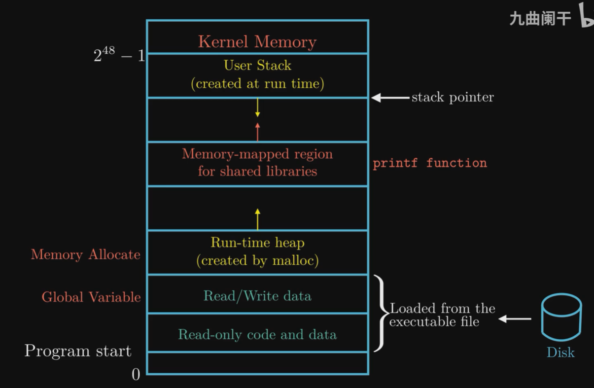
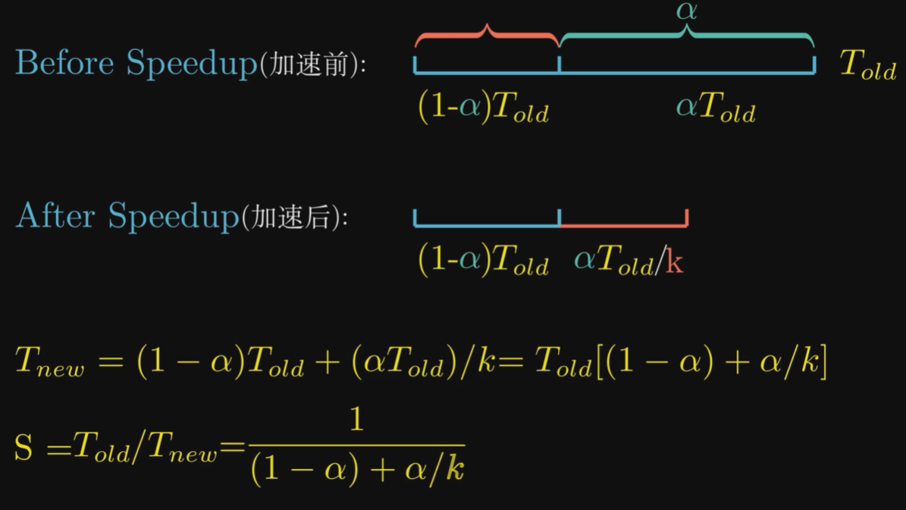

# Roaming in Computer System

### The compilation system

```bash
# compile
gcc -o hello hello.c
```

What happened:

* preprocessor (cpp): `hello.c --> hello.i`
* compiler (ccl): `hello.i --> hello.s`
* assembler (as): `hello.s --> hello.o`
* linker (ld): `hello.o, printf.o, ... --> hello`


### Hardware Organization of a System

Hardwares:

* CPU

  * PC (program counter): a word length (8 Byte for 64-bit system) pointer to the current command.
  * Registers
  * ALU (Algorithmic/Logic Unit)

* Main Memory

* IO devices

* IO Bridge (system bus, memory bus, IO bus)

  

Memory hierarchy: Balance between **Access Speed** and **Storage Size**!

* Register: 100~1000 B
* L1 Cache: 10~100 KB

* L2 Cache: 0.1~10 MB
* L3 Cache: 10~100 MB
* Main Memory: 1~100 GB
* Disk: 1~1000 TB


Memory Organization:




### Concurrency and Parallelism

Amdahl's Law: How much can a program be accelerated.




Different methods:

* Thread-level Concurrency
* Instruction-level Parallelism
* SIMD (Single Instruction Multiple Data) Parallelism