## Information Storage


### Integer

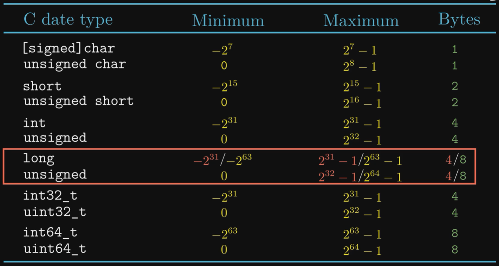

Unsigned Encodings:

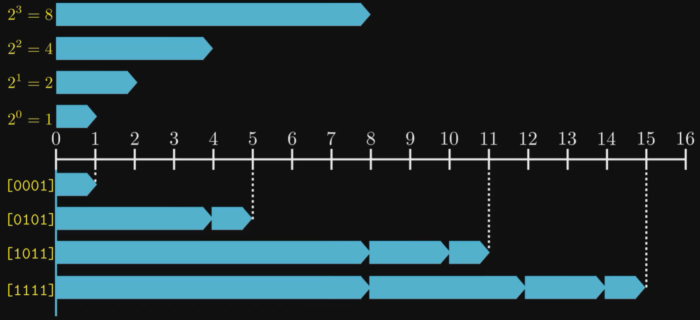

Signed Encodings (Two's complement):

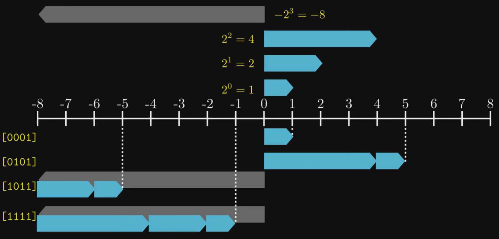

Conversion between signed and unsigned:

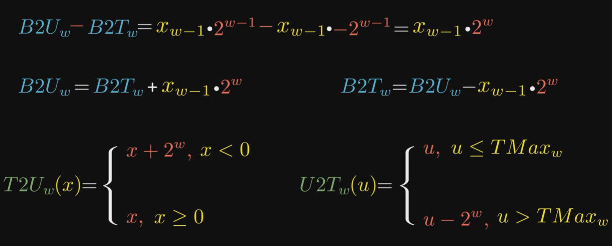

WARNING: C implicitly cast signed to unsigned.

```cpp
int a = -1;
unsigned int b = 0;
assert(a > b); // true, signed -1 --> unsigned 2^{32}-1 > 0
```


### Integer Arithmetic

Overflow:

* unsigned:

  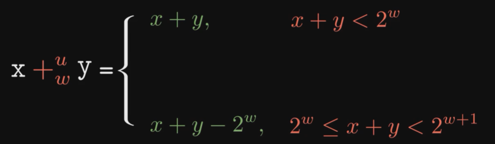

* signed

  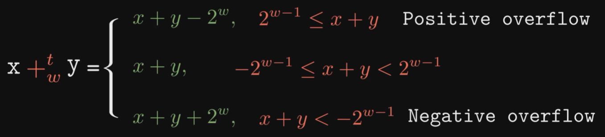


### Floating Point

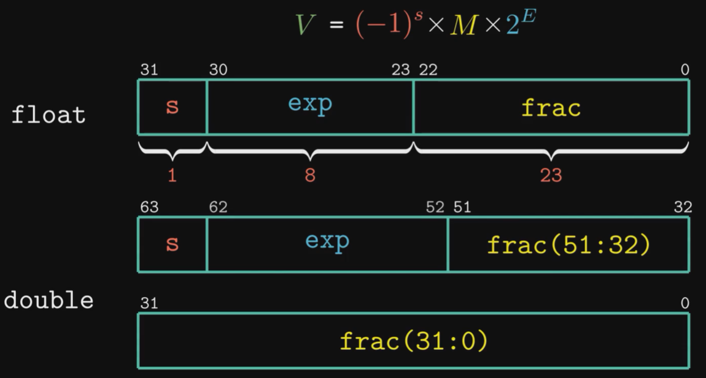

* Normalized (most numbers):

  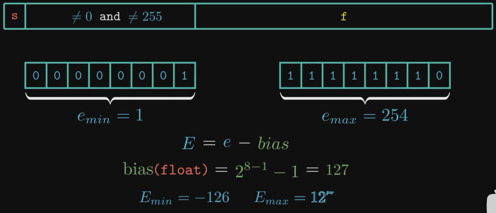

  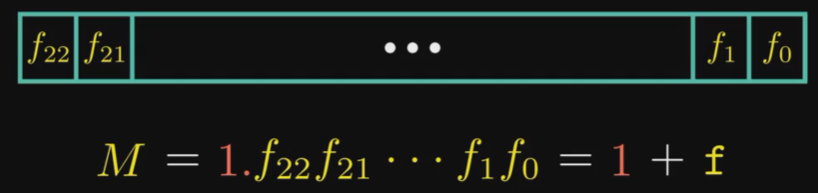

  

* Denormalized (zero, and near-zero small numbers)

  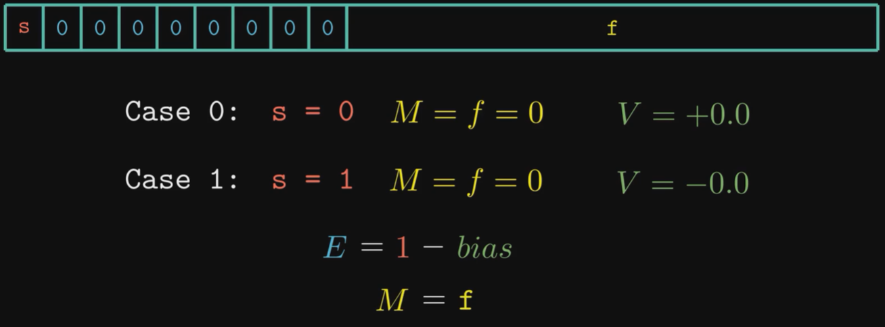

  

* Special (Infinity and NaN)

  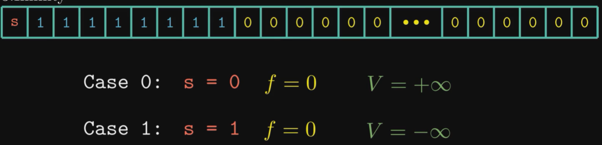

  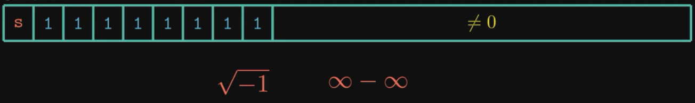

​	