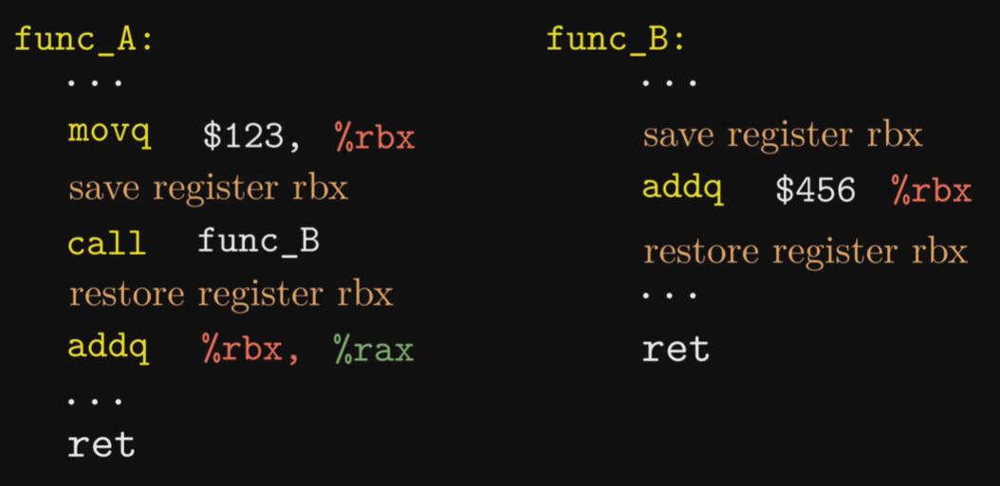
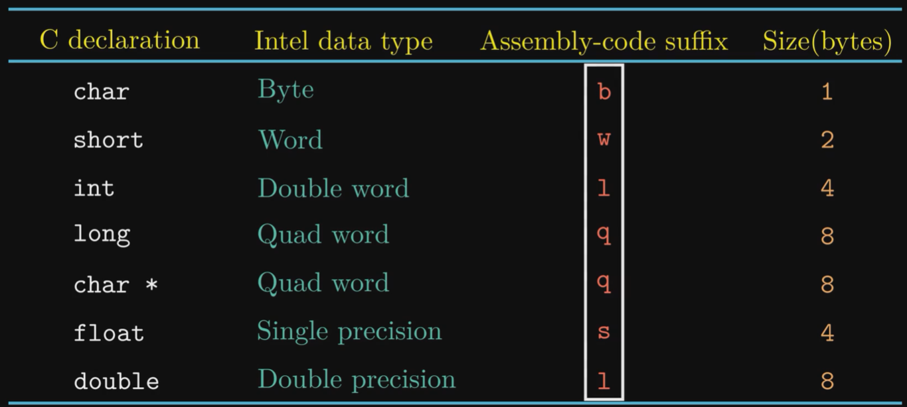

## Machine Language

### Compile

```bash
# -Og: do not optimize, generate assembly code according to the program
# -S: generate assembly
gcc -Og -S test.c # test.s
```


#### Registers

* Caller-saved / Callee-saved Register: different strategies to save register context at calling functions.

  

* Size of data type

  