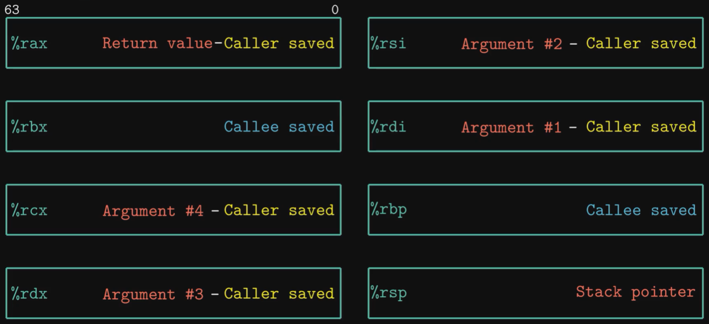
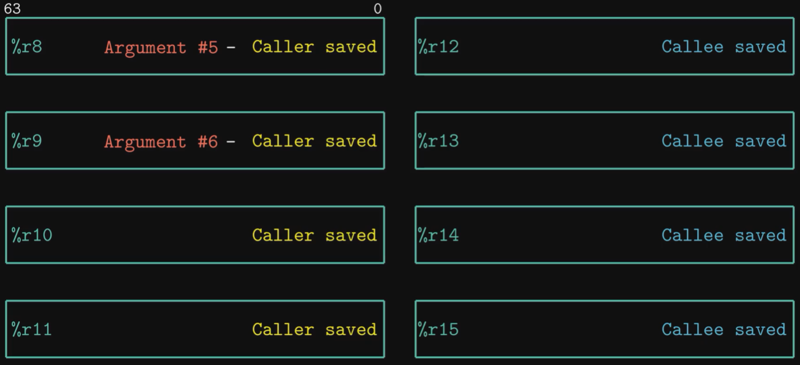
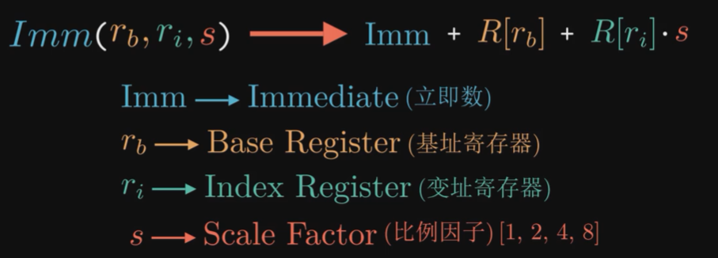
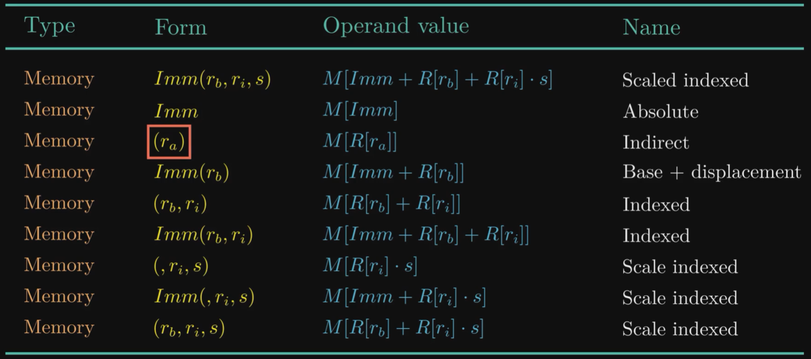
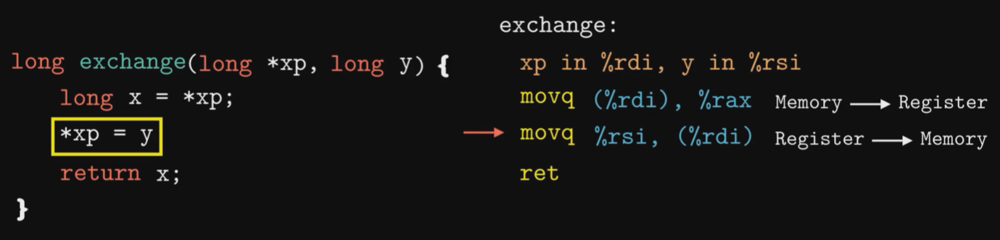
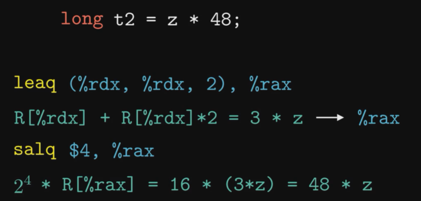

## Machine Language

### Compile

```bash
# -Og: do not optimize, generate assembly code according to the program
# -S: generate assembly
gcc -Og -S test.c # test.s, assembly code
gcc -Og -c test.c # test.o, binary machine code
```


#### Registers

* **Caller-saved / Callee-saved** Register: different strategies to save register context at calling functions.

  

* Size of data type (remember the suffix!)

  
  
  * **b**: 1 byte
  * **w**: word, 2 bytes (old machine convention, 1 word only equals 2 bytes. Now we usually have 8 bytes = 64 bits for a word.)
  * **l**: long word, 4 bytes
  * **q**: quad word, 8 bytes

* All 16 registers:

  Name convention for the 8 old registers at different bit length:

  | 64 bits | rax  | rbx  | rcx  | rdx  | rsi  | rdi  | rbp  | rsp  |
  | ------- | ---- | ---- | ---- | ---- | ---- | ---- | ---- | ---- |
  | 32 bits | eax  | ebx  | ecx  | edx  | esi  | edi  | ebp  | esp  |
  | 16 bits | ax   | bx   | cx   | dx   | si   | di   | bp   | sp   |
  | 8 bits  | al   | bl   | cl   | dl   | sil  | dil  | bpl  | spl  |

  

  And there are 8 new registers:

  


### Instructions

* Operation Code: `movq, addq, subq, xorq, ret`

* Operands:

  * Immediate: `$1, $8`

  * Register: `%rax, %rdi, %rsi`

  * Memory Reference: `(%rbx)`

    

    

* `mov S, D`

  * Source and Destination **cannot be both memory address**.
  * 32-bit operation will also set the higher 32 bits to 0, but other operation won't.
    * `movb $-1 %al`: lower 8 bits changed to 0xFF.
    * `movl $-1 %eax`: lower 32 bits changed to 0xFFFFFFFF, but higher 32 bits of `%rax` also changed to 0x000000 !
  * `movz`: zero-extending
  * `movs`: signed-extending
  * `cltq`: equals `movslq %eax, %rax`.

  * example:

    

* Stack related

  `%rsp` records the stack pointer (stack grows **from high address to low address**).

  * `pushq %rax`: equals `subq $8, %rsp; movq %rax, (%rsp)`
  * `popq %rbx`: equals `movq (%rsp), %rbx; addq $8, %rsp `

* `leaq S, D` : load effective address.

  Directly write the value of S into D (as an address).

  ```bash
  movq (%rdx, %rdx, 2), %rax # write the value at memory location (3 * %rdx) to %rax
  leaq (%rdx, %rdx, 2), %rax # directly write (3 * %rdx) to %rax
  ```

  Can be used to load address, or abused to perform simple multiplying & adding...

* Unary

  * `inc D`
  * `dec D`
  * `neg D`
  * `not D`

* Binary

  * `add S, D `
  * `sub S, D`
  * `imul S, D`
  * `xor S, D`
  * `or S, D`
  * `and S, D`

* Shift

  `k` can only be an immediate number, or the value in `%cl`.

  * `sal/shl k, D`: left shift
  * `sar k, D`: right shift, arithmetic
  * `shr k, D`: right shift, logical

  Example: use `leaq` and `sal` to perform multiplication.

  

* Condition Code Register

  Controlled by ALU, the values are determined by the most recent operation's result.

  * CF: Carry Flag, Set to 1 if overflow happened for **unsigned** operation.
  * ZF: Zero Flag, Set to 1 if result is 0.
  * SF: Sign Flag, Set to 1 if result is negative.
  * OF: Overflow Flag, Set to 1 if overflow happened for **signed** operation.

  Two instructions for CCR:

  * `cmpq S, D`, equal to `subq`, but only set CCR.
  * `testq S, D`, equal to `addq`, but only set CCR.
  * `sete D`, set-equal, set D to 1 if last `cmpq` set `ZF` to 1 (i.e., `S == D for cmpq S, D`)
  * `setl D`, set-less, set D to 1 if last `cmpq` set `SF ^ OF` to 1 (i.e., `S < D for cmpq S, D`, `OF` considers signed overflow condition)
  * `setle D`, set-less-equal, `(SF ^ OF) | ZF`
  * `setg D`, set-greater, `~(SF ^ OF) & ~ZF`
  * `setge D`, set-greater-equal, `~(SF ^ OF)`
  * `seta D`, set-above, `~CF & ~ZF`, for unsigned greater.
  * `setae D`, set-above-equal, `~CF`, for unsigned greater-equal.
  * `setb D`, set-below, `CF`, for unsigned less.
  * `setbe D`, set-below-equal, `CF | ZF`, for unsigned less-equal.

* 


> TODO: 3-6
