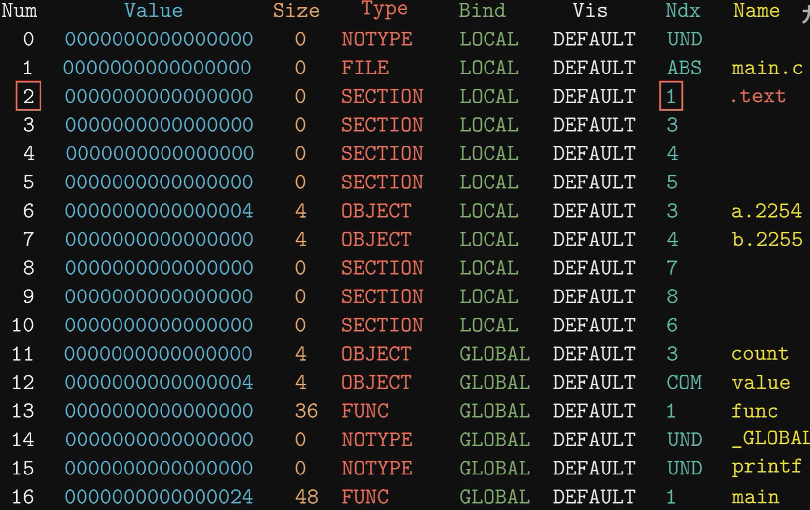
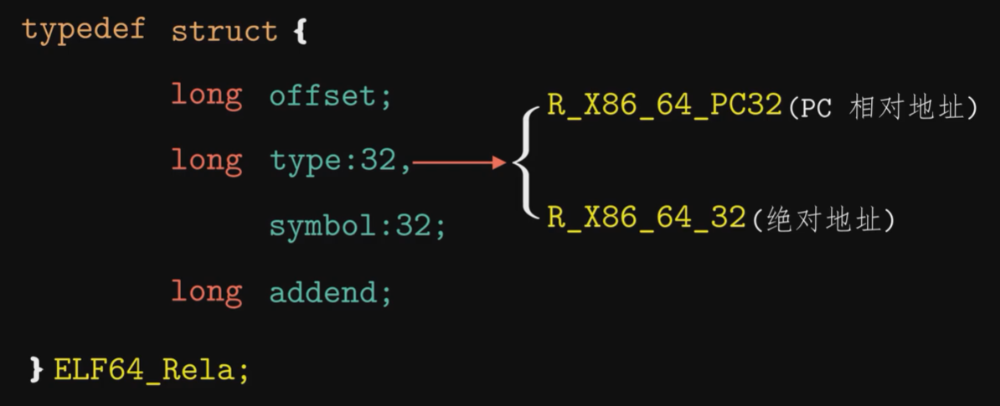
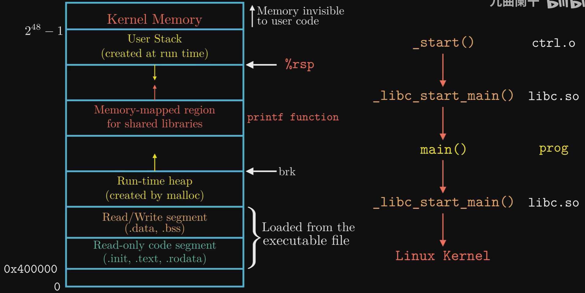

# Linking

### Why

Separate source code (especially for large systems) into multiple smaller parts, so we can compile each part independently, which avoids re-building everything when we modify one part. 

These parts are **linked** together later.

### The Compilation System

* Preprocessor

  ```bash
  # main.c --> main.i
  cpp -o main.i main.c
  cpp -o sum.i sum.c
  
  # or using gcc
  gcc -E -o main.i main.c
  ```

* Compiler

  ```bash
  # main.i --> main.s
  cc -S -o main.s main.i
  cc -S -o sum.s sum.i
  
  # or
  gcc -S -o main.s main.i
  ```

* Assembler

  Generate **Relocatable Object Files** (*.o)

  ```bash
  # main.s --> main.o
  as -o main.o main.s
  as -o sum.o sum.s
  
  # or (note that here we start directly from main.c)
  gcc -c main.c # default output is main.o
  ```

* Linker

  ```bash
  # main.o, sum.o, .... --> main
  ld -static -o main main.o sum.o \
  	/usr/lib/x86-644-linux-gnu/crt1.o \ # c runtime
  	......
  ```

  
### Relocatable Object Files

* ELF (Executable and Linkable Format) header

  ```bash
  # show ELF header info
  readelf -h main.o
  ```

* Sections

  The compiled program, and data.

  It contains multiple "section", which is defined in the later Section header table.

  ```bash
  # check sections's data
  objdump -s -d main.o
  ```

  * `.text`: compiled machine code.

  * `.data`: data, initialized global/static variables

  * `.bss`: better-save-space, uninitialized/0-init global/static variables.

  * `.rodata`: read-only data (const variables), start from the same position with `.bss`.

  * `.comment`: compiler version

  * `.symtab`: **symbol table**.

    ```bash
    # show symtab
    readelf -s main.o
    ```

    

    * Global Symbols: defined in this file and can be accessed by other files.
    * External Symbols: defined in other files and referred by this file.
    * Local Symbols: defined in this file, cannot be accessed by other files.

  * `.rel.text`: **relocation entries** for code (e.g., functions).

  * `.rel.data`: **relocation entries** for variables.

* Section header table

  index for the Sections (name, type, address, offset).

  ```bash
  # show ELF section table
  readelf -S main.o
  ```


### Handling Symbols

#### Undefined symbols

Compilation won't report error on **undefined** symbols (but must be **declared**!), they are assumed to be linked in.

```cpp
# main.c
void foo(); // declared, but not defined

int main() {
    foo();
}
```

```bash
# OK! main.c --> main.o
gcc -c main.c

readelf -s main.o
# ... NOTYPE GLOBAL DEFAULT UND foo

# ERROR! 
gcc -o main main.c
# ... undefined reference to `foo'
# ... error: ld returned 1 exit status
```

#### Duplicate symbols

* Strong symbols: functions, initialized global variables.
* Weak symbols: uninitialized global variables.

Any duplicate strong symbols will cause linking error, but weak symbols can be overwritten by strong symbols (but this is still not dangerous, and **duplication names should always be avoided**!).

E.g., linking these two files won't lead to error (only a warning is given). Use `-fno-common` or `-Werror` to turn it into error.

```cpp
# foo.c
int x = 100; // strong symbol, x is only allocated 4 Bytes.

# bar.c
double x; // weak symbol
void bar() {
    x = 0; // dangerous! write 8 Bytes to x.
}
```

#### Library Archive

Linux saves static library into `*.a` archive files. Each archive file is a collection of many `*.o` files.

```bash
# extract a static library
ar -t /usr/lib/x86_64-linux-gpu/libc.a # list all included *.o files
ar -x /usr/lib/x86_64-linux-gpu/libc.a # extract all *.o files (~1690)

# make a static library
gcc -c add.c mul.c # add.o, mul.o
ar rcs lib.a add.o mul.o # archive into lib.a

# use our static library
gcc -c main.c # main.c uses func in add.c & mul.c
gcc -static -o main main.o lib.a # append the lib archive
```


### Static Linking

```bash
# main.o uses add.o & printf.o, but not uses mul.o
gcc -static -o main main.o lib.a # libc.a is always appended at last
```

Maintain three sets: **Executable, Undefined, Defined**.

* E: only the necessary `*.o` files.
* U: currently undefined symbols.
* D: currently defined symbols (handle duplicated definitions).

Order matters! The following will fail since `lib.a` is processed before`main.o`, so it cannot add `add.o` into E.

```bash
gcc -static -o main lib.a main.o # undefined reference to add
```

This means we need to **sort libs by dependency relationship** when appending them to gcc.

```bash
# foo.c --> libx.a
# libx.a --> liby.a
gcc -static -o foo foo.c libx.a liby.a # liby is after libx

# foo.c --> libx.a
# libx.a <--> liby.a (mutual dependence!)
gcc -static -o foo foo.c libx.a liby.a libx.a # must duplicate libx.a twice here
```


### Relocation

After determining the set **E**xecutable, linker performs relocation to merge all the `*.o` files into one.

Two steps are performed:

* Sections and Symbol Definitions.

  merge the `.text` and `.data` from all `*.o` files.

* Symbol References within Sections.

  resolve the undefined symbols based on the **relocation entries** defined in `.rel.text` and `.rel.data`.
  
  The structure for relocation entry:
  
  


### Executable Files

Similar to ELF files:

* ELF header
* Segment header table
* Sections
  * `.init`: the initialization program
  * `.text`
  * `.rodata, .data, .bss`
  * `.symtab`
  * `.debug, .line, .strtab`
* Section header table

Note that `.rel.text`  and `.rel.data` are no longer needed since all the code are after-relocation thus no undefined symbols.

What happens when we run an executable file:




### Dynamic Linking

Static linking (static libraries, `*.o`) has various disadvantages:

* Recompilation is needed if a static library is updated.
* Frequently used code (like the standard c library) are always copied to our program.

Therefore, dynamic linking (dynamic/shared libraries, `*.so, *.dll`) is proposed.

How to create a shared library:

```bash
# -shared: shared library
# -fpic: flag-positional-independent-code
gcc -shared -fpic -o lib.so add.c mul.c

# compile with dynamic linking
gcc -o main main.c lib.so
```

In dynamic linking, the code in `lib.so` is NOT copied into `main`!

Instead, only the relocation information and symbol table are copied. 

A dynamic linker (`ld-linux.so`) will resolve the undefined symbols at runtime.

