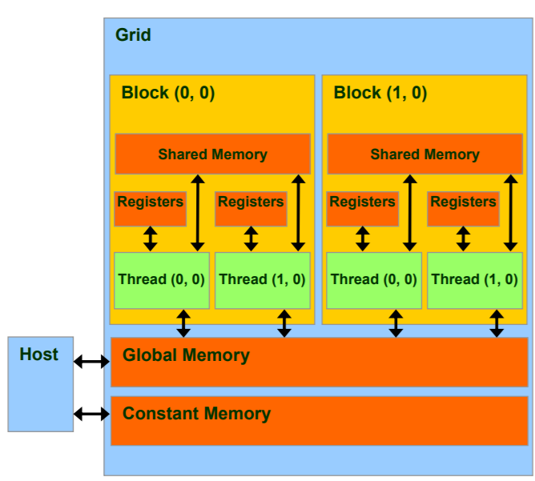

# CUDA

https://nanohub.org/resources/7225/share?sharewith=pinterest


## Examples


### Compile

```bash
nvcc hello.cu -o hello.out
```

### Profile

```bash
nvprof ./hello.out
```


## Tutorials


### Compute Capability (SM version)

indicates the features supported by the GPU **hardware** (not to be confused with CUDA **software** version).

> 6 = Pascal
>
> 7 = Volta, 7.5 = Turing
>
> 8 = Ampere


### Call kernel with <<<num_blocks, num_threads>>

**(num_blocks, num_threads can be 1d/2d/3d)**

CUDA will launch a grid:

* a grid contains `num_blocks` blocks.
* each block contains `num_threads` threads.

```c
Thread // concurrent code and associated state executed on the CUDA device (in parallel with other threads)
Warp // a group of threads executed physically in parallel
Block // a group of threads that are executed together and form the unit of resource assignment
Grid // a group of thread blocks that must all complete before the next kernel call of the program can take effect
```

The full Execution Configuration: <<<Dg, Db, Ns, S>>>

* Ns: (size_t, default = 0) that specifies the number of bytes in shared memory that id dynamically allocated per block in addition to the statically allocated memory.

* S: (cudaStream_t, default = 0) the associated stream.


About how to decide the `N_THREAD` or `block_size` [here](https://stackoverflow.com/questions/9985912/how-do-i-choose-grid-and-block-dimensions-for-cuda-kernels):

* hardware limits: We can launch at most 4294967295=65536*65536 (x/y/z: 4294967295/65536/65536) blocks, 
  with each block contains at most 1024 (x/y/z: 1024/1024/64) threads !
* usually, tune it from `[128, 1024]` with a stride of 32.


### Built-ins

```c
void __syncthreads(); // sync all threads in a block.

// build vector 
int2 make_int2(int x, int y);
int3 make_int3(int x, int y, int z);

// special uint3 type
dim3 Dim3(x=1, y=1, z=1);
```


### One-dimensional example

```c
/*   

  BlockIdx, ThreadIdx
<<<GridDim, BlockDim>>>

*/


threadIdx.x  // ranges from 0 to num_threads - 1
blockDim.x   // = num_threads
blockIdx.x   // ranges from 0 to num_blocks - 1
gridDim.x    // = num_blocks

tid = blockIdx.x * blockDim.x + threadIdx.x; // unique id for each kernel call.
```

```c
__global__ void vector_add(float *out, float *a, float *b, int n) {
    for(int i = 0; i < n; i += 1){
        out[i] = a[i] + b[i];
    }
}

vector_add<<<1,1>>>(d_out, d_a, d_b, N);
// NO parallel, just use one thread to process N elements.
```

```c
__global__ void vector_add(float *out, float *a, float *b, int n) {
    int index = threadIdx.x; // ranges from 0 to num_threads.
    int stride = blockDim.x; // = num_threads

    for(int i = index; i < n; i += stride){
        out[i] = a[i] + b[i];
    }
}

vector_add<<<1,256>>>(d_out, d_a, d_b, N);
// only use 256 threads to process, each thread process N / 256 elements in a strided way.
```

```c
__global__ void vector_add(float *out, float *a, float *b, int n) {
    int tid = blockIdx.x * blockDim.x + threadIdx.x;
    
    if (tid < n) { out[tid] = a[tid] + b[tid]; }
}

int block_size = 256;
int grid_size = ((N + block_size - 1) / block_size); // at most 4294967295, enough for most cases
vector_add<<<grid_size, block_size>>>(d_out, d_a, d_b, N);
// allocate enough blocks, each with 256 threads to process. Each thread only process 1 element!
```


### Two-dimensional example

```c
__global__ void matrix_add(float A[N][N], float B[N][N], float C[N][N]) {
    int i = blockIdx.x * blockDim.x + threadIdx.x;
    int j = blockIdx.y * blockDim.y + threadIdx.y;
    
    if (i < N && j < N) C[i][j] = A[i][j] + B[i][j];
}


dim3 threadsPerBlock(16, 16);
dim3 numBlocks(N / threadsPerBlock.x, N / threadsPerBlock.y);

MatAdd<<<numBlocks, threadsPerBlock>>>(A, B, C);
```


### [Function prefix](https://stackoverflow.com/questions/12373940/difference-between-global-and-device-functions)

Concepts: host (cpu), device (gpu, ...)

```c
__global__ // called by host (<<<,>>>),                  run on device. (kernels, must return void)
__device__ // called by device (__global__ or __device__),  run on device.
__host__   // called by host,                               run on host.
```

global & device function cannot:

* recursion
* static variable declaration 
* variable number of arguments.


### Memory Location

```c
__device__                 int GlobalVar; // global memory
[__device__] __local__     int LocalVar;  // thread local memory
[__device__] __shared__    int SharedVar; // block shared memory
[__device__] __constant__  int ConstVar;  // constant memory

int RegVar;     // register (local)
int RegArr[10]; // local memory
```



```c
– R/Only                   // constant memory (very fast if in cache)
– R/W shared within Block  // shared memory (very fast)
– R/W within each thread   // registers (very fast)
– R/W inputs/results       // global memory (very slow)
```


### MatMul Example with shared memory

```c
// Thread block size
#define BLOCK_SIZE 16

// Matrices are stored in row-major order:
// M(row, col) = *(M.elements + row * M.stride + col)
typedef struct {
    int width;
    int height;
    int stride; 
    float* elements;
} Matrix;

// Get a matrix element
__device__ float GetElement(const Matrix A, int row, int col) {
    return A.elements[row * A.stride + col];
}

// Set a matrix element
__device__ void SetElement(Matrix A, int row, int col, float value) {
    A.elements[row * A.stride + col] = value;
}

// Get the BLOCK_SIZExBLOCK_SIZE sub-matrix Asub of A that is
// located col sub-matrices to the right and row sub-matrices down
// from the upper-left corner of A
 __device__ Matrix GetSubMatrix(Matrix A, int row, int col)  {
    Matrix Asub;
    Asub.width    = BLOCK_SIZE;
    Asub.height   = BLOCK_SIZE;
    Asub.stride   = A.stride;
    Asub.elements = &A.elements[A.stride * BLOCK_SIZE * row + BLOCK_SIZE * col];
    return Asub;
}

// Matrix multiplication kernel called by MatMul()
 __global__ void MatMulKernel(Matrix A, Matrix B, Matrix C) {
    // Block row and column
    int blockRow = blockIdx.y;
    int blockCol = blockIdx.x;

    // Each thread block computes one sub-matrix Csub of C
    Matrix Csub = GetSubMatrix(C, blockRow, blockCol);

    // Each thread computes one element of Csub
    // by accumulating results into Cvalue
    float Cvalue = 0;

    // Thread row and column within Csub
    int row = threadIdx.y;
    int col = threadIdx.x;

    // Loop over all the sub-matrices of A and B that are
    // required to compute Csub
    // Multiply each pair of sub-matrices together
    // and accumulate the results
    for (int m = 0; m < (A.width / BLOCK_SIZE); ++m) {

        // Get sub-matrix Asub of A
        Matrix Asub = GetSubMatrix(A, blockRow, m);

        // Get sub-matrix Bsub of B
        Matrix Bsub = GetSubMatrix(B, m, blockCol);

        // Shared memory used to store Asub and Bsub respectively
        __shared__ float As[BLOCK_SIZE][BLOCK_SIZE];
        __shared__ float Bs[BLOCK_SIZE][BLOCK_SIZE];

        // Load Asub and Bsub from device memory to shared memory
        // Each thread loads one element of each sub-matrix
        As[row][col] = GetElement(Asub, row, col);
        Bs[row][col] = GetElement(Bsub, row, col);

        // Synchronize to make sure the sub-matrices are loaded
        // before starting the computation
        __syncthreads();
        
        // Multiply Asub and Bsub together
        for (int e = 0; e < BLOCK_SIZE; ++e) Cvalue += As[row][e] * Bs[e][col];

        // Synchronize to make sure that the preceding
        // computation is done before loading two new
        // sub-matrices of A and B in the next iteration
        __syncthreads();
    }

    // Write Csub to device memory
    // Each thread writes one element
    SetElement(Csub, row, col, Cvalue);
}

// Matrix multiplication - Host code
// Matrix dimensions are assumed to be multiples of BLOCK_SIZE
void MatMul(const Matrix A, const Matrix B, Matrix C) {
    // Load A and B to device memory
    Matrix d_A;
    d_A.width = d_A.stride = A.width; d_A.height = A.height;
    size_t size = A.width * A.height * sizeof(float);
    cudaMalloc(&d_A.elements, size);
    cudaMemcpy(d_A.elements, A.elements, size, cudaMemcpyHostToDevice);
    
    Matrix d_B;
    d_B.width = d_B.stride = B.width; d_B.height = B.height;
    size = B.width * B.height * sizeof(float);
    cudaMalloc(&d_B.elements, size);
    cudaMemcpy(d_B.elements, B.elements, size, cudaMemcpyHostToDevice);

    // Allocate C in device memory
    Matrix d_C;
    d_C.width = d_C.stride = C.width; d_C.height = C.height;
    size = C.width * C.height * sizeof(float);
    cudaMalloc(&d_C.elements, size);

    // Invoke kernel
    dim3 dimBlock(BLOCK_SIZE, BLOCK_SIZE);
    dim3 dimGrid(B.width / dimBlock.x, A.height / dimBlock.y);
    MatMulKernel<<<dimGrid, dimBlock>>>(d_A, d_B, d_C);

    // Read C from device memory
    cudaMemcpy(C.elements, d_C.elements, size, cudaMemcpyDeviceToHost);

    // Free device memory
    cudaFree(d_A.elements);
    cudaFree(d_B.elements);
    cudaFree(d_C.elements);
}
```


### Optimize Pointer Aliasing

```c
// pointer aliasing example
void example1(float *a, float *b, float *c, int i) {
  a[i] = a[i] + c[i]; // c[i] may change (in case a == c)
  b[i] = b[i] + c[i]; // c[i] needs reloading -> time waste
}

__global__ void example3a(float* a, float* b, int* c) {
  int index = blockIdx.x * blockDim.x + threadIdx.x;
  b[index] = a[c[index]]; // in case a == b
}
```

If we know at compile time a pointer is not accessed by other pointers (No overlapping regions in pointer area), we can add `__restrict__` to the pointer to avoid reloading.

For cuda, we need both `const` and  `__restrict__` to achieve this optimization.

```c
// tell cuda a != b
__global__ void example3b(const float* __restrict__ a, float* __restrict__ b, const int*  __restrict__ c) {
  int index = blockIdx.x * blockDim.x + threadIdx.x;
  b[index] = a[c[index]];
}
```


### Stream

The default stream (0) : No concurrency.

```c
const int N = 1 << 20;

__global__ void kernel(float *x, int n)
{
    int tid = threadIdx.x + blockIdx.x * blockDim.x;
    for (int i = tid; i < n; i += blockDim.x * gridDim.x) {
        x[i] = sqrt(pow(3.14159,i));
    }
}

int main()
{
    const int num_streams = 8;

    cudaStream_t streams[num_streams];
    float *data[num_streams];

    for (int i = 0; i < num_streams; i++) {
        cudaStreamCreate(&streams[i]);
 
        cudaMalloc(&data[i], N * sizeof(float));
        
        // launch one worker kernel per stream
        kernel<<<1, 64, 0, streams[i]>>>(data[i], N);

        // launch a dummy kernel on the default stream
        kernel<<<1, 1>>>(0, 0);
    }

    cudaDeviceReset();

    return 0;
}
```

```bash
nvcc ./stream_test.cu -o stream_legacy # slower
nvcc --default-stream per-thread ./stream_test.cu -o stream_per_thread
```


### Array unfold

In cuda, tensors are usually flattened for parallel. 

pytorch tensor is row-major.

```
arr [3, n] row-major
[[x1, x2, ..., xn],
 [y1, y2, ..., yn],
 [z1, z2, ..., zn]]
 
farr = arr.view(-1) [3n,]
[x1, x2, ..., xn, y1, ..., yn, z1, ..., zn]
```

Usually, to access `arr[i, j, k]`, we need `farr[i*(J+K) + j*K + k]`


### Atomic Operators

these functions are guaranteed to be performed without interference from other threads.

(of course, slower than direct operation.)

```c
T atomicAdd(T* address, T val); // add val to *address and write back to address (return old *address)
int atomicSub(int* address, int val);
int atomicExch(int* address, int val); // write val to *address
int atomicMin(int* address, int val);
int atomicMax(int* address, int val);
int atomicAnd(int* address, int val);
int atomicOr(int* address, int val);
int atomicXor(int* address, int val);
```


### Pragma unroll

```c++
#pragma unroll
for(int i=0; i<3; i++) {
    a[i] = i;
}
```

this will translate to

```
a[0] = 0;
a[1] = 1;
a[2] = 2;
```


### compute capability

>  实际架构代码必须兼容于虚拟架构代码。在运行时，若二进制代码可直接运行在所在显卡上，则直接运行二进制代码；否则，若文件中包含虚拟架构代码，显卡驱动会尝试将虚拟架构代码在编译时动态编译为二进制代码进行执行。

`nvcc` compilation includes two phases:

* **Virtual** compute arch (PTX generation, `.cu --> .ptx`)

  `-arch` specifies the virtual arch. (only support one, e.g., `-arch=compute_20`)

* **Real** sm arch (cubin/binary generation, `.ptx --> .cubin`)

  `-code` specifies the real arch. (support many, e.g. `-code=sm_20,sm_21`)

We can use `-gencode` to support many virtual archs:

```cpp
... -gencode=arch=compute_50,code=sm_50 -gencode=arch=compute_52,code=sm_52 ...
```

Some abbreviations:

```cpp
-arch=sm_70 // -arch=compute_70 -code=compute_70,sm_70
            // -gencode arch=compute_70,code=\'compute_70,sm_70\'
```


### compilation in detail


### [Print from kernel](https://docs.nvidia.com/cuda/cuda-c-programming-guide/index.html#formatted-output)

First, use `--gpu-architecture > 20` (this is default to `compute_10`)

```bash
nvcc -arch=compute_30 program.cu
```

Or in pytorch CUDA extension:

```python
extra_compile_args = {
    'cxx': ['-g', '-O3', '-fopenmp', '-lgomp'],
    'nvcc': ['-arch=compute_30', '-O3']
}
```

then you can `printf()` from kernel directly!

```c++
#include <cstdio>

__global__ void helloCUDA(float f) {
    printf("Hello thread %d, f=%f\n", threadIdx.x, f);
}
```


### [CUDA memory check](https://stackoverflow.com/questions/27277365/unspecified-launch-failure-on-memcpy/27278218#27278218)

Useful tool to debug `cuda illegal memory access`.

For compute_70 and later, the tool is called `compute-sanitizer`.

Compile your program with `-lineinfo` to get the detailed error location.

then run:

```sh
compute-sanitizer [any program that uses cuda and error]

# example output
========= Invalid __global__ read of size 2 bytes                                                                                                                                                          
=========     at 0xd80 in /home/kiui/anaconda3/lib/python3.9/site-packages/torch/include/c10/util/Half-inl.h:37:c10::Half::operator float() const                                                          
=========     by thread (174,0,0) in block (11,0,0)                                                                                                                                                        
=========     Address 0x7f169c7ff2f0 is out of bounds                                                                                                                                                      
=========     Device Frame:/home/kiui/projects/torch-ngp/raymarching/src/raymarching.cu:154:void kernel_generate_points<c10::Half>(c10::Half const*, c10::Half const*, c10::Half const*, float, int, float,
 unsigned int, unsigned int, unsigned int, c10::Half*, int*, int*) [0xc50]                                                                                                                                 
=========     Saved host backtrace up to driver entry point at kernel launch time                                                                                                                          
=========     Host Frame: [0x209e4a]                                                                                                                                                                       
=========                in /lib/x86_64-linux-gnu/libcuda.so.1                                                                                                                                             
=========     Host Frame: [0x115ab]                                                                                                                                                                        
=========                in /home/kiui/anaconda3/lib/python3.9/site-packages/torch/lib/libcudart-a7b20f20.so.11.0                                                                                          
=========     Host Frame:cudaLaunchKernel [0x618c0]                                                                                                                                                        
=========                in /home/kiui/anaconda3/lib/python3.9/site-packages/torch/lib/libcudart-a7b20f20.so.11.0                                                                                          
=========     Host Frame:generate_points(at::Tensor, at::Tensor, at::Tensor, float, int, float, unsigned int, unsigned int, unsigned int, at::Tensor, at::Tensor, at::Tensor) [0x8c12]                     
=========                in /home/kiui/.cache/torch_extensions/py39_cu113/_raymarching/_raymarching.so                                                                                                     
=========     Host Frame: [0x1ca0d]                                                                                                                                                                        
=========                in /home/kiui/.cache/torch_extensions/py39_cu113/_raymarching/_raymarching.so                                                                                                     
=========     Host Frame: [0x18833]                                                                                                                                                                        
=========                in /home/kiui/.cache/torch_extensions/py39_cu113/_raymarching/_raymarching.so                                                                                                     
=========     Host Frame: [0x174714]                                                                                              .....
```

And it points out where out of bounds happens:

```cpp
// /home/kiui/projects/torch-ngp/raymarching/src/raymarching.cu:154:
const float density = grid[index];
```


### template

cuda provides `AT_DISPATCH_FLOATING_TYPES` to automatically dispatch & cast type for every input.

(mainly deal with `Float` vs `Double` issue)

```c
template <typename scalar_t>
__global__ void lltm_cuda_forward_kernel(
    const scalar_t* __restrict__ gates,
    const scalar_t* __restrict__ old_cell,
    scalar_t* __restrict__ new_h,
    scalar_t* __restrict__ new_cell,
    scalar_t* __restrict__ input_gate,
    scalar_t* __restrict__ output_gate,
    scalar_t* __restrict__ candidate_cell,
    size_t state_size) {
  const int column = blockIdx.x * blockDim.x + threadIdx.x;
  const int index = blockIdx.y * state_size + column;
  const int gates_row = blockIdx.y * (state_size * 3);
  if (column < state_size) {
    input_gate[index] = sigmoid(gates[gates_row + column]);
    output_gate[index] = sigmoid(gates[gates_row + state_size + column]);
    candidate_cell[index] = elu(gates[gates_row + 2 * state_size + column]);
    new_cell[index] =
        old_cell[index] + candidate_cell[index] * input_gate[index];
    new_h[index] = tanh(new_cell[index]) * output_gate[index];
  }
}

// macro
AT_DISPATCH_FLOATING_TYPES(gates.type(), "lltm_forward_cuda", ([&] {
    lltm_cuda_forward_kernel<scalar_t><<<blocks, threads>>>(
        gates.data<scalar_t>(),
        old_cell.data<scalar_t>(),
        new_h.data<scalar_t>(),
        new_cell.data<scalar_t>(),
        input_gate.data<scalar_t>(),
        output_gate.data<scalar_t>(),
        candidate_cell.data<scalar_t>(),
        state_size);
  }));
```

For `c10::Half`, things are slightly different:

```cpp
AT_DISPATCH_FLOATING_TYPES_AND_HALF(
    in_feat.type(), "convolution_forward_cuda", ([&] {
        scatter_kernel<scalar_t>
            <<<ceil((double)(in_buffer_size * n_out_channels) / 256), 256>>>(
            in_buffer_size, n_out_feats, n_out_channels,
            out_buffer.data_ptr<scalar_t>(),
            out_feat.data_ptr<scalar_t>(),
            neighbor_map.data_ptr<int>(), transpose);
    }));
```

However, it will not cast `at::Half` to native  `__half` in CUDA. This lead to problems such as we cannot use `atomicAdd()` for `at::Half` (https://discuss.pytorch.org/t/getting-half-out-of-an-fp16-tensor/85743). The offcial implementation is like (https://github.com/pytorch/pytorch/blob/master/aten/src/THC/THCAtomics.cuh#L184):

```cpp

static inline  __device__ at::Half gpuAtomicAdd(at::Half *address, at::Half val) {
#if ((CUDA_VERSION < 10000) || (defined(__CUDA_ARCH__) && (__CUDA_ARCH__ < 700)))
  return AtomicFPOp<at::Half>()(address, val,
                                [](at::Half hsum, at::Half val) {
                                  return THCNumerics<at::Half>::add(hsum, val);
                                });
#else
  return atomicAdd(reinterpret_cast<__half*>(address), val);
#endif
}
```

However, `__half` atomicAdd is extremely slow compared to `float` or `__half2`. Usually a better choice is to not use it at all.


### Cuda example: find max value & index in an array

https://www.apriorit.com/dev-blog/614-cpp-cuda-accelerate-algorithm-cpu-gpu

Local memory version: 

```cpp
__global__ void reduceMaxIdxOptimized(const float* __restrict__ input, const int size, float* maxOut, int* maxIdxOut)
{
    float localMax = 0.f;
    int localMaxIdx = 0;
  
    for (int i = threadIdx.x; i < size; i += blockDim.x)
    {
        float val = input[i];
  
        if (localMax < abs(val))
        {
            localMax = abs(val);
            localMaxIdx = i;
        }
    }
  
    atomicMax(maxOut, localMax);
  
    __syncthreads();
  
    if (*maxOut == localMax)
    {
        *maxIdxOut = localMaxIdx;
    }
}

// impl of atomic operation
__device__ void atomicMax(float* const address, const float value)
{
    if (*address >= value)
    {
        return;
    }
  
    int* const addressAsI = (int*)address;
    int old = *addressAsI, assumed;
  
    do
    {
        assumed = old;
        if (__int_as_float(assumed) >= value)
        {
            break;
        }
  
        old = atomicCAS(addressAsI, assumed, __float_as_int(value));
    } while (assumed != old);
}
```

Shared memory version.

```c
__global__ void reduceMaxIdxOptimizedShared(const float* __restrict__ input, const int size, float* maxOut, int* maxIdxOut)
{
    __shared__ float sharedMax;
    __shared__ int sharedMaxIdx;
  
    if (0 == threadIdx.x)
    {
        sharedMax = 0.f;
        sharedMaxIdx = 0;
    }
  
    __syncthreads();
  
    float localMax = 0.f;
    int localMaxIdx = 0;
  
    for (int i = threadIdx.x; i < size; i += blockDim.x)
    {
        float val = input[i];
  
        if (localMax < abs(val))
        {
            localMax = abs(val);
            localMaxIdx = i;
        }
    }
  
    atomicMax(&sharedMax, localMax);
  
    __syncthreads();
  
    if (sharedMax == localMax)
    {
        sharedMaxIdx = localMaxIdx;
    }
  
    __syncthreads();
  
    if (0 == threadIdx.x)
    {
        *maxOut = sharedMax;
        *maxIdxOut = sharedMaxIdx;
    }
}
```

Optimized thread blocks

```c
__global__ void reduceMaxIdxOptimizedBlocks(const float* __restrict__ input, const int size, float* maxOut, int* maxIdxOut)
{
    __shared__ float sharedMax;
    __shared__ int sharedMaxIdx;
  
    if (0 == threadIdx.x)
    {
        sharedMax = 0.f;
        sharedMaxIdx = 0;
    }
  
    __syncthreads();
  
    float localMax = 0.f;
    int localMaxIdx = 0;
  
    for (int i = threadIdx.x + blockIdx.x * blockDim.x; i < size; i += blockDim.x)
    {
        float val = input[i];
  
        if (localMax < abs(val))
        {
            localMax = abs(val);
            localMaxIdx = i;
        }
    }
  
    atomicMax(&sharedMax, localMax);
  
    __syncthreads();
  
    if (sharedMax == localMax)
    {
        sharedMaxIdx = localMaxIdx;
    }
  
    __syncthreads();
  
    if (0 == threadIdx.x)
    {
        maxOut[blockIdx.x] = sharedMax;
        maxIdxOut[blockIdx.x] = sharedMaxIdx;
    }
}
```

Warp optimized

```c
__global__ void reduceMaxIdxOptimizedWarp(const float* __restrict__ input, const int size, float* maxOut, int* maxIdxOut)
{
    float localMax = 0.f;
    int localMaxIdx = 0;
  
    for (int i = threadIdx.x; i < size; i += blockDim.x)
    {
        float val = input[i];
  
        if (localMax < abs(val))
        {
            localMax = abs(val);
            localMaxIdx = i;
        }
    }
  
    const float warpMax = warpReduceMax(localMax);
  
    const int warpMaxIdx = warpBroadcast(localMaxIdx, warpMax == localMax);
  
    const int lane = threadIdx.x % warpSize;
  
    if (lane == 0)
    {
        int warpIdx = threadIdx.x / warpSize;
        maxOut[warpIdx] = warpMax;
        maxIdxOut[warpIdx] = warpMaxIdx;
    }
}
```

