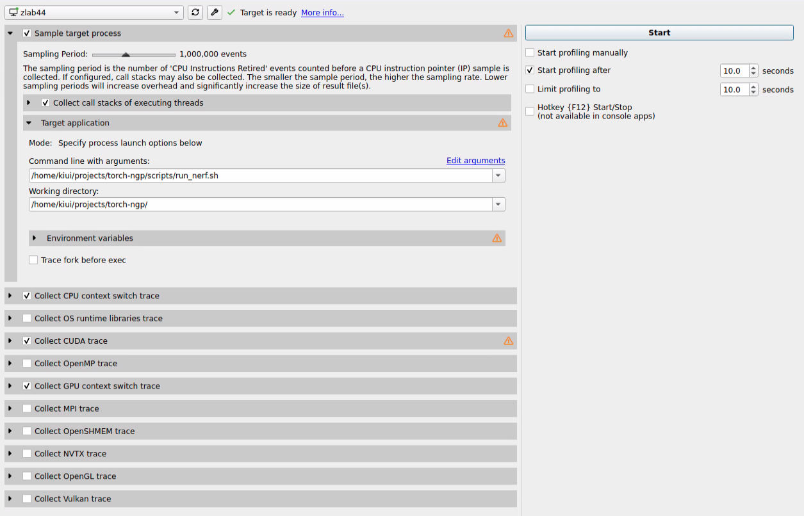
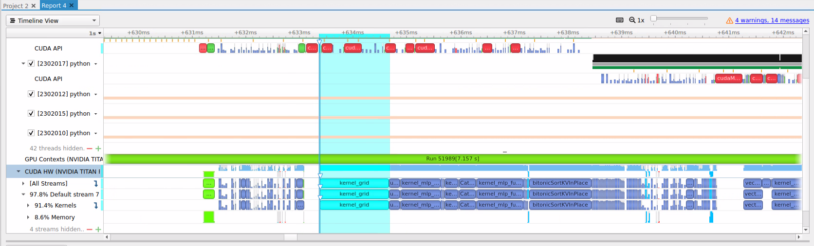

# nsight-sys

A CPU & CUDA profiler.

### install

Should be located in `/usr/local/cuda/bin/nsight-sys` if CUDA is successfully installed.

```bash
# check status
nsys status --environment

# if it shows any Fail, we should change paranoid level
Timestamp counter supported: Yes
Sampling Environment Check
Linux Kernel Paranoid Level = 4: OK
Linux Distribution = Ubuntu
Linux Kernel Version = 5.11.0-46-generic: OK
Linux perf_event_open syscall available: Fail
Sampling trigger event available: Fail
Intel(c) Last Branch Record support: Not Available
Sampling Environment: Fail

# set paranoid level to 2 or 1
sudo sh -c 'echo 1 >/proc/sys/kernel/perf_event_paranoid'
```


### Usage

Pretty simple, just start the GUI, choose new project, and enter the **command line** that starts your program.

Example usage:



Note:

* select `collect CUDA trace` to profile CUDA.
* select `start profiling after 10.0 secs`, because we run a training script and it needs to warm up. (else it will collect a lot of unneeded CPU instructions)

And after finishing (or manually stopping) the command, it generates a report:

* **Timeline View**: the most amazing part. DO CHECK THE WARNINGS!

  

* **Files**: where the `stdout` and `stderr` goes. Check here to make sure the command runs correctly.