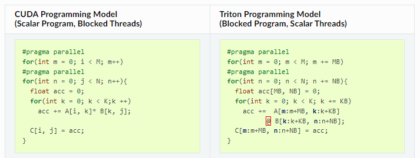

# Triton

###  install

Better to install from source since it is under active development:

```bash
git clone https://github.com/openai/triton.git
cd triton/python
pip install -e .
```


### Questions

* **how to debug, e.g., print from kernel?**

* **it seems triton's logic is not identical to CUDA, what's the difference? **

  Maybe a good answer:

  

  (This Single-Program-Multiple-Data model seems more convoluted than CUDA...)

* **Can I translate any CUDA implementation into triton?**

* **if possible, is triton's performance comparable to the CUDA implementation?**

  Yes, and can be better if carefully tuned, according to the matrix-multiplication exp. 

  But the improvement is not very significant...

* **How can I use triton?**

  For even better performance compared to CUDA?

  Since it is also hard to write efficient triton programs... this is not very practical.

  For example, I cannot think of a way to use triton to do raytracing/raymarching. It still requires blocked operation, but in this case each ray behaves differently, and cannot share in a block.

  

### basics

There is no built doc for `triton.language`, search it [here](https://github.com/openai/triton/blob/master/python/triton/language/core.py).

1D Vector add example:

```python
import torch
import triton
import triton.language as tl

# decorator to call the jit compiler
@triton.jit
def kernel_add(px, py, pz, # pointer to data
               N, # total element count
               B: tl.constexpr, # batch size, `tl.constexpr` means value should be determined before runtime.
              ):
    # 1D parallel (axis=0), launch B threads to process N elements in a strided way.
    pid = tl.program_id(0)
    # we are going to process x[pid * B : (pid + 1) * B], create the index offset.
    offsets = pid * B + tl.arange(0, B)
    # mask out-of-bound threads in case N % B != 0
    mask = offsets < N
    # load data
    x = tl.load(px + offsets, mask=mask)
    y = tl.load(py + offsets, mask=mask)    
    # calculate 
    z = x + y
    # write data
    tl.store(pz + offsets, z, mask=mask)
    
# function to wrap the kernel
def add(x, y):
    # x, y: [N]
    assert x.is_cuda and y.is_cuda
    z = torch.empty_like(x)
    N = x.shape[0]
    # how many kernels to launch to cover N elements (return a tuple)
    grid = lambda meta: (triton.cdiv(N, meta['B']),) # ceiling division, allocate enough blocks.
    kernel_add[grid](x, y, z, N, B=512)
    return z

# test
N = 10240
x = torch.rand(N, device='cuda')
y = torch.rand(N, device='cuda')
z0 = x + y
z1 = add(x, y)
print(torch.allclose(z0, z1))
```

Some differences from writing CUDA :

* We don't use `N_THREAD`, instead, we use `BLOCK_SIZE = N / N_THREAD`.


parallel-on-batch-dim example (softmax):

```python
import torch
import triton
import triton.language as tl

@triton.jit
def kernel_softmax(px, py, M, B: tl.constexpr):
    # parallel on N rows
    pid = tl.program_id(0)
    # allocate
    px = px + pid * M
    py = py + pid * M
    offsets = tl.arange(0, B)
    # mask (a little different, this mask happens for each thread)
    mask = offsets < M
    # load
    x = tl.load(px + offsets, mask=mask, other=-float('inf'))
    # calc
    x = x - tl.max(x, axis=0) # for numerical stability
    num = tl.exp(x)
    den = tl.sum(num, axis=0)
    y = num / den
    # write
    tl.store(py + offsets, y, mask=mask)

def softmax(x):
    # x: [N, M], perform row-wise softmax
    N, M = x.shape
    y = torch.empty_like(x)
    # block size must cover a full row
    B = triton.next_power_of_2(M)
    # launch N kernels (parallel per batch)
    kernel_softmax[(N,)](x, y, M, B=B)
    return y    

# test
x = torch.randn(10, 100, device='cuda')
y0 = torch.softmax(x, axis=1)
y1 = softmax(x)
assert torch.allclose(y0, y1), (y0, y1)

# benchmark
@triton.testing.perf_report(
    triton.testing.Benchmark(
        x_names=['M'],  # argument names to use as an x-axis for the plot
        x_vals=[
            128 * i for i in range(1, 100, 10)
        ],  # different possible values for `x_name`
        line_arg='provider',  # argument name whose value corresponds to a different line in the plot
        line_vals=[
            'triton',
            'torch-native',
        ],  # possible values for `line_arg``
        line_names=[
            "Triton",
            "Torch (native)",
        ],  # label name for the lines
        styles=[('blue', '-'), ('green', '-')],  # line styles
        ylabel="GB/s",  # label name for the y-axis
        plot_name="softmax-performance",  # name for the plot. Used also as a file name for saving the plot.
        args={'N': 4096},  # values for function arguments not in `x_names` and `y_name`
    )
)

def benchmark(N, M, provider):
    x = torch.randn(N, M, device='cuda', dtype=torch.float32)
    if provider == 'torch-native':
        ms, min_ms, max_ms = triton.testing.do_bench(lambda: torch.softmax(x, axis=1))
    if provider == 'triton':
        ms, min_ms, max_ms = triton.testing.do_bench(lambda: softmax(x))
    gbps = lambda ms: 2 * x.nelement() * x.element_size() * 1e-9 / (ms * 1e-3)
    return gbps(ms), gbps(max_ms), gbps(min_ms)

benchmark.run(show_plots=False, print_data=True)
```


> TODO: 

Matrix-multiplication example:

```python
import torch

import triton
import triton.language as tl

# %
# :code:`triton.jit`'ed functions can be auto-tuned by using the `triton.autotune`
# decorator, which consumes:
#   - A list of :code:`triton.Config` objects that define different configurations of
#       meta-parameters (e.g., BLOCK_SIZE_M) and compilation options (e.g., num_warps) to try
#   - An autotuning *key* whose change in values will trigger evaluation of all the
#       provided configs


@triton.autotune(
    configs=[
        triton.Config({'BLOCK_SIZE_M': 128, 'BLOCK_SIZE_N': 256, 'BLOCK_SIZE_K': 32, 'GROUP_SIZE_M': 8}, num_stages=3, num_warps=8),
        triton.Config({'BLOCK_SIZE_M': 256, 'BLOCK_SIZE_N': 128, 'BLOCK_SIZE_K': 32, 'GROUP_SIZE_M': 8}, num_stages=3, num_warps=8),
        triton.Config({'BLOCK_SIZE_M': 256, 'BLOCK_SIZE_N': 64, 'BLOCK_SIZE_K': 32, 'GROUP_SIZE_M': 8}, num_stages=4, num_warps=4),
        triton.Config({'BLOCK_SIZE_M': 64, 'BLOCK_SIZE_N': 256, 'BLOCK_SIZE_K': 32, 'GROUP_SIZE_M': 8}, num_stages=4, num_warps=4),
        triton.Config({'BLOCK_SIZE_M': 128, 'BLOCK_SIZE_N': 128, 'BLOCK_SIZE_K': 32, 'GROUP_SIZE_M': 8}, num_stages=4, num_warps=4),
        triton.Config({'BLOCK_SIZE_M': 128, 'BLOCK_SIZE_N': 64, 'BLOCK_SIZE_K': 32, 'GROUP_SIZE_M': 8}, num_stages=4, num_warps=4),
        triton.Config({'BLOCK_SIZE_M': 64, 'BLOCK_SIZE_N': 128, 'BLOCK_SIZE_K': 32, 'GROUP_SIZE_M': 8}, num_stages=4, num_warps=4),
        triton.Config({'BLOCK_SIZE_M': 128, 'BLOCK_SIZE_N': 32, 'BLOCK_SIZE_K': 32, 'GROUP_SIZE_M': 8}, num_stages=4, num_warps=4),
        triton.Config({'BLOCK_SIZE_M': 64, 'BLOCK_SIZE_N': 32, 'BLOCK_SIZE_K': 32, 'GROUP_SIZE_M': 8}, num_stages=5, num_warps=2),
        triton.Config({'BLOCK_SIZE_M': 32, 'BLOCK_SIZE_N': 64, 'BLOCK_SIZE_K': 32, 'GROUP_SIZE_M': 8}, num_stages=5, num_warps=2),
    ],
    key=['M', 'N', 'K'],
)
@triton.jit
def matmul_kernel(
    # Pointers to matrices
    a_ptr, b_ptr, c_ptr,
    # Matrix dimensions
    M, N, K,
    # The stride variables represent how much to increase the ptr by when moving by 1
    # element in a particular dimension. E.g. stride_am is how much to increase a_ptr
    # by to get the element one row down (A has M rows)
    stride_am, stride_ak,
    stride_bk, stride_bn,
    stride_cm, stride_cn,
    # Meta-parameters
    BLOCK_SIZE_M: tl.constexpr, BLOCK_SIZE_N: tl.constexpr, BLOCK_SIZE_K: tl.constexpr,
    GROUP_SIZE_M: tl.constexpr,
    ACTIVATION: tl.constexpr,
):
    """Kernel for computing the matmul C = A x B.
    A has shape (M, K), B has shape (K, N) and C has shape (M, N)
    """
    # -----------------------------------------------------------
    # Map program ids `pid` to the block of C it should compute.
    # This is done in a grouped ordering to promote L2 data reuse
    # See above `L2 Cache Optimizations` section for details
    pid = tl.program_id(axis=0)
    num_pid_m = tl.cdiv(M, BLOCK_SIZE_M)
    num_pid_n = tl.cdiv(N, BLOCK_SIZE_N)
    num_pid_in_group = GROUP_SIZE_M * num_pid_n
    group_id = pid // num_pid_in_group
    first_pid_m = group_id * GROUP_SIZE_M
    group_size_m = min(num_pid_m - first_pid_m, GROUP_SIZE_M)
    pid_m = first_pid_m + (pid % group_size_m)
    pid_n = (pid % num_pid_in_group) // group_size_m

    # ----------------------------------------------------------
    # Create pointers for the first blocks of A and B.
    # We will advance this pointer as we move in the K direction
    # and accumulate
    # a_ptrs is a block of [BLOCK_SIZE_M, BLOCK_SIZE_K] pointers
    # b_ptrs is a block of [BLOCK_SIZE_K, BLOCK_SIZE_n] pointers
    # see above `Pointer Arithmetics` section for details
    offs_am = pid_m * BLOCK_SIZE_M + tl.arange(0, BLOCK_SIZE_M)
    offs_bn = pid_n * BLOCK_SIZE_N + tl.arange(0, BLOCK_SIZE_N)
    offs_k = tl.arange(0, BLOCK_SIZE_K)
    a_ptrs = a_ptr + (offs_am[:, None] * stride_am + offs_k[None, :] * stride_ak)
    b_ptrs = b_ptr + (offs_k[:, None] * stride_bk + offs_bn[None, :] * stride_bn)

    # -----------------------------------------------------------
    # Iterate to compute a block of the C matrix
    # We accumulate into a `[BLOCK_SIZE_M, BLOCK_SIZE_N]` block
    # of fp32 values for higher accuracy.
    # `accumulator` will be converted back to fp16 after the loop
    accumulator = tl.zeros((BLOCK_SIZE_M, BLOCK_SIZE_N), dtype=tl.float32)
    for k in range(0, K, BLOCK_SIZE_K):
        # Note that for simplicity, we don't apply a mask here.
        # This means that if K is not a multiple of BLOCK_SIZE_K,
        # this will access out-of-bounds memory and produce an
        # error or (worse!) incorrect results.
        a = tl.load(a_ptrs)
        b = tl.load(b_ptrs)
        # We accumulate along the K dimension
        accumulator += tl.dot(a, b)
        # Advance the ptrs to the next K block
        a_ptrs += BLOCK_SIZE_K * stride_ak
        b_ptrs += BLOCK_SIZE_K * stride_bk
    # you can fuse arbitrary activation functions here
    # while the accumulator is still in FP32!
    if ACTIVATION:
        accumulator = ACTIVATION(accumulator)
    c = accumulator.to(tl.float16)

    # -----------------------------------------------------------
    # Write back the block of the output matrix C
    offs_cm = pid_m * BLOCK_SIZE_M + tl.arange(0, BLOCK_SIZE_M)
    offs_cn = pid_n * BLOCK_SIZE_N + tl.arange(0, BLOCK_SIZE_N)
    c_ptrs = c_ptr + stride_cm * offs_cm[:, None] + stride_cn * offs_cn[None, :]
    c_mask = (offs_cm[:, None] < M) & (offs_cn[None, :] < N)
    tl.store(c_ptrs, c, mask=c_mask)


# we can fuse `leaky_relu` by providing it as an `ACTIVATION` meta-parameter in `_matmul`
@triton.jit
def leaky_relu(x):
    return tl.where(x >= 0, x, 0.01 * x)


def matmul(a, b, activation=None):
    # checks constraints
    assert a.shape[1] == b.shape[0], "incompatible dimensions"
    assert a.is_contiguous(), "matrix A must be contiguous"
    assert b.is_contiguous(), "matrix B must be contiguous"
    M, K = a.shape
    K, N = b.shape
    assert (
        K % 32 == 0
    ), "We don't check memory-out-of-bounds with K so K must be divisible by BLOCK_SIZE_K"
    # allocates output
    c = torch.empty((M, N), device=a.device, dtype=a.dtype)
    # 1D launch kernel where each block gets its own program.
    grid = lambda META: (
        triton.cdiv(M, META['BLOCK_SIZE_M']) * triton.cdiv(N, META['BLOCK_SIZE_N']),
    )
    matmul_kernel[grid](
        a, b, c,
        M, N, K,
        a.stride(0), a.stride(1),
        b.stride(0), b.stride(1),
        c.stride(0), c.stride(1),
        ACTIVATION=activation,
    )
    return c


torch.manual_seed(0)
a = torch.randn((512, 512), device='cuda', dtype=torch.float16)
b = torch.randn((512, 512), device='cuda', dtype=torch.float16)
triton_output = matmul(a, b, activation=None)
torch_output = torch.matmul(a, b)
print(f"triton_output={triton_output}")
print(f"torch_output={torch_output}")
if triton.testing.allclose(triton_output, torch_output):
    print("✅ Triton and Torch match")
else:
    print("❌ Triton and Torch differ")


@triton.testing.perf_report(
    triton.testing.Benchmark(
        x_names=['M', 'N', 'K'],  # argument names to use as an x-axis for the plot
        x_vals=[
            128 * i for i in range(2, 33)
        ],  # different possible values for `x_name`
        line_arg='provider',  # argument name whose value corresponds to a different line in the plot
        # possible values for `line_arg``
        line_vals=['cublas', 'cublas + relu', 'triton', 'triton + relu'],
        # label name for the lines
        line_names=["cuBLAS", "cuBLAS (+ torch.nn.LeakyReLU)", "Triton", "Triton (+ LeakyReLU)"],
        # line styles
        styles=[('green', '-'), ('green', '--'), ('blue', '-'), ('blue', '--')],
        ylabel="TFLOPS",  # label name for the y-axis
        plot_name="matmul-performance",  # name for the plot. Used also as a file name for saving the plot.
        args={},
    )
)

def benchmark(M, N, K, provider):
    a = torch.randn((M, K), device='cuda', dtype=torch.float16)
    b = torch.randn((K, N), device='cuda', dtype=torch.float16)
    if provider == 'cublas':
        ms, min_ms, max_ms = triton.testing.do_bench(lambda: torch.matmul(a, b))
    if provider == 'triton':
        ms, min_ms, max_ms = triton.testing.do_bench(lambda: matmul(a, b))
    if provider == 'cublas + relu':
        torch_relu = torch.nn.ReLU(inplace=True)
        ms, min_ms, max_ms = triton.testing.do_bench(
            lambda: torch_relu(torch.matmul(a, b))
        )
    if provider == 'triton + relu':
        ms, min_ms, max_ms = triton.testing.do_bench(
            lambda: matmul(a, b, activation=leaky_relu)
        )
    perf = lambda ms: 2 * M * N * K * 1e-12 / (ms * 1e-3)
    return perf(ms), perf(max_ms), perf(min_ms)

benchmark.run(show_plots=True, print_data=True)
```

