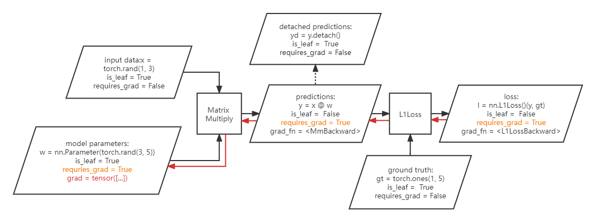
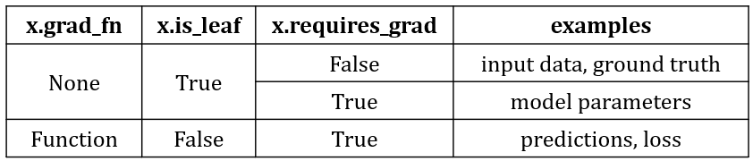

# autodiff


### Concepts






* `x.is_leaf`

  whether tensor `x` is a leaf node, i.e., `x.grad_fn == None` (is not created via a `Function` operation / is the leaf nodes in the DAG).

  In specific, `is_leaf == True` includes the following conditions:

  * `requires_grad == False` (e.g., the input data, the ground truth)
  * `requires_grad == True and grad_fn == None` (e.g., the trainable parameters)

  therefore, non-leaf tensors are any outputs of `Function` that `requires_grad == True`. (e.g., predictions, loss). 

  > non-leaf tensors must have `requires_grad = True`, if you want to change it, an error will be reported:
  >
  > ```python
  > x = torch.rand(1, 3)
  > y = nn.Linear(3, 5)(x)
  > y.requires_grad = False
  > # RuntimeError: you can only change requires_grad flags of leaf variables. If you want to use a computed variable in a subgraph that doesn't require differentiation use var_no_grad = var.detach().
  > ```

  

* `x.requires_grad`

  whether tensor `x` requires grad, which affects:

  * In `forward()`, a `Function` is only recored in the DAG if at least one of its inputs has `requires_grad == True`
  * In `backward()`, only tensors with `is_leaf == True and requires_grad == True` will get `grad`.

  default to `False`, unless set explicitly, or wrapped in `nn.Parameter`.

  it is just a boolean flag, so setting it is not a `Function`.

  ```python
  # set at intialization
  x = torch.rand(3, requires_grad=True)
  
  # both following method just change the flag in-place.
  x.requires_grad = True
  x.requires_grad_(True) # also return the tensor itself.
  
  # nn.Parameter (which is used inside nn.Module) automatically requires grad.
  x = nn.Parameter(torch.rand(3))
  # is_leaf: True, requires_grad: True, grad_fn: None, grad: None
  x = nn.Linear(3, 5).weight
  # is_leaf: True, requires_grad: True, grad_fn: None, grad: None
  ```

  

* `x.grad_fn`

  the `torch.autograd.Function` (operation) that creates `x`.

  this is the place where the **computation DAG** is saved (i.e., saves all the inputs, and the exact operator used to compute `x`)

  

* `x.backward()`

  calculate gradients through the DAG. 

  only non-leaf tensors (`grad_fn != None`) can call `backward()`, else an error will be reported:

  ```python
  RuntimeError: element 0 of tensors does not require grad and does not have a grad_fn
  ```

  

* `x.grad`

  the accumulated / populated gradients, default to `None`.

  only tensor with `is_leaf == True and requires_grad == True` will get its `grad` after a later `backward()`.

  if you access the `grad` of a non-leaf tensor, a warning will be reported:

  ```
  UserWarning: The .grad attribute of a Tensor that is not a leaf Tensor is being accessed. Its .grad attribute won't be populated during autograd.backward(). If you indeed want the gradient for a non-leaf Tensor, use .retain_grad() on the non-leaf Tensor. If you access the non-leaf Tensor by mistake, make sure you access the leaf Tensor instead. See github.com/pytorch/pytorch/pull/30531 for more informations.
  ```


* `x.detach()`

  create a new tensor (but not copy data) from `x`, and set `requires_grad = False`. (which also means `is_leaf == True`).
  note that `x.clone()` will copy data but remains the gradient to the original tensor (thus `is_leaf == False`).


* `with torch.no_grad():`

  temporarily disable all DAG recording (and thus cannot call `backward()`), i.e., behave as if no inputs requires grad. 

  it can also work as a  decorator:

  ```python
  @torch.no_grad()
  def func(x):
  	...
  ```

  `torch.enable_grad()` can be used inside `torch.no_grad()` block, to re-enable gradient calculation.

  

* `nn.Module.eval()`

  not to be confused with `no_grad()`, it just sets the correct behavior for special modules like `BatchNorm` and `Dropout`.

  the correct way to perform inference is always using both `no_grad()` and `eval()`:

  ```python
  model.eval()
  with torch.no_grad():
      y = model(x)
  ```

  

* `with torch.set_grad_enabled(True/False):`

  similar to `with torch.no_grad()/enable_grad():`.


* `x.retain_grad()`

  `x` must be a non-leaf tensor to call this before `backward()`, so `x` will keep its `grad` (as the leaf tensors that requires grad).

  the state can be checked by `x.retains_grad`, which is a boolean flag.


* `torch.autograd.grad(outputs, inputs, grad_outputs=None, retain_graph=None, create_graph=False)`

  a way to manually compute and get the gradients.

  * outputs: tensor, usually a scalar such as the loss.
  * inputs: tensor, used to calculate $\frac{d~\text{outputs}}{d~\text{inputs}}$.
  * grad_outputs: $d~\text{outputs}$, should be the same shape as outputs, if left `None`, will use all ones.
  * create_graph: whether keep the DAG so higher order derivitives can be calculated.
  * retrain_graph: default to create_graph, do not free the DAG.

  example use in SDF to calculate normals:

  ```python
  with torch.set_grad_enabled(True):
      input.requires_grad_(True)
      sigma = self.backbone(input)
      normal = - torch.autograd.grad(torch.sum(sigma), input, create_graph=True)[0] # [B, N, 3]
      return sigma, normal
  ```


Full Examples:

```python
import torch
import torch.nn as nn

def check(x):
    print(f'is_leaf: {x.is_leaf}, requires_grad: {x.requires_grad}, grad_fn: {x.grad_fn}, grad: {x.grad}')

#####################
### simple operations
    
x = torch.rand(3)
check(x)
# is_leaf: True, requires_grad: False, grad_fn: None, grad: None

x = torch.rand(3, requires_grad=True)
check(x)
# is_leaf: True, requires_grad: True, grad_fn: None, grad: None

x = torch.rand(3, requires_grad=True) + 1
check(x)
# is_leaf: False, requires_grad: True, grad_fn: <AddBackward0 object at 0x7f7df1added0>, grad: None
# note: + is a Function. therefore, it leaves a CopyBackwards grad_fn, and makes x non-leaf.

x = torch.rand(3, requires_grad=True).cuda()
check(x)
# is_leaf: False, requires_grad: True, grad_fn: <CopyBackwards object at 0x7f7e2efe90d0>, grad: None
# note: cuda() is also a Function! 

x = torch.rand(3) + 1
check(x)
# is_leaf: True, requires_grad: False, grad_fn: None, grad: None
# note: if x doesn't require grad, the Function that operates on it will not be recorded, and the output is still a leaf.

x = torch.rand(3).cuda()
check(x)
# is_leaf: True, requires_grad: False, grad_fn: None, grad: None

##############
### nn.Module

x = torch.rand(3, requires_grad=True, device='cuda')
check(x)
# cuda:0, is_leaf: True, requires_grad: True, grad_fn: None, grad: None

lin = nn.Linear(3, 5)
check(lin.weight)
# is_leaf: True, requires_grad: True, grad_fn: None, grad: None
# note: nn.Module's parameters are wrapped by nn.Parameter, so it is leaf and requires grad.

x = torch.rand(1, 3)
y = lin(x)
check(y)
# is_leaf: False, requires_grad: True, grad_fn: <AddmmBackward object at 0x7f7e4004c9d0>, grad: None

gt = torch.rand(1, 5)
l = nn.L1Loss(y, gt)
check(l)
# is_leaf: False, requires_grad: True, grad_fn: <L1LossBackward object at 0x7f7e40021c90>, grad: None

l.backward()
check(lin.weight)
# is_leaf: True, requires_grad: True, grad_fn: None, grad: tensor([...])
# note: other tensors (x, y, l, gt) will still have grad == None.
```