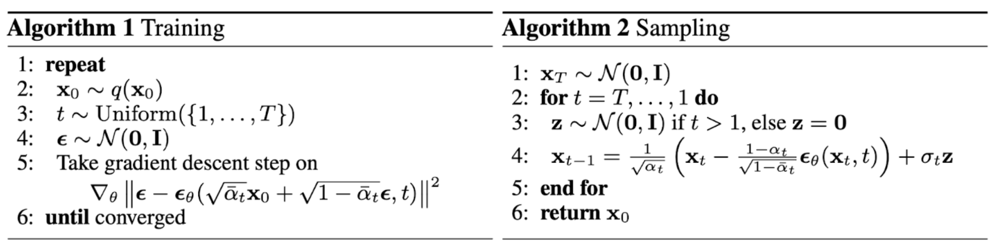

# Diffusion models

### The forward pass (image to noise)

The forward process can be described with a sequence of gaussian distributions:

$$
q(x_t|x_{t-1})=\mathcal N(x_t; \sqrt{1 - \beta_t}x_{t-1}, \beta_tI)
$$

Assume $$\beta_t$$ is the weight for gaussian noise (variance) at step $$t$$, and $$\alpha_t = 1 - \beta_t,~ \bar\alpha_t= \prod_{i=1}^t\alpha_i$$.

The forward step gradually adds **a sequence of gaussian noise** $\{\epsilon_t\} \sim \mathcal N(0, I)$ to the **real image** $x_0$, so the corrupted image at step $t$ is:

$$
\begin{aligned}
x_t &= \sqrt{\alpha_t}x_{t-1}+ \sqrt{1-\alpha_t}\epsilon_{1} \\
&= \sqrt{\alpha_t}(\sqrt{\alpha_{t-1}}x_{t-2}+ \sqrt{1-\alpha_{t-1}}\epsilon_{2})+ \sqrt{1-\alpha_t}\epsilon_{1}  \\
&= \sqrt{\alpha_t\alpha_{t-1}}x_{t-2}+\sqrt{\alpha_t(1-\alpha_{t-1})}\epsilon_{2}+ \sqrt{1-\alpha_t}\epsilon_{1}  \\
&= \sqrt{\alpha_t\alpha_{t-1}}x_{t-2}+\sqrt{1-\alpha_t\alpha_{t-1}} \epsilon_{2}  \\
&= \cdots \\
&= \sqrt{\bar \alpha_{t}}x_{0}+\sqrt{1-\bar \alpha_{t}} \epsilon_{t} \\
\end{aligned}
$$

Note that two independent gaussian noise $\epsilon_{1}, \epsilon_{2}$ can be merged into one: 

$$
\mathcal N(0, {\alpha_t(1-\alpha_{t-1})})+\mathcal N(0, {1-\alpha_{t}}) \rightarrow \mathcal N(0, {1-\alpha_t\alpha_{t-1}})
$$

**This means we can express any $x_t$ with $x_0$, $\{\beta_1, \beta_2, \cdots, \beta_t\}$, and a random noise $\epsilon_{t}$.**

### The backward pass (noise to image)

Given $$x_{t}$$, we want to get $$x_{t-1}$$, and eventually restore the real image $x_0$.

**It's proven that if $\beta_t$ is small enough, the backward process is also a sequence of gaussian.**

$$
q(x_{t-1}|x_t) = \mathcal N(x_{t-1}; \tilde\mu_t(x_t, t), \tilde\beta_tI)
$$

which gives the denoising step with **another sequence of gaussian noise** $\{z_t\} \sim \mathcal N(0, I)$:

$$
x_{t-1} = \tilde\mu_t(x_t, t)+\tilde \beta_t z_t
$$

Through some math we could get:

$$
\tilde\beta_t = \frac {1 - \bar \alpha_{t-1}} {1 - \bar \alpha_{t}} \beta_t\\
\tilde\mu_t(x_t, t)=\frac {1} {\sqrt{\alpha_t}} (x_t-\frac{1-\alpha_t}{\sqrt{1-\bar \alpha_t}}\epsilon_t)
$$

Note that here **$\epsilon_t$ is the exact noise added in the forward step!**

And **all we need is a neural network that predicts this noise $\epsilon_t$ given $x_t(x_0, t) = \sqrt{\bar \alpha_{t}}x_{0}+\sqrt{1-\bar \alpha_{t}}\epsilon_t$**.

Assume the predicted noise is $\epsilon_\theta$, we need to minimize the following loss:

$$
\mathcal L=\mathbb E_{t,x_0,\epsilon_t}||\epsilon_t -\epsilon_\theta(x_0, t)||^2
$$

The neural network is usually an **U-Net with attention** since we need same-size output as input.

### DDPM (Denoising Diffusion Probabilistic Model)

DDPM exactly describes the above idea.

Note that DDPM use $\tilde \beta_t = \beta_t$ as an approximation.

### DDIM (Denoising Diffusion Implicit Model)

DDIM use a different formula for the backward step:

$$
\begin{aligned}
x_{t-1} &= \sqrt{\bar \alpha_{t-1}}x_{0}+\sqrt{1-\bar \alpha_{t-1}} \epsilon_{t-1} \\
&= \sqrt{\bar \alpha_{t-1}}x_{0}+\sqrt{1-\bar \alpha_{t-1} -\sigma_t^2} \epsilon_{t} +\sigma_t z_t \\
&= \sqrt{\bar \alpha_{t-1}}x_{0}+\sqrt{1-\bar \alpha_{t-1} -\sigma_t^2} \frac {x_t-\sqrt{\alpha_t}x_0}{\sqrt{1-\alpha_t}} +\sigma_t z_t \\
\end{aligned}
$$

According to $x_{t-1} = \tilde\mu_t(x_t, t)+\tilde \beta_t z_t$, we have

$$
\tilde\mu_t(x_t, t)=\sqrt{\bar \alpha_{t-1}}x_{0}+\sqrt{1-\bar \alpha_{t-1} -\sigma_t^2} \frac {x_t-\sqrt{\alpha_t}x_0}{\sqrt{1-\alpha_t}} \\
\tilde\beta_t = \sigma_t^2= \frac {1 - \bar \alpha_{t-1}} {1 - \bar \alpha_{t}} \beta_t
$$

Another hyper-parameter $\eta \ge  0$ is introduced as $\eta \tilde \beta_t = \sigma_t^2$.

DDPM usually requires $T=1000$ steps for both training and inference ($S = T = 1000$), which makes generation (inference) too slow.

To speed up inference, DDIM use strided sampling where $S <T$, and shows when $\eta = 0$, $S=50\sim100$ steps are enough to generate good images.

### LDM (Latent Diffusion Model)

Instead of diffusing in the pixel space, LDM first use a VQVAE to compress the image space (e.g., 512x512x3) into a latent space (e.g., 64x64x4).

This greatly reduces the computation cost for both training and testing.

### Conditioned Generation

Assume we want to condition the generation to an input $y$ which may be class labels or **text**.

#### Classifier-Guided Diffusion

A pretrained classifier is required, not flexible.

#### Classifier-Free Guidance

Train **both conditioned denoiser $\epsilon_\theta(x_0, t)$ and unconditioned denoiser $\epsilon_\theta(x_0, t, y)$** in the same neural network together.

The final denoiser is simply a weighted combination of these two terms:

$$
\begin{aligned}
\bar\epsilon_\theta(x_0, t, y) &= \epsilon_\theta(x_0, t, y) + w(\epsilon_\theta(x_0, t, y) - \epsilon_\theta(x_0, t)) \\
&=(w+1)\epsilon_\theta(x_0, t, y) - w\epsilon_\theta(x_0, t)
\end{aligned}
$$

where a larger $w$ leads to stronger class guidance.

