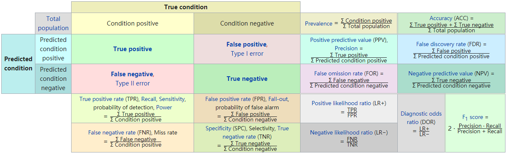

# ROC & AUC

A metric traditionally used for binary classification task.


### sklearn API

```python
from sklearn import metrics

# one step
auc = metrics.roc_auc_score(truth, pred)

# two steps
fpr, tpr, thresholds = metrics.roc_curve(truth, pred)
auc = metrics.auc(fpr, tpr)
```


### Great Illustration




### Receiver Operation Curve

A graphic plot metric for binary classifier. 

$$
TPR = \frac{TP}{P}=\frac {TP}{TP+FN} \\ 

FPR = \frac{FP}{N}=\frac {FP}{FP+TN} \\
$$

In binary classification, the prediction is usually a continuous variable. 

We need a threshold $T$ to determine whether the prediction is positive or negative.

ROC curve plots parametrically $TPR(T)$ vs. $FPR(T)$.


### Area Under the Curve

Use $TPR$ as y axis and $FPR$ as x axis.


### Self Implementations

```python
# naive thresholding (lot of duplicates)
def get_auc(truth, pred):
	truth = np.array(truth)
    pred = np.array(pred)
    def get_tpr_fpr(truth, pred, thresh):
    	pred = (pred >= thresh).astype(np.int)
        tp = np.logical_and(truth == 1, pred == 1).sum()
        tn = np.logical_and(truth == 0, pred == 0).sum()
        fn = np.logical_and(truth == 1, pred == 0).sum()
        fp = np.logical_and(truth == 0, pred == 1).sum()
        tpr = tp / (tp + fn)
        fpr = fp / (fp + tn)
        return tpr, fpr
    # get tprs, fprs
    tprs = []
    fprs = []
    threshs = []
    for thresh in np.arange(1, -0.01, -0.01): # descending, so we get [0,0] to [1,1]
    	tpr, fpr = get_tpr_fpr(truth, pred, thresh)
        tprs.append(tpr)
        fprs.append(fpr)
        threshs.append(thresh)
    # area
    area = 0
    for i in range(1, len(tprs)):
    	area += (tprs[i]+tprs[i-1])*(fprs[i]-fprs[i-1])/2
    return area

# we can simply use pred as thresholds!
def get_auc(truth, pred):
	truth = np.array(truth)
    pred = np.array(pred)
    def get_tpr_fpr(truth, pred, thresh):
    	pred = (pred >= thresh).astype(np.int)
        tp = np.logical_and(truth == 1, pred == 1).sum()
        tn = np.logical_and(truth == 0, pred == 0).sum()
        fn = np.logical_and(truth == 1, pred == 0).sum()
        fp = np.logical_and(truth == 0, pred == 1).sum()
        tpr = tp / (tp + fn)
        fpr = fp / (fp + tn)
        return tpr, fpr
    # get tprs, fprs
    idx = np.argsort(pred)[::-1] # descending threshs
    pred = pred[idx]
    truth = truth[idx]
    threshs = np.insert(pred, 0, pred[0]+1) # insert a large thresh at beginning to get [0,0]
    tprs = [0]
    fprs = [0]
    for thresh in pred:
    	tpr, fpr = get_tpr_fpr(truth, pred, thresh)
        tprs.append(tpr)
        fprs.append(fpr)
    # area
    area = 0
    for i in range(1, len(tprs)):
    	area += (tprs[i]+tprs[i-1])*(fprs[i]-fprs[i-1])/2
    return area

# amazing cumsum
def get_auc_final(truth, pred):
	truth = np.array(truth)
    pred = np.array(pred)

    # get tprs, fprs
    idx = np.argsort(pred)[::-1]
    pred = pred[idx]
    truth = truth[idx]

    tprs = np.cumsum(truth)
    fprs = np.cumsum(1 - truth)
    
    tprs = tprs / tprs[-1] # get rate
    fprs = fprs / fprs[-1]
    
    tprs = np.insert(tprs, 0, 0)
    fprs = np.insert(fprs, 0, 0)
    threshs = np.insert(pred, 0, pred[0]+1)
    # area
    area = 0
    for i in range(1, len(tprs)):
    	area += (tprs[i]+tprs[i-1])*(fprs[i]-fprs[i-1])/2
    return area
```

