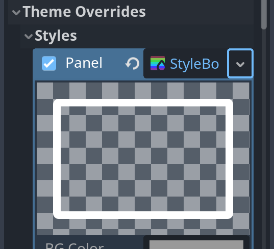
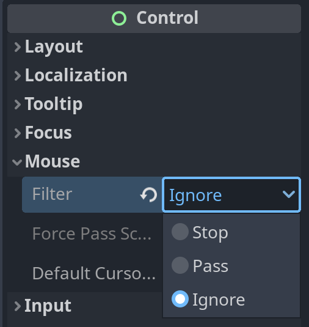

# Pitfalls & Tricks

### Panel

`Panel` is used to represent a box-like UI, e.g.

* background panel for other UI elements.
* a round-corner boundary, to show "highlight" effect.

To change the look, we need to create a new `StyleBox` inside `Inspector > Theme Overrides > Styles > Panel`




### Mouse_entered/exited

Note that `mouse_exited` will be triggered if the mouse enter a child `Control/CollisionObject2D` element!

To avoid this, we need to set `mouse filter` in Inspector:



* Stop (default): not applying filter, i.e., it will trigger mouse signals normally.

* Ignore: ignore all mouse signals.

  

### VisibleOnScreenNotifier2D

```python
signal screen_exited()
```

Useful to delete objects out of screen.

```python
# node tree
Area2D
⊢-> VisibleOnScreenNotifier2D 

# connect screen_exited to Area2D and impl:
func _on_visible_on_screen_notifier_2d_screen_exited():
	queue_free()
```


### Different Resolutions

The base size can be set in `Project Settings --> Display --> Window --> Size`

For high-resolution non-pixel desktop games, we can start from base size of 3840 x 2160 (4K).

If you are developing with a smaller monitor, change `Window Width/Height Override` (need to check **advanced settings**) to a smaller size (like 1920x1080), so the debugging window won't go beyond your monitor.

Then we need to allow resize (keep aspect ratio) the window by setting:

* Stretch mode = canvas_items
* Stretch aspect = expand

Now your window start from 1920x1280 but renders high quality images and automatically downscale them!

Correctly get window size:

```python
var window = get_window()
# actual size of current window
print(window.size) # e.g., 1920x1080
# size before scaling
print(window.content_scale_size) # 3820x2160
```


### Steps for a new project

* Configure viewport resolution in `Project settings --> Display --> Window --> Size` .
* Configure main scene in `Project settings --> Application --> Run`.

