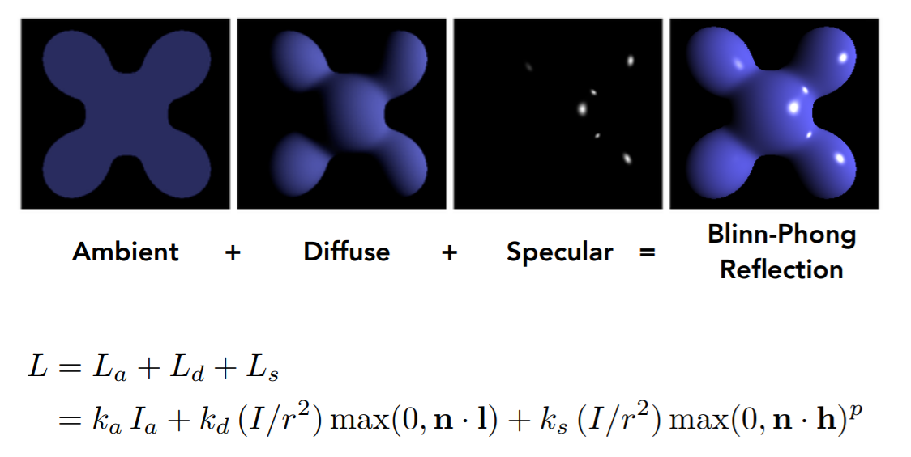
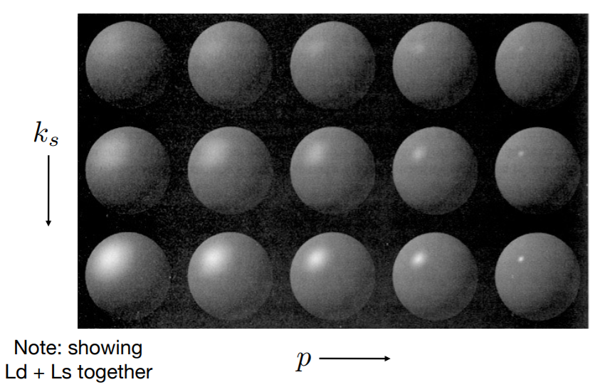
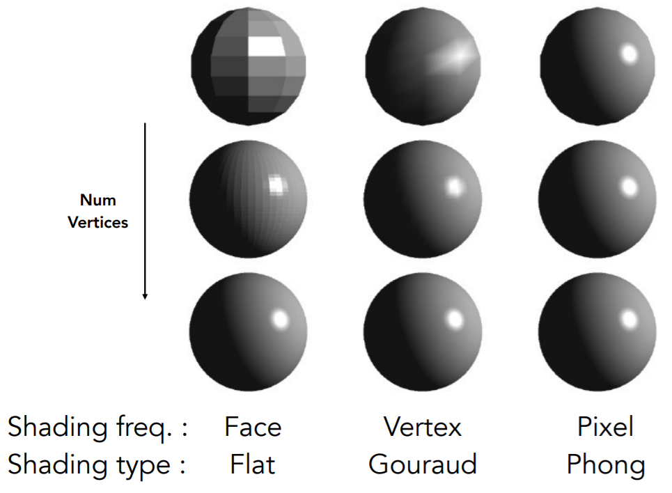
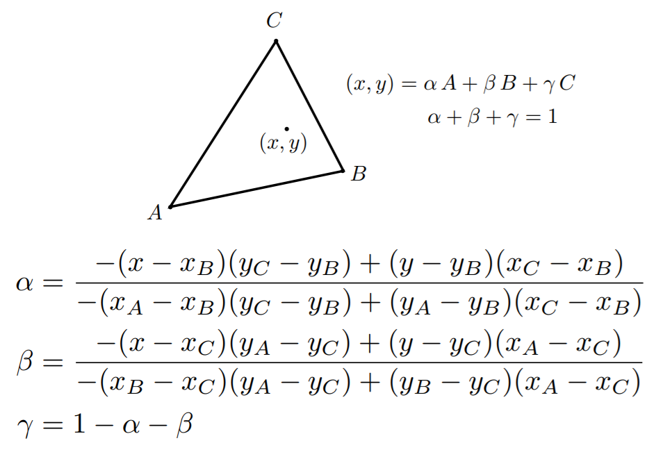
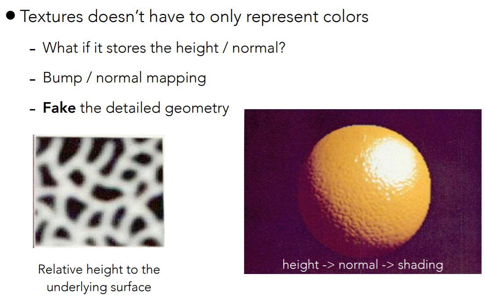

# Shading


### Blinn-Phong reflectance model




##### Ambient Term

Not depend on anything. Just a constant environment light.

$$
\displaylines{
L_a = k_aI_a
}
$$


##### Diffuse Term (Lambertian) 

depend on light direction, independent of view direction.

$$
\displaylines{
L_d = k_d\frac I {r^2} \max(0, \mathbf n\cdot \mathbf l)
}
$$

where $k_d$ is a coefficient, $\frac I {r^2}$ is the energy received at radius $r$. $\mathbf n\cdot \mathbf l = \cos \alpha$ (assume unit vector.)


##### Specular Term (Blinn-Phong, the highlight)

depends on both light direction and view direction.

Brighter near Mirror reflection direction (defined as $r$)

$$
\displaylines{
\mathbf h = \frac {\mathbf v + \mathbf l} {||\mathbf v + \mathbf l||} \\
L_s = k_s \frac I {r^2} \max(0, \mathbf n\cdot \mathbf h)^p
}
$$

where $p$ is a coefficient to control the highlight's area (the larger $p$, the smaller highlight region).

note we have $2<n, h> = <v, r>$.


```c++
// example of blinn-phong shading with texture mapping.
Eigen::Vector3f texture_fragment_shader(const fragment_shader_payload& payload)
{

    Eigen::Vector3f texture_color = payload.texture->getColor(payload.tex_coords(0), payload.tex_coords(1));
	
    // coefficients
    Eigen::Vector3f ka = Eigen::Vector3f(0.005, 0.005, 0.005);
    Eigen::Vector3f kd = texture_color / 255.f;
    Eigen::Vector3f ks = Eigen::Vector3f(0.7937, 0.7937, 0.7937);
    
    // view direction
    Eigen::Vector3f eye_pos{0, 0, 10};
    
    // ambient intensity
    Eigen::Vector3f amb_light_intensity{10, 10, 10};
	
    // light source position and intensity
    auto l1 = light{{30, 50, 20}, {500, 500, 500}};
    auto l2 = light{{-30, 50, 0}, {500, 500, 500}};
    std::vector<light> lights = {l1, l2};
    
	// specular order
    float p = 150;
	
    // shading point's coordinate and normal.
    Eigen::Vector3f point = payload.view_pos;
    Eigen::Vector3f normal = payload.normal;
	
    // output color
    Eigen::Vector3f result_color = {0, 0, 0};

    for (auto& light : lights)
    {
        float r = (point - light.position).norm();
        Eigen::Vector3f l = (light.position - point).normalized();
        Eigen::Vector3f v = (eye_pos - point).normalized();
        Eigen::Vector3f h = (v + l).normalized();

        Eigen::Vector3f ambient = ka.cwiseProduct(amb_light_intensity);
        Eigen::Vector3f diffuse = kd.cwiseProduct(light.intensity / (r * r)) * std::max(.0f, (float)normal.dot(l));
        Eigen::Vector3f specular = ks.cwiseProduct(light.intensity / (r * r)) * powf(std::max(.0f, (float)normal.dot(h)), p);

        result_color += ambient + diffuse + specular;
    }

    return result_color * 255.f;
}
```





### Shading Frequency



##### Flat shading: Each Triangle

Direct shade each triangle. Not smooth.

##### Gouraud Shading: Each Vertex

DEF: **vertex normal** is defined as the average of surrounding face normals.

* compute vertex normals.
* compute color for each vertex.
* interpolate **color** for each pixel inside each triangle.

##### Phong Shading: Each Pixel

* compute vertex normals.
* interpolate **normals** for each pixel inside each triangle.
* compute color for each pixel.


##### Barycentric Interpolation

Interpolate by area. suppose $X = (x, y)$:

$$
\displaylines{
\alpha = \frac {S_{XBC}} {S_{ABC}}\\
\beta = \frac {S_{XAC}} {S_{ABC}} \\
\gamma = \frac {S_{XAB}} {S_{ABC}}
}
$$

A practical version:



Properties:

* $(x,y)$ is inside $\Delta ABC$ if and only if $\alpha, \beta, \gamma$ are all non-negative.


### Texture Mapping

Each triangle copies a piece of texture image (2d, uv-space) to the surface (3d).

* Compute UV coordinate for each vertex.
* Interpolate UV coordinate for each pixel. (barycentric)
* Interpolate color at UV, and assign it to the pixel. (nearest, bilinear, bicubic)


##### Texture can affect shading: (bump / displacement shading)




```c++
// example code of bump & displacement shading.

Eigen::Vector3f bump_fragment_shader(const fragment_shader_payload& payload)
{
    
    Eigen::Vector3f ka = Eigen::Vector3f(0.005, 0.005, 0.005);
    Eigen::Vector3f kd = payload.color;
    Eigen::Vector3f ks = Eigen::Vector3f(0.7937, 0.7937, 0.7937);

    auto l1 = light{{30, 50, 20}, {500, 500, 500}};
    auto l2 = light{{-30, 50, 0}, {500, 500, 500}};

    std::vector<light> lights = {l1, l2};
    Eigen::Vector3f amb_light_intensity{10, 10, 10};
    Eigen::Vector3f eye_pos{0, 0, 10};

    float p = 150;

    Eigen::Vector3f color = payload.color; 
    Eigen::Vector3f point = payload.view_pos;
    Eigen::Vector3f normal = payload.normal;


    float kh = 0.2, kn = 0.1;

    Eigen::Vector3f t;
    t << normal(0) * normal(1) / sqrtf(normal(0) * normal(0) + normal(2) * normal(2)),
         sqrtf(normal(0) * normal(0) + normal(2) * normal(2)),
         normal(1) * normal(2) / sqrtf(normal(0) * normal(0) + normal(2) * normal(2));
    Eigen::Vector3f b = normal.cross(t);
    Eigen::Matrix3f tbn;
    tbn << t(0), b(0), normal(0),
           t(1), b(1), normal(1),
           t(2), b(2), normal(2);

    auto color_uv = payload.texture->getColor(payload.tex_coords(0), payload.tex_coords(1));
    auto color_uuv = payload.texture->getColor(payload.tex_coords(0) + 1.0f / payload.texture->width, payload.tex_coords(1));
    auto color_uvv = payload.texture->getColor(payload.tex_coords(0), payload.tex_coords(1) + 1.0f / payload.texture->height);
    
    float du = kh * kn * (color_uuv.norm() - color_uv.norm());
    float dv = kh * kn * (color_uvv.norm() - color_uv.norm());

    Eigen::Vector3f ln;
    ln << -du, -dv, 1;

    normal = (tbn * ln).normalized();

    Eigen::Vector3f result_color = {0, 0, 0};
    result_color = normal;

    return result_color * 255.f;
}


Eigen::Vector3f displacement_fragment_shader(const fragment_shader_payload& payload)
{
    
    Eigen::Vector3f ka = Eigen::Vector3f(0.005, 0.005, 0.005);
    Eigen::Vector3f kd = payload.color;
    Eigen::Vector3f ks = Eigen::Vector3f(0.7937, 0.7937, 0.7937);

    auto l1 = light{{30, 50, 20}, {500, 500, 500}};
    auto l2 = light{{-30, 50, 0}, {500, 500, 500}};

    std::vector<light> lights = {l1, l2};
    Eigen::Vector3f amb_light_intensity{10, 10, 10};
    Eigen::Vector3f eye_pos{0, 0, 10};

    float p = 150;

    Eigen::Vector3f color = payload.color; 
    Eigen::Vector3f point = payload.view_pos;
    Eigen::Vector3f normal = payload.normal;

    float kh = 0.2, kn = 0.1;

    Eigen::Vector3f t;
    t << normal(0) * normal(1) / sqrtf(normal(0) * normal(0) + normal(2) * normal(2)),
         sqrtf(normal(0) * normal(0) + normal(2) * normal(2)),
         normal(1) * normal(2) / sqrtf(normal(0) * normal(0) + normal(2) * normal(2));
    Eigen::Vector3f b = normal.cross(t);
    Eigen::Matrix3f tbn;
    tbn << t(0), b(0), normal(0),
           t(1), b(1), normal(1),
           t(2), b(2), normal(2);

    auto color_uv = payload.texture->getColor(payload.tex_coords(0), payload.tex_coords(1));
    auto color_uuv = payload.texture->getColor(payload.tex_coords(0) + 1.0f / payload.texture->width, payload.tex_coords(1));
    auto color_uvv = payload.texture->getColor(payload.tex_coords(0), payload.tex_coords(1) + 1.0f / payload.texture->height);
    
    float du = kh * kn * (color_uuv.norm() - color_uv.norm());
    float dv = kh * kn * (color_uvv.norm() - color_uv.norm());

    Eigen::Vector3f ln;
    ln << -du, -dv, 1;

    normal = (tbn * ln).normalized();

    Eigen::Vector3f result_color = {0, 0, 0};

    for (auto& light : lights)
    {
        float r = (point - light.position).norm();
        Eigen::Vector3f l = (light.position - point).normalized();
        Eigen::Vector3f v = (eye_pos - point).normalized();
        Eigen::Vector3f h = (v + l).normalized();

        Eigen::Vector3f ambient = ka.cwiseProduct(amb_light_intensity);
        Eigen::Vector3f diffuse = kd.cwiseProduct(light.intensity / (r * r)) * std::max(.0f, (float)normal.dot(l));
        Eigen::Vector3f specular = ks.cwiseProduct(light.intensity / (r * r)) * powf(std::max(.0f, (float)normal.dot(h)), p);

        result_color += ambient + diffuse + specular;

    }

    return result_color * 255.f;
}

```

