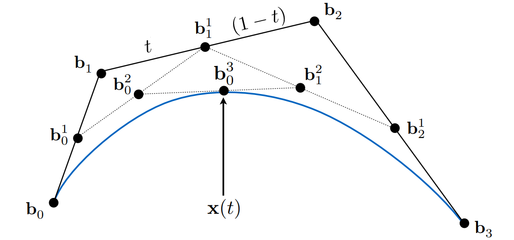
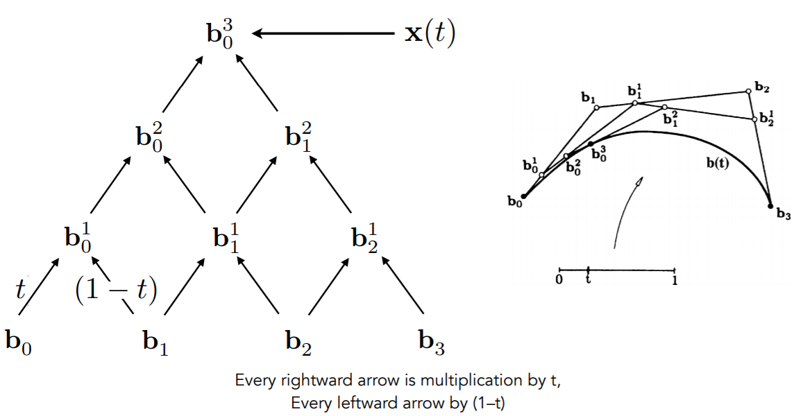
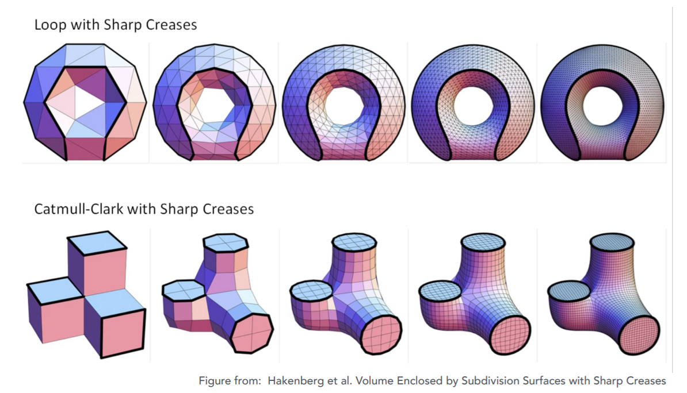
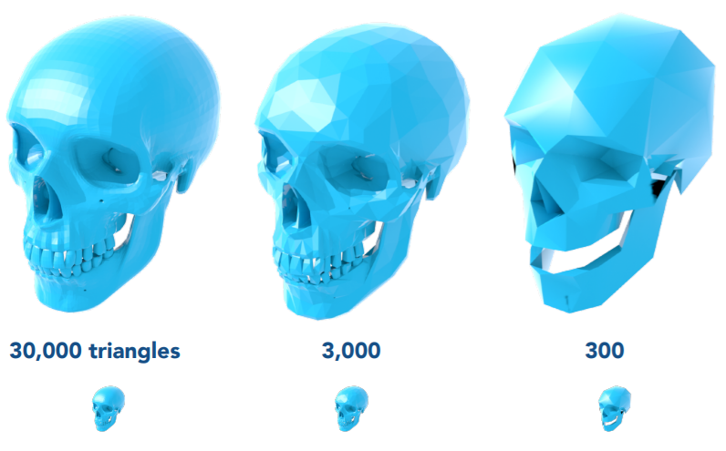
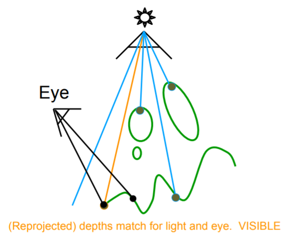

# Geometry

 ### Representation

##### Implicit

abstract functions. (Signed Distance Function, SDF)

$$

f(x, y, z) = 
\begin{cases}
\le0, \text{inside} \\
>0, \text{outside}
\end{cases}

$$

easy to test inside/outside, but hard to sample.


##### Explicit

directly given as Meshes, Point Clouds, Voxels.

Or 2d parameter maps ($f(u,v)\rightarrow (x,y,z)$)

easy to sample, but hard to test inside/outside.


### Bezier Curves



##### De Casteljau Algorithm:

Given 4 control points, an interpolation parameter $t$, and order $n$, **recursively** linear interpolate each segment to generate new segments for $n$ times.



This algorithm has a explicit algebra solution (the Bernstein form):

$$

\mathbf b^n(t) = \sum_{j=0}^n\mathbf b_j B^n_j(t) \\
B_i^n(t) = C_n^it^i(1-t)^{n-i}

$$

In particular, for a $n=4 $ Bezier curve:

$$

\mathbf b^n(t) = \mathbf b_0(1-t)^3 + \mathbf b_13t(1-t)^2 + \mathbf b_23t^2(1-t) + \mathbf b_3 t^3

$$


Piece-wise cubic Bezier is the most common technique to represent curves.

B-Splines (Basis Splines) is superset of Bezier Curves.

Bezier Curve can be extended to Bezier Surface in 3D, and use separable 1D de Casteljau to solve.


```c++
// explicit solution for Bezier curve of n = 4.
void algebra_bezier(const std::vector<cv::Point2f> &points, cv::Mat &window) 
{
    auto &p_0 = points[0];
    auto &p_1 = points[1];
    auto &p_2 = points[2];
    auto &p_3 = points[3];
    for (double t = 0.0; t <= 1.0; t += 0.001) 
    {
        auto point = std::pow(1 - t, 3) * p_0 + 
                     3 * t * std::pow(1 - t, 2) * p_1 +
                     3 * std::pow(t, 2) * (1 - t) * p_2 + 
                     std::pow(t, 3) * p_3;
        window.at<cv::Vec3b>(point.y, point.x)[2] = 255;
    }
}

// de Casteljau's algorithm for Bezier curve of any n.
void recursive_bezier(const std::vector<cv::Point2f> &control_points, cv::Mat &window) 
{
    for (double t = 0.0; t < 1.0; t += 0.001) {
        auto p = recursive_bezier_func(control_points, t);
        window.at<cv::Vec3b>(p.y, p.x)[1] = 255;
    }
}

cv::Point2f recursive_bezier_func(const std::vector<cv::Point2f> &points, float t) 
{
    // end recursion
    if (points.size() == 1) return points[0];
    // further recursion
    std::vector<cv::Point2f> new_points;
    for (size_t i = 1; i < points.size(); i++) {
        auto& p0 = points[i - 1];
        auto& p1 = points[i];
        new_points.push_back(p0 + (p1 - p0) * t);
    }
    return recursive_bezier_func(new_points, t);
}
```


### Mesh Operations

##### Subdivision (Magnification)

Loop and add vertices.



##### Simplification

Collapse edges and minimize quadric error.




### Shadow

A pixel NOT in shadow must be seen both by the light and camera.

##### Two pass search algorithm:

* compute depth from light to object.
* compute depth from camera to object.
* project camera-visible area to light. (shadow: light-occluded, not shadow: light-visible)




problem: soft-shadow (penumbra) vs hard-shadow (umbra)