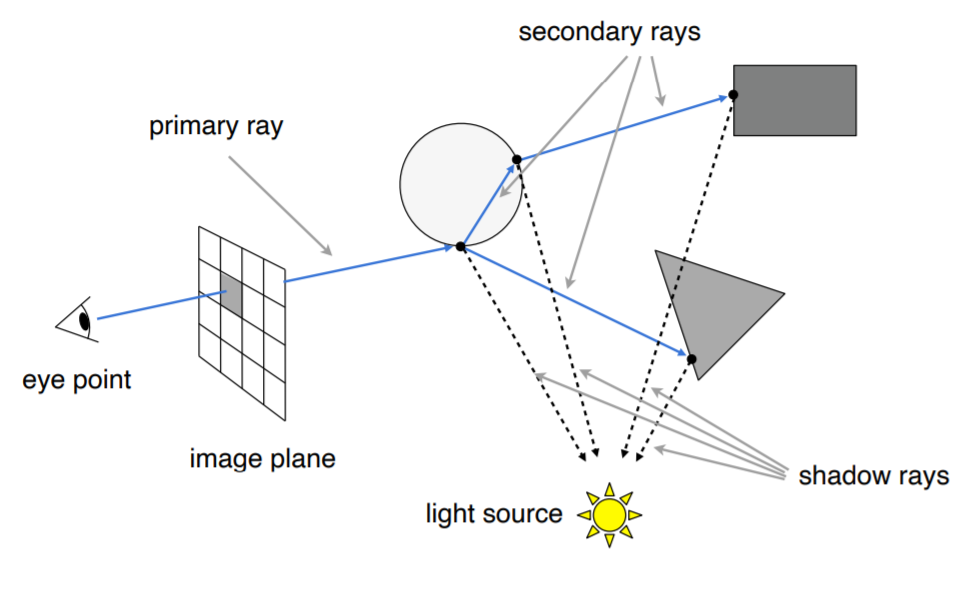
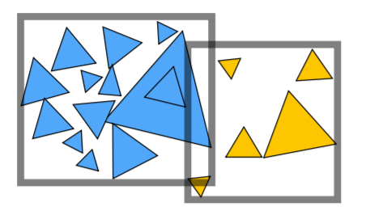
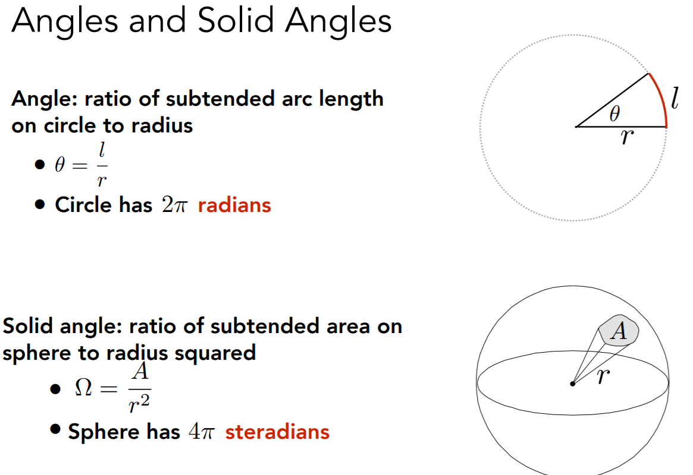
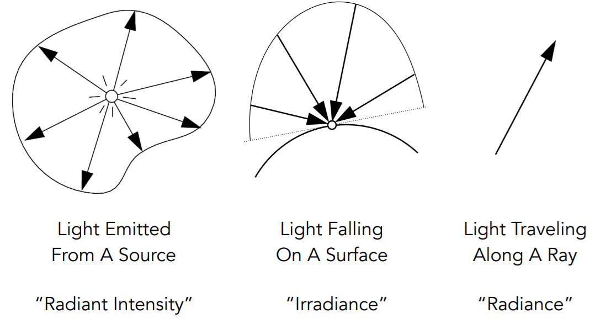
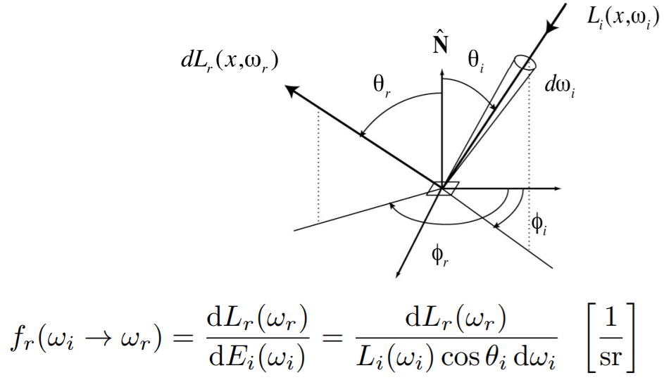
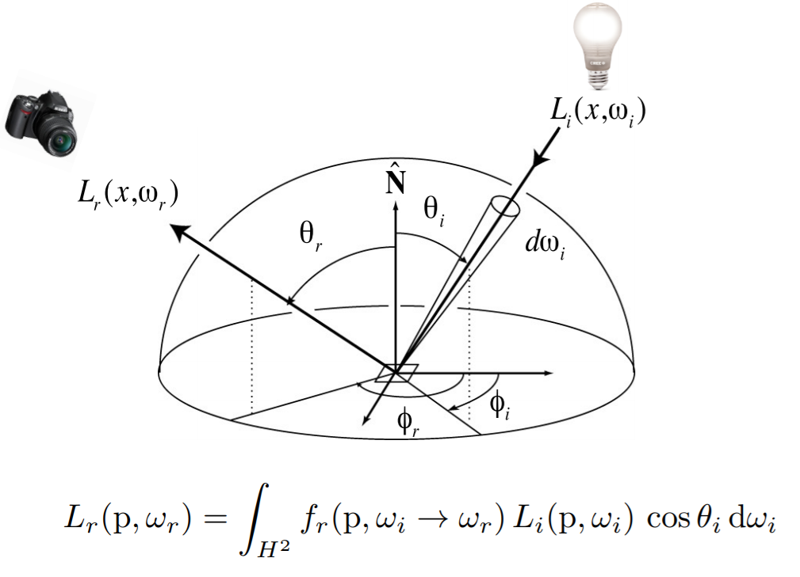
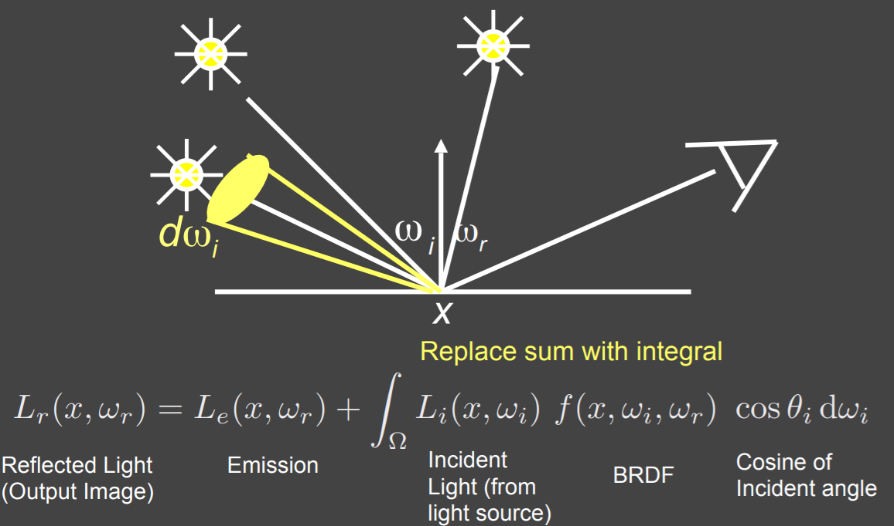

# Ray Tracing

### Why?

Rasterization Shading cannot handle global effect (e.g., soft shadow, multiple light sources, glossy reflection, indirect illumination).

Ray-tracing is slow, but can generate high quality shades.


### Whitted-Style Ray Tracing

Cast ray and trace the route recursively.



A ray is defined by origin $\mathbf o$ and direction $\mathbf d$ as a function of time $t \ge 0$:

$$

\mathbf r(t) = \mathbf o + t\mathbf d

$$

Ray-Surface intersection algorithm:

* Naïve: Check intersection with each triangles. (slow!)

* AABB (Axis-Aligned Bounding Boxes): 

  first check if ray hit object bounding box, then check intersection with the object triangles.

  Need to pre-compute bounding boxes by spatial partitioning (uniform grid, KD-tree) / object partitioning (bounding volume hierarchy).


```c++
// Moller Trumbore Algorithm: detect ray-triangle intersection 
bool rayTriangleIntersect(const Vector3f& v0, const Vector3f& v1, const Vector3f& v2, const Vector3f& orig,
                          const Vector3f& dir, float& tnear, float& u, float& v)
{
    auto e1 = v1 - v0;
    auto e2 = v2 - v0;
    auto s = orig - v0;
    auto s1 = crossProduct(dir, e2);
    auto s2 = crossProduct(s, e1);

    float k = 1.0f / dotProduct(s1, e1);
    float tnear_ = k * dotProduct(s2, e2);
    float u_ = k * dotProduct(s1, s);
    float v_ = k * dotProduct(s2, dir);
	
    // don't forget tnear_ > 0 
    if ((tnear_ > 0) && (u_ > 0) &&  (v_ > 0) && (1 - u_ - v_ >= 0)) {
        tnear = tnear_;
        u = u_;
        v = v_;
        return true;
    }
    else return false;
}
```


#### BVH (Bounding Volume Hierarchy)

BVH partitions **object** directly, compared to KD-Tree/Oct-Tree/BSP-Tree that partitions **space**.

BVH's bounding boxes **may overlap in space, but each object is uniquely contained in bounding box**.




### Basic Radiometry



Physically correct manner of light calculation.

**Radiant Energy**: $Q [J=Joule]$

**Radiant Flux**: $\Phi = \frac  {dQ} {dt} [W] [lm=lumen]$

**Radiant Intensity**: $I(\omega) = \frac {d\Phi} {d\omega} [W/sr] [cd=candela]$, power per solid angle.

**Irradiance**: $E(x) = \frac {d\Phi(x)} {dA} [W/m^2] [lux]$ power per unit area incident on  a surface point.

**Radiance/Luminance**: $L(p, \omega) = \frac {d^2\Phi(p, \omega)} {d\omega dA\cos\theta} [W/sr\ m^2] [nit]$ , power per unit solid angle per projected unit area. (or Irradiance per solid angle, or Intensity per projected unit area)

* Incident Radiance
* Exiting Radiance

Irradiance （辐射照度） vs radiance （辐射亮度）: 




**Bidirectional Reflectance Distribution Function (BRDF)**: how much light is reflected into each outgoing direction from each incoming direction.



The Reflection Equation:



The Rendering Equation:




### Path Tracing

Whitted-Style Ray Tracing's assumptions are too simple (in fact wrong).

e.g. Glossy materials reflection, diffuse materials reflection.

We can numerically solve the rendering function by Monte Carlo Integration.

```bash
# Distributed Ray Tracing
shade(p, wo)
	Randomly choose N directions wi~pdf
	Lo = 0.0
	For each wi
		Trace a ray r(p, wi)
		If ray r hit the light
			Lo += (1 / N) * L_i * f_r * cosine / pdf(wi)
		Else If ray r hit an object at q
			Lo += (1 / N) * shade(q, -wi) * f_r * cosine / pdf(wi)
	Return Lo
```

But the #ray explodes after many bounces. Also, the recursion never ends (light never stop bouncing).

So we decide to **only choose one random direction** each time, and use Russian Roulette (RR) method to randomly stop light bouncing.

```bash
# Path Tracing (N == 1)
shade(p, wo, P_RR) # P_RR is a parameter to control RR stop.
	# Random stop 
	Randomly select ksi from U[0, 1].
	If ksi > P_RR
		Return 0
	# Random Path
	Randomly choose ONE direction wi~pdf(w)
	Trace a ray r(p, wi)
		If ray r hit the light
			Return L_i * f_r * cosine / pdf(wi)
		Else If ray r hit an object at q
			Return shade(q, -wi) * f_r * cosine / pdf(wi)
```

However, this randomness will be very noisy. 

So we trace multiple paths for each pixel and average them.

```bash
ray_generation(camPos, pixel)
	Uniformly choose N sample positions within the pixel
	pixel_radiance = 0.0
	For each sample in the pixel
		Shoot a ray r(camPos, cam_to_sample)
		If ray r hit the scene at p
			pixel_radiance += 1 / N * shade(p, sample_to_cam)
	Return pixel_radiance
```

There are lots of other tricks, e.g., sampling the light, test if light is blocked, ... See the following implementation:

```c++
// Implementation of Path Tracing
Vector3f Scene::castRay(const Ray &ray, int depth) const
{
	// recursion depth limit
    if (depth > this->maxDepth) {
        return Vector3f(0.0f);
    }
    // find intersection of ray with scene
    Intersection intersection = Scene::intersect(ray);
    Material *m = intersection.m;
    Object *hitObject = intersection.obj;
    Vector3f hitColor = this->backgroundColor;
    Vector2f uv;
    uint32_t index = 0;
    // if intersected
    if (intersection.happened) {
        // retrieve hitPoint 
        Vector3f hitPoint = intersection.coords;
        Vector3f N = intersection.normal; // normal
        Vector2f st; // st coordinates
        hitObject->getSurfaceProperties(hitPoint, ray.direction, index, uv, N, st);
        
        // prepare variables
        Vector3f wo = -ray.direction; // light_out direction
        Vector3f wi; // light_in direction
        float light_prob; // light_in prob
	
        // render!
        switch (m->getType()) {
            // only support DIFFUSE now...
            case DIFFUSE:
            {
                /// direct light: sample light sources
                Intersection light_pos;
                sampleLight(light_pos, light_prob);
                Vector3f lightPoint = light_pos.coords;
                Vector3f lightIntensity = light_pos.emit;
                Vector3f lightN = light_pos.normal;
                // test if light is blocked.
                wi = normalize(hitPoint - lightPoint);
                Ray ray_light2hit(lightPoint, wi);
                Intersection light2hit_isect = Scene::intersect(ray_light2hit);
                Vector3f directColor(0.0f);
                // if not blocked (the precsion is necessary! 1e-2 is good, but 1e-6 will cause noises)
                if ((light2hit_isect.coords - hitPoint).norm() <= 1e-2) {
                    Vector3f f_r = m->eval(wi, wo, N);
                    float cos_theta = dotProduct(N, -wi);
                    float cos_theta2 = dotProduct(lightN, wi);
                    float dist = powf((lightPoint - hitPoint).norm(), 2);
                    // L_i * f_r * cos \theta * cos \theta' / |x'-p|^2 / pdf_light
                    directColor = lightIntensity * f_r * cos_theta * cos_theta2 / dist / light_prob;
                }
                
                /// indirect light: Random Russian Roulette
                Vector3f indirectColor(0.0f);
                // start RR
                float ksi = get_random_float();
                // if RR passed
                if (ksi <= RussianRoulette) {
                    // sample light_in direction
                    wi = -m->sample(ray.direction, N);
                    light_prob = m->pdf(wi, wo, N);
                    // test light intersection
                    Ray ray_rr(hitPoint, -wi);
                    Intersection rr_isect = Scene::intersect(ray_rr);
                    // if intersected
                    if (rr_isect.happened) {
                        // with non-emit surface
                        if (!rr_isect.obj->hasEmit()) {
                            // recursive call to find the intensity !
                            Vector3f rrIntensity = castRay(ray_rr, depth+1);
                            Vector3f f_r = m->eval(wi, wo, N);
                            float cos_theta = dotProduct(N, -wi);
                            // L_i * f_r * cos \theta / light_prob / RR_prob
                            indirectColor = rrIntensity * f_r * cos_theta / light_prob / RussianRoulette;
                        }
                    }
                }

                /// if self-emitting
                Vector3f selfColor(0.0f);
                if (m->hasEmission()) {
                    selfColor = m->getEmission();
                }
                
                // final color
                hitColor = directColor + indirectColor + selfColor;
                break;
            }
        }
    }
    return hitColor;
}
```

