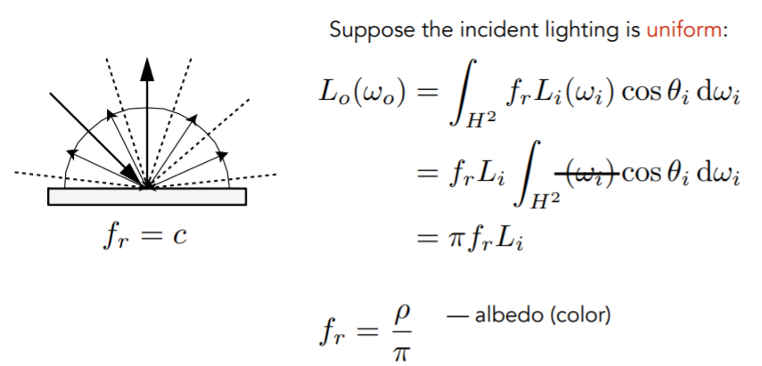
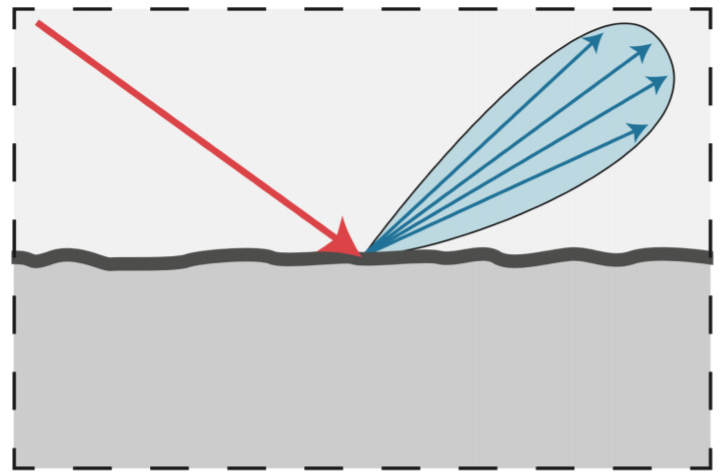
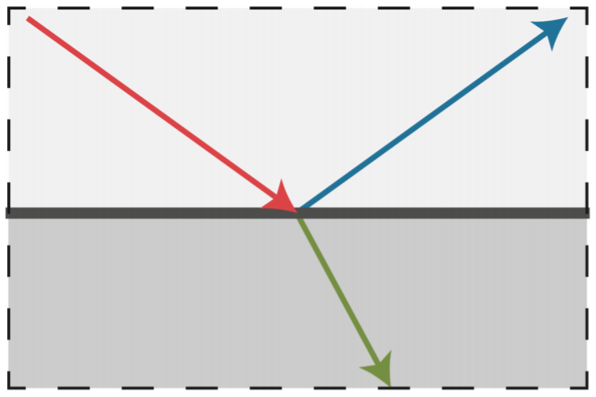
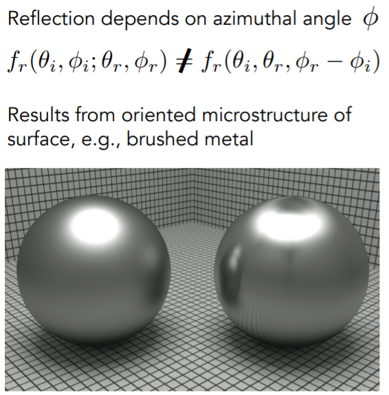

# Material

Material == BRDF

### Diffuse (Lambertian) Material

### Glossy Material

### Ideal Reflective / Refractive Material

### Microfacet Theory

### Anisotropic Materials

### Properties of BRDF

* Non-negativity
* Linearity
* Reciprocity Principle
* Energy Conservation