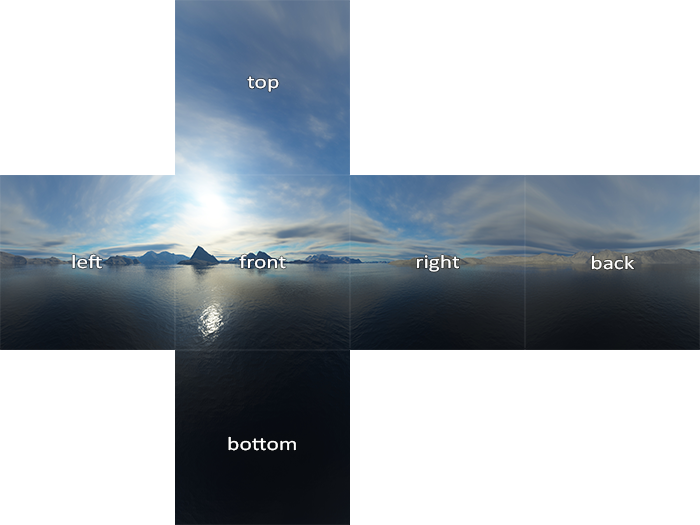

### Depth test

* Depth buffer: if we enable depth test, we should create a depth buffer to save the depth values.

  ```cpp
  // enable
  glEnable(GL_DEPTH_TEST);
  // clear
  glClear(GL_COLOR_BUFFER_BIT | GL_DEPTH_BUFFER_BIT);
  
  //// however, if you want read-only depth buffer:
  glDepthMask(GL_FALSE);
  ```

  By default, the depth buffer precision is 24-bit. (don't ask why...)

* **Traditional Depth test runs after fragment shader**. It compares with the z value of `gl_FragCoord` which is the 3d location of the current pixel, and only render the fragment color if `gl_FragCoord.z < buffer.z`.

  Now most GPUs support **Early depth testing** (hardware feature). It runs before fragment shader, and avoid calling fragment shader if it is occluded (so as to save time!). But to enable early depth testing, you must not manually set `gl_FragCoord.z` value in fragment shader.

* set depth comparator.

  ```cpp
  // default less pass, keep smaller depth (so discard larger depth)
  glDepthFunc(GL_LESS);
  // always pass, so it renders in the drawing order.
  glDepthFunc(GL_ALWAYS);
  // greater pass (used for inversed depth)
  glDepthFunc(GL_GREATER);
  // others:
  glDepthFunc(GL_NEVER); // reverse drawing order
  glDepthFunc(GL_EQUAL);
  glDepthFunc(GL_NOTEQUAL);
  glDepthFunc(GL_LEQUAL);
  glDepthFunc(GL_GEQUAL);
  ```

* depth precision: 

  z buffer's depth range is $[0, 1]$, which is mapped from the frustum depth $[near, far]$.

  This mapping is NON-linear, because we want more precision in nearer distance, while less precision in further distance.
  

$$
\displaylines{
  z' = \frac {1/z - 1/near} {1/far - 1/near}
}
$$


  To visualize z buffer, just set it as the `FragColor`:

  ```glsl
  //// fragment shader to display non-linear depth
  void main() {
      FragColor = vec4(vec3(gl_FragCoord.z), 1.0);
  }
  
  //// if we want to restore the linear depth:
  float near = 0.1;
  float far = 100.0;
  float linearize(float depth) {
      return (near * far) / (far + depth * (near - far)); // [0, 1] --> [near, far]
  }
  void main() {
      FragColor = vec4(vec3(linearize(gl_FragCoord.z) / far), 1.0);
  }
  ```

* z-fighting: if two triangles are tightly placed, z-buffer maybe not precise enough to determine which is in the front and switching between the two triangles, resulting in strange visual effect.

  There is no real solution for this (maybe set 32-bit depth buffer), so never place two triangles too close!


### Stencil test (模板测试)

* Stencil can be viewed as a **mask**, so we have more control on where to draw. For example, we can use it to highlight the edge of an object.

  Stencil test runs after fragment shader and before depth test.

  ```
  vertex shader --> (early depth test) --> fragment shader --> stencil test --> (depth test)
  ```

* We need a stencil buffer too. By default it is 8-bit, so we can set at most 256 values for stencil test.

* Enable and clear:

  ```cpp
  // enable, by default stencil is initailized to 1.
  glEnable(GL_STENCIL_TEST);
  // clear
  glClear(GL_COLOR_BUFFER_BIT | GL_DEPTH_BUFFER_BIT | GL_STENCIL_BUFFER_BIT);
  
  // set stencil read-only
  glStencilMask(0x00);
  // re-enable write
  glStencilMask(0xFF);
  ```

* stencil comparator. similar to depth comparator.

  ```cpp
  // draw only if (stencil & 0xFF) == 1
  // accept same comparators as depth. (ALWAYS, LESS, GREATER, EQUAL, ...)
  // `0xFF` is an AND mask, usually we just use 0xFF (all 1).
  glStencilFunc(GL_EQUAL, 1, 0xFF)
  ```

* update stencil.

  ```cpp
  // define actions for three cases: (stencil failed, depth failed, both passed)
  // values accept:
  // GL_KEEP: do not change stencil
  // GL_ZERO: s = 0
  // GL_REPLACE: set stentil to the ref value in glStencilFunc (the 1 in previous example)
  // GL_INCR: s = s + 1 if s != 0xFF else s
  // GL_INCR_WRAP: s = (s + 1) % 0xFF
  // GL_DECR: s = s - 1 if s != 0 else s
  // GL_DECR_WRAP: s = (s - 1 + 0xFF) % 0xFF
  // GL_INVERRT: s = ~s
  glStencilOp(sfail, dpfail, dppass); // default is (GL_KEEP, GL_KEEP, GL_KEEP)
  ```
  
* example: draw the edge of an object. (outlining)

  ```cpp
  // enable stencil test
  glEnable(GL_STENCIL_TEST);
  // set stencil to 1 (see the next line) if both passed
  glStencilOp(GL_KEEP, GL_KEEP, GL_REPLACE);
  // always pass stencil
  glStencilFunc(GL_ALWAYS, 1, 0xFF);
  // enable write stencil
  glStencilMask(0xFF); 
  // draw the object with a normal shader
  normalShader.use();
  DrawObject(); // now, s = 1 for the object area.
  
  // pass stencil only if not in object area.
  glStencilFunc(GL_NOTEQUAL, 1, 0xFF);
  // disable write stencil
  glStencilMask(0x00); 
  // disable depth test (since we are going to draw edges)
  glDisable(GL_DEPTH_TEST);
  // draw the edge with another shader.
  shaderSingleColor.use(); 
  DrawObjectEnlarged(); // we need to manually scale the object so it looks like an edge...
  ```


### Blending

* alpha blending allows drawing (full or partial) transparent objects.

* discarding fully transparent fragments:

  First, use RGBA texture instead of RGB.

  ```cpp
  glTexImage2D(GL_TEXTURE_2D, 0, GL_RGBA, width, height, 0, GL_RGBA, GL_UNSIGNED_BYTE, data);
  
  // also, better set wrap mode to CLAMP_TO_EDGE
  // in case the texture top is transparent while bottom is not and the interpolation looks strange.
  glTexParameteri( GL_TEXTURE_2D, GL_TEXTURE_WRAP_S, GL_CLAMP_TO_EDGE);
  glTexParameteri( GL_TEXTURE_2D, GL_TEXTURE_WRAP_T, GL_CLAMP_TO_EDGE);
  ```

  Second, modify the fragment shader:

  ```glsl
  #version 330 core
  out vec4 FragColor;
  in vec2 TexCoords;
  
  uniform sampler2D texture1;
  
  void main() {             
      // do not append 1, since texture1 is now RGBA
      vec4 texColor = texture(texture1, TexCoords);
      // discard fragment if a < 0.1
      if (texColor.a < 0.1) discard;
      FragColor = texColor;
  }
  ```

* blending partially transparent object.

  We need to enable blend by:

  ```cpp
  // enable alpha blending
  glEnable(GL_BLEND);
  
  // set how to blend 
  // accepts parameters (src_rgb, dst_rgb, [src_a, rgb_a])
  // GL_ZERO, GL_ONE
  // GL_SRC_COLOR, GL_DST_COLOR
  // GL_ONE_MINUS_SRC_COLOR, GL_ONE_MINUS_DST_COLOR
  // GL_SRC_ALPHA, GL_DST_ALPHA
  // GL_ONE_MINUS_SRC_ALPHA, GL_ONE_MINUS_DST_ALPHA
  // the most usual case we want is:
  // rgba = src.a * src.rgba + (1 - src.a) * bg.rgba
  glBlendFunc(GL_SRC_ALPHA, GL_ONE_MINUS_SRC_ALPHA); 
  
  // another usual case for separate setting rgb and a:
  // rgb = src.a * src.rgb + (1 - src.a) * bg.rgb
  // a = 1 * src.a + 0 * bg.a = src.a
  glBlendFuncSeparate(GL_SRC_ALPHA, GL_ONE_MINUS_SRC_ALPHA, GL_ONE, GL_ZERO);
  
  // if you don't want to ADD (who knows why)
  glBlendEquation(GL_FUNC_ADD); // default, src + dst
  glBlendEquation(GL_FUNC_SUBTRACT); // src - dst
  glBlendEquation(GL_FUNC_REVERSE_SUBTRACT); // dst - src
  ```

* draw order matters!

  **depth test won't check transparency!** So we must draw transparent objects from furthest to nearest.

  The usual practice is:

  * draw all opaque objects.
  * draw all transparent objects from furthest to nearest.

  How to sort is a difficult topic, but for simple plane-like object, we can:

  ```cpp
  std::map<float, glm::vec3> sorted;
  for (unsigned int i = 0; i < windows.size(); i++) {
      float distance = glm::length(camera.Position - windows[i]);
      sorted[distance] = windows[i];
  }
  ```


### Face Culling

* A way to discard occluded faces (back facing), so we can save computation time.

* Winding order of triangles:

  

  The vertex order of a face defines its winding order. OpenGL use this to determine whether a triangle is front-facing or back-facing. **So we must provide correct face vertex orders if we want to use face culling!**

* enable it:

  ```cpp
  // enable
  glEnable(GL_CULL_FACE);
  // set cull mode
  glCullFace(GL_BACK); // default, other choices are GL_FRONT, GL_FRONT_AND_BACK.
  // set front face definition
  glFrontFace(GL_CCW); // default, CCW = counter-clock-wise. other choice is GL_CW,
  ```

  
### Frame Buffer Object (FBO)

* OpenGL use frame buffers to store color, depth, stencil, ... GLFW creates default color buffer, depth buffer, stencil buffer for us to use. 

* The default frame buffer (which renders to the screen) is created automatically with OpenGL context, and has the id `0`.

* Create frame buffer

  ```cpp
  // gen fbo
  unsigned int fbo;
  glGenFramebuffers(1, &fbo);
  // bind frame buffer
  glBindFramebuffer(GL_FRAMEBUFFER, fbo);
  // we need to make frame buffer complete (add an attachment)
  // how to check if complete:
  if (glCheckFramebufferStatus(GL_FRAMEBUFFER) == GL_FRAMEBUFFER_COMPLETE) {  
      // frame buffer can be used now. 
  }
  // rebind to screen buffer (0)
  glBindFramebuffer(GL_FRAMEBUFFER, 0);
  // delete frame buffer
  glDeleteFramebuffers(1, &fbo); // 1 means we delete one frame buffer. (size)
  ```

* attachment

  we have two choices: texture or render buffer.

  * texture attachment: 

    so we can render to a texture, and use it later!

    ```cpp
    // create a color texture
    unsigned int texture;
    glGenTextures(1, &texture);
    glBindTexture(GL_TEXTURE_2D, texture);
    // we pass in NULL data, since it is now empty.
    glTexImage2D(GL_TEXTURE_2D, 0, GL_RGB, 800, 600, 0, GL_RGB, GL_UNSIGNED_BYTE, NULL);
    glTexParameteri(GL_TEXTURE_2D, GL_TEXTURE_MIN_FILTER, GL_LINEAR);
    glTexParameteri(GL_TEXTURE_2D, GL_TEXTURE_MAG_FILTER, GL_LINEAR);
    
    //// bind it to frame buffer
    // `GL_FRAMEBUFFER` is the target.
    // `GL_COLOR_ATTACHMENT0` means it's a color attachment.
    // `GL_TEXTURE_2D` means the texture type.
    // `texture` is the texture object.
    // `0` is Mipmap level, just use 0.
    glFramebufferTexture2D(GL_FRAMEBUFFER, GL_COLOR_ATTACHMENT0, GL_TEXTURE_2D, texture, 0);
    
    //// bind a depth texture (24 bit)
    glTexImage2D(GL_TEXTURE_2D, 0, GL_DEPTH_COMPONENT24, 800, 600, 0, GL_DEPTH_COMPONENT, GL_FLOAT, NULL);
    glFramebufferTexture(GL_FRAMEBUFFER, GL_DEPTH_ATTACHMENT, GL_TEXTURE_2D, texture, 0);
    
    //// bind a stencil texture (8 bit) [not recommended, always use depth+stencil]
    
    //// bind a depth+stencil texture (24 + 8 = 32 bit)
    glTexImage2D(GL_TEXTURE_2D, 0, GL_DEPTH24_STENCIL8, 800, 600, 0, GL_DEPTH_STENCIL, GL_UNSIGNED_INT_24_8, NULL);
    glFramebufferTexture2D(GL_FRAMEBUFFER, GL_DEPTH_STENCIL_ATTACHMENT, GL_TEXTURE_2D, texture, 0);
    ```

  * Renderbuffer object (RBO) attachment: 

    optimized for offscreen rendering, but is write-only, and can only be read with `glReadPixels`.

    > In brief, if you want to sample from the attachment, use normal texture. If you don't need to sample, use RBO.

    ```cpp
    // gen rbo
    unsigned int rbo;
    glGenRenderbuffers(1, &rbo);
    // bind buffer
    glBindRenderbuffer(GL_RENDERBUFFER, rbo);
    // allocate memory (like glTexImage2D, for example we use depth+stencil.)
    glRenderbufferStorage(GL_RENDERBUFFER, GL_DEPTH24_STENCIL8, 800, 600);
    // bind to frame buffer
    glFramebufferRenderbuffer(GL_FRAMEBUFFER, GL_DEPTH_STENCIL_ATTACHMENT, GL_RENDERBUFFER, rbo);
    ```

* render to frame buffer (attachment)

  Instead of rendering to the screen directly, 

  ```cpp
  // create framebuffer
  unsigned int framebuffer;
  glGenFramebuffers(1, &framebuffer);
  glBindFramebuffer(GL_FRAMEBUFFER, framebuffer);
  // we first attach a texture for color.
  unsigned int texColorBuffer;
  glGenTextures(1, &texColorBuffer);
  glBindTexture(GL_TEXTURE_2D, texColorBuffer);
  glTexImage2D(GL_TEXTURE_2D, 0, GL_RGB, 800, 600, 0, GL_RGB, GL_UNSIGNED_BYTE, NULL);
  glTexParameteri(GL_TEXTURE_2D, GL_TEXTURE_MIN_FILTER, GL_LINEAR );
  glTexParameteri(GL_TEXTURE_2D, GL_TEXTURE_MAG_FILTER, GL_LINEAR);
  glBindTexture(GL_TEXTURE_2D, 0);
  glFramebufferTexture2D(GL_FRAMEBUFFER, GL_COLOR_ATTACHMENT0, GL_TEXTURE_2D, texColorBuffer, 0);  
  // we then attach a RBO for depth + stencil.
  unsigned int rbo;
  glGenRenderbuffers(1, &rbo);
  glBindRenderbuffer(GL_RENDERBUFFER, rbo); 
  glRenderbufferStorage(GL_RENDERBUFFER, GL_DEPTH24_STENCIL8, 800, 600);  
  glBindRenderbuffer(GL_RENDERBUFFER, 0);
  glFramebufferRenderbuffer(GL_FRAMEBUFFER, GL_DEPTH_STENCIL_ATTACHMENT, GL_RENDERBUFFER, rbo);
  // check completeness
  if(glCheckFramebufferStatus(GL_FRAMEBUFFER) != GL_FRAMEBUFFER_COMPLETE)
      std::cout << "ERROR::FRAMEBUFFER:: Framebuffer is not complete!" << std::endl;
  // rebind to screen (or unbind framebuffer)
  glBindFramebuffer(GL_FRAMEBUFFER, 0);
  ```

  We need a quad shader to draw the rectangle texture to screen.

  ```glsl
  // vertex shader
  #version 330 core
  layout (location = 0) in vec2 aPos;
  layout (location = 1) in vec2 aTexCoords;
  
  out vec2 TexCoords;
  
  void main() {
      gl_Position = vec4(aPos.x, aPos.y, 0.0, 1.0); 
      TexCoords = aTexCoords;
  }
  ```

  ```glsl
  // frag shader
  #version 330 core
  out vec4 FragColor;
  
  in vec2 TexCoords;
  
  uniform sampler2D screenTexture;
  
  void main() { 
      FragColor = texture(screenTexture, TexCoords);
  }
  ```

  Render two passes (first render to framebuffer, second render to screen)

  ```cpp
  // render scene to our framebuffer
  glBindFramebuffer(GL_FRAMEBUFFER, framebuffer);
  glClearColor(0.1f, 0.1f, 0.1f, 1.0f);
  glClear(GL_COLOR_BUFFER_BIT | GL_DEPTH_BUFFER_BIT);
  // draw scene
  glEnable(GL_DEPTH_TEST);
  DrawScene();    
  
  // render our framebuffer to screen
  glBindFramebuffer(GL_FRAMEBUFFER, 0);
  glClearColor(1.0f, 1.0f, 1.0f, 1.0f); 
  glClear(GL_COLOR_BUFFER_BIT);
  // draw quad
  glDisable(GL_DEPTH_TEST); // since we only draw a quad.
  QuadScreenShader.use();
  glBindVertexArray(quadVAO);
  glBindTexture(GL_TEXTURE_2D, texColorBuffer);
  glDrawArrays(GL_TRIANGLES, 0, 6);  
  ```

* post processing.

  An advantage of using frame buffer is to post-process rendered image before print to screen.

  These effects can be applied in the quad fragment shader.

  For example, apply custom kernel convolution:

  ```glsl
  const float offset = 1.0 / 300.0;  
  
  void main() {
      vec2 offsets[9] = vec2[](
          vec2(-offset,  offset), // 左上
          vec2( 0.0f,    offset), // 正上
          vec2( offset,  offset), // 右上
          vec2(-offset,  0.0f),   // 左
          vec2( 0.0f,    0.0f),   // 中
          vec2( offset,  0.0f),   // 右
          vec2(-offset, -offset), // 左下
          vec2( 0.0f,   -offset), // 正下
          vec2( offset, -offset)  // 右下
      );
  	
      // sharpen edges
      float kernel[9] = float[](
          -1, -1, -1,
          -1,  9, -1,
          -1, -1, -1
      );
  
      vec3 sampleTex[9];
      for(int i = 0; i < 9; i++)
      {
          sampleTex[i] = vec3(texture(screenTexture, TexCoords.st + offsets[i]));
      }
      vec3 col = vec3(0.0);
      for(int i = 0; i < 9; i++)
          col += sampleTex[i] * kernel[i];
  
      FragColor = vec4(col, 1.0);
  }
  ```

  
### Cube map

* A cube map is another type of texture, which contains six 2D texture that makes a box. Cube maps can be helpful for environment texture (such as the sky box), and we can use a direction vector to sample it (like sampling a sphere).

  

* Create a cube map from 6 2D textures:

  ```cpp
  // gen CUBE_MAP
  unsigned int textureID;
  glGenTextures(1, &textureID);
  glBindTexture(GL_TEXTURE_CUBE_MAP, textureID);
  // copy data
  int width, height, nrChannels;
  unsigned char *data;  
  for(unsigned int i = 0; i < textures_faces.size(); i++)
  {
      data = stbi_load(textures_faces[i].c_str(), &width, &height, &nrChannels, 0);
      glTexImage2D(
          // this loops the six faces (POSITIVE_X, NEGATIVE_X, POSITIVE_Y, ...)
          GL_TEXTURE_CUBE_MAP_POSITIVE_X + i, 
          0, GL_RGB, width, height, 0, GL_RGB, GL_UNSIGNED_BYTE, data
      );
  }
  // set parameter
  glTexParameteri(GL_TEXTURE_CUBE_MAP, GL_TEXTURE_MAG_FILTER, GL_LINEAR);
  glTexParameteri(GL_TEXTURE_CUBE_MAP, GL_TEXTURE_MIN_FILTER, GL_LINEAR);
  glTexParameteri(GL_TEXTURE_CUBE_MAP, GL_TEXTURE_WRAP_S, GL_CLAMP_TO_EDGE);
  glTexParameteri(GL_TEXTURE_CUBE_MAP, GL_TEXTURE_WRAP_T, GL_CLAMP_TO_EDGE);
  glTexParameteri(GL_TEXTURE_CUBE_MAP, GL_TEXTURE_WRAP_R, GL_CLAMP_TO_EDGE);
  ```

  use it in fragment shader:

  ```glsl
  #version 330 core
  out vec4 FragColor;
  in vec3 TexCoords;
  
  uniform samplerCube skybox;
  
  void main() {    
      FragColor = texture(skybox, TexCoords);
  }
  ```

  we usually render skybox as the first object and disable depth test, so it is always covered by later objects.

  ```cpp
  // draw skybox
  glDepthMask(GL_FALSE);
  skyboxShader.use();
  glBindVertexArray(skyboxVAO);
  glBindTexture(GL_TEXTURE_CUBE_MAP, cubemapTexture);
  glDrawArrays(GL_TRIANGLES, 0, 36);
  glDepthMask(GL_TRUE);
  // draw other objs
  ```

  > Optimization trick by early depth testing:
  >
  > We can render skybox at last, and use a trick to set the z always to 1.
  >
  > ```glsl
  > void main() {
  >     TexCoords = aPos;
  >     vec4 pos = projection * view * vec4(aPos, 1.0);
  >     gl_Position = pos.xyww; // z = w, after perspective division, z = 1
  > }
  > ```

* environment mapping.

  We can reflect or refract environment texture to objects to make the scene more realistic.

  * Reflection

    Change the object's shader, so it reflects the skybox:

    ```glsl
    #version 330 core
    layout (location = 0) in vec3 aPos;
    layout (location = 1) in vec3 aNormal;
    
    out vec3 Normal;
    out vec3 Position;
    
    uniform mat4 model;
    uniform mat4 view;
    uniform mat4 projection;
    
    void main() {
        // note the correct way to transform normal!
        Normal = mat3(transpose(inverse(model))) * aNormal;
        Position = vec3(model * vec4(aPos, 1.0));
        gl_Position = projection * view * model * vec4(aPos, 1.0);
    }
    ```

    ```glsl
    #version 330 core
    out vec4 FragColor;
    
    in vec3 Normal;
    in vec3 Position;
    
    uniform vec3 cameraPos;
    uniform samplerCube skybox;
    
    void main() {             
        vec3 I = normalize(Position - cameraPos);
        vec3 R = reflect(I, normalize(Normal)); // built in func to calculate light direction after reflection at normal.
        FragColor = vec4(texture(skybox, R).rgb, 1.0);
    }
    ```

  * Refraction

    similar to reflection.

    ```glsl
    void main() {             
        float ratio = 1.00 / 1.52;
        vec3 I = normalize(Position - cameraPos);
        vec3 R = refract(I, normalize(Normal), ratio); // built in
        FragColor = vec4(texture(skybox, R).rgb, 1.0);
    }
    ```

  However, these reflection / refraction effect are static. (It only reflect / refract the environment texture, but not other objects.)

  To achieve **dynamic** environment mapping, we need to frame buffer all reflective faces and then render it to the object!


### Advanced GLSL

* set the point size.

  ```cpp
  // need to enable it.
  glEnable(GL_PROGRAM_POINT_SIZE);
  ```

  use in vertex shader:

  ```glsl
  void main() {
      gl_Position = projection * view * model * vec4(aPos, 1.0);    
      gl_PointSize = gl_Position.z; // float, further points are larger.
  }
  ```

* get fragment coordinate:

  ```glsl
  void main() {             
      if (gl_FragCoord.x < 400) // vec3, Read-only!
          FragColor = vec4(1.0, 0.0, 0.0, 1.0); // left helf screen is Red
      else
          FragColor = vec4(0.0, 1.0, 0.0, 1.0); // right half screen is Green
  }
  ```

* manually set fragment depth

  ```glsl
  void main() {
      gl_FragDepth = 0.0; // float, writable, default value is gl_FragCoord.z 
  }
  ```

  > This will disable early depth testing !!!

* get face direction

  ```glsl
  void main() {             
      // use different texture for front and back faces.
      if(gl_FrontFacing) // bool, is front-facing
          FragColor = texture(frontTexture, TexCoords);
      else
          FragColor = texture(backTexture, TexCoords);
  }
  ```

* interface block

  like define a struct for in / out.

  ```glsl
  #version 330 core
  layout (location = 0) in vec3 aPos;
  layout (location = 1) in vec2 aTexCoords;
  
  uniform mat4 model;
  uniform mat4 view;
  uniform mat4 projection;
  
  // define a block 
  out VS_OUT {
      vec2 TexCoords;
  } vs_out; // initialize it.
  
  void main() {
      gl_Position = projection * view * model * vec4(aPos, 1.0);    
      vs_out.TexCoords = aTexCoords;
  }  
  ```

  ```glsl
  #version 330 core
  out vec4 FragColor;
  
  // recieve a block, must have the same definition !
  in VS_OUT {
      vec2 TexCoords;
  } fs_in; // but the instance name can change.
  
  uniform sampler2D texture;
  
  void main() {             
      FragColor = texture(texture, fs_in.TexCoords);   
  }
  ```

* Uniform Buffer Object (UBO)

  like define a struct tor uniform. 

  ```glsl
  #version 330 core
  layout (location = 0) in vec3 aPos;
  
  layout (std140) uniform Matrices {
      mat4 projection;
      mat4 view;
  };
  uniform mat4 model;
  
  void main() {
      gl_Position = projection * view * model * vec4(aPos, 1.0);
  }
  ```

  ```cpp
  unsigned int uniformBlockIndexRed    = glGetUniformBlockIndex(shaderRed.ID, "Matrices");
  unsigned int uniformBlockIndexGreen  = glGetUniformBlockIndex(shaderGreen.ID, "Matrices");
  unsigned int uniformBlockIndexBlue   = glGetUniformBlockIndex(shaderBlue.ID, "Matrices");
  unsigned int uniformBlockIndexYellow = glGetUniformBlockIndex(shaderYellow.ID, "Matrices");  
  
  glUniformBlockBinding(shaderRed.ID,    uniformBlockIndexRed, 0);
  glUniformBlockBinding(shaderGreen.ID,  uniformBlockIndexGreen, 0);
  glUniformBlockBinding(shaderBlue.ID,   uniformBlockIndexBlue, 0);
  glUniformBlockBinding(shaderYellow.ID, uniformBlockIndexYellow, 0);
  
  unsigned int uboMatrices
  glGenBuffers(1, &uboMatrices);
  glBindBuffer(GL_UNIFORM_BUFFER, uboMatrices);
  glBufferData(GL_UNIFORM_BUFFER, 2 * sizeof(glm::mat4), NULL, GL_STATIC_DRAW);
  glBindBuffer(GL_UNIFORM_BUFFER, 0);
  glBindBufferRange(GL_UNIFORM_BUFFER, 0, uboMatrices, 0, 2 * sizeof(glm::mat4));
  
  glm::mat4 projection = glm::perspective(glm::radians(45.0f), (float)width/(float)height, 0.1f, 100.0f);
  glBindBuffer(GL_UNIFORM_BUFFER, uboMatrices);
  glBufferSubData(GL_UNIFORM_BUFFER, 0, sizeof(glm::mat4), glm::value_ptr(projection));
  glBindBuffer(GL_UNIFORM_BUFFER, 0);
  
  glm::mat4 view = camera.GetViewMatrix();           
  glBindBuffer(GL_UNIFORM_BUFFER, uboMatrices);
  glBufferSubData(GL_UNIFORM_BUFFER, sizeof(glm::mat4), sizeof(glm::mat4), glm::value_ptr(view));
  glBindBuffer(GL_UNIFORM_BUFFER, 0);
  
  // ... 绘制红色立方体
  glBindVertexArray(cubeVAO);
  shaderRed.use();
  glm::mat4 model;
  model = glm::translate(model, glm::vec3(-0.75f, 0.75f, 0.0f));  // 移动到左上角
  shaderRed.setMat4("model", model);
  glDrawArrays(GL_TRIANGLES, 0, 36);        
  // ... 绘制绿色立方体
  // ... 绘制蓝色立方体
  // ... 绘制黄色立方体 
  ```


### Geometry Shader

* `Vertex Shader --> [Geometry Shader] --> Fragment Shader`

  Geometry shader operates on the set of vertices for the fragment (point, lines, or triangles), and can even change the fragment type (e.g., input is point, but output is line.)

  The following example renders a point (x, y) into a horizontal line segment (x-0.1, y) to (x+0.1, y).

  ```glsl
  #version 330 core
      
  // define the input (type)
  // accepts: points, lines, lines_adjacency, triangles, triangles_adjacency.    
  // e.g., we render points.
  layout (points) in;
  
  // define the output (type and max_vertices)
  // accepts: points, line_strip, triangle_strip 
  // strip means an array, e.g., line_strip with max_vertices = 6 means 3 lines.
  // e.g., we render points into lines.
  layout (line_strip, max_vertices = 2) out;
  
  void main() {    
      /* gl_in[] is a built in struct like:
      in gl_Vertex
      {
          vec4  gl_Position;
          float gl_PointSize;
          float gl_ClipDistance[];
      } gl_in[];
  	*/
      gl_Position = gl_in[0].gl_Position + vec4(-0.1, 0.0, 0.0, 0.0); 
      EmitVertex(); // set output vertex 1
  
      gl_Position = gl_in[0].gl_Position + vec4( 0.1, 0.0, 0.0, 0.0);
      EmitVertex(); // set output vertex 2
  
      EndPrimitive(); // set output line strip
  }
  ```

  call it with:

  ```cpp
  // compile and link
  geometryShader = glCreateShader(GL_GEOMETRY_SHADER);
  glShaderSource(geometryShader, 1, &gShaderCode, NULL);
  glCompileShader(geometryShader);  
  ...
  glAttachShader(program, geometryShader);
  glLinkProgram(program);
  
  // call
  glDrawArrays(GL_POINTS, 0, 4);
  ```

* example: explode!

  use geometry shader to move each triangle along its face normal for a distance.

  ```glsl
  #version 330 core
  layout (location = 0) in vec3 aPos;
  layout (location = 2) in vec2 aTexCoords;
  
  // pass texCoords to geom shader
  out VS_OUT {
      vec2 texCoords;
  } vs_out;
  
  uniform mat4 projection;
  uniform mat4 view;
  uniform mat4 model;
  
  void main()
  {
      vs_out.texCoords = aTexCoords;
      gl_Position = projection * view * model * vec4(aPos, 1.0); 
  }
  ```

  ```glsl
  #version 330 core
  layout (triangles) in;
  layout (triangle_strip, max_vertices = 3) out;
  
  // recieve texCoords from vert shader.
  // note we call it gs_in[], not the built in gl_in[]
  in VS_OUT {
      vec2 texCoords;
  } gs_in[];
  
  // pass texCoords to frag shader.
  out vec2 TexCoords; 
  
  uniform float time; // shader.setFloat("time", glfwGetTime());
  
  vec4 explode(vec4 position, vec3 normal) {
      float magnitude = 2.0;
      vec3 direction = normal * ((sin(time) + 1.0) / 2.0) * magnitude; // vary with time.
      return position + vec4(direction, 0.0);
  }
  
  vec3 GetNormal() {
     vec3 a = vec3(gl_in[0].gl_Position) - vec3(gl_in[1].gl_Position);
     vec3 b = vec3(gl_in[2].gl_Position) - vec3(gl_in[1].gl_Position);
     return normalize(cross(a, b));
  }
  
  void main() {    
      // face normal for the current triangle
      vec3 normal = GetNormal();
  	
      // explode three vertices
      gl_Position = explode(gl_in[0].gl_Position, normal);
      TexCoords = gs_in[0].texCoords;
      EmitVertex();
      
      gl_Position = explode(gl_in[1].gl_Position, normal);
      TexCoords = gs_in[1].texCoords;
      EmitVertex();
      
      gl_Position = explode(gl_in[2].gl_Position, normal);
      TexCoords = gs_in[2].texCoords;
      EmitVertex();
      
      EndPrimitive();
  }
  ```

  ```glsl
  #version 330 core
  out vec4 FragColor;
  
  // recieve from geom shader.
  in vec2 TexCoords;
  
  uniform sampler2D texture_diffuse1;
  
  void main() {
      FragColor = texture(texture_diffuse1, TexCoords);
  }
  ```

* example: draw normals.

  ```glsl
  #version 330 core
  layout (location = 0) in vec3 aPos;
  layout (location = 1) in vec3 aNormal;
  
  out VS_OUT {
      vec3 normal;
  } vs_out;
  
  uniform mat4 projection;
  uniform mat4 view;
  uniform mat4 model;
  
  void main() {
      gl_Position = projection * view * model * vec4(aPos, 1.0); 
      mat4 normalMatrix = mat4(transpose(inverse(view * model)));
  	vs_out.normal = projection * normalMatrix * vec4(aNormal, 0.0);
  }
  ```

  ````glsl
  #version 330 core
  layout (triangles) in;
  layout (line_strip, max_vertices = 6) out;
  
  in VS_OUT {
      vec3 normal;
  } gs_in[];
  
  const float MAGNITUDE = 0.4;
  
  void GenerateLine(int index) {
      gl_Position = gl_in[index].gl_Position;
      EmitVertex();
      gl_Position = gl_in[index].gl_Position + vec4(gs_in[index].normal, 0.0) * MAGNITUDE;
      EmitVertex();
      EndPrimitive();
  }
  
  void main() {
      GenerateLine(0); // 第一个顶点法线
      GenerateLine(1); // 第二个顶点法线
      GenerateLine(2); // 第三个顶点法线
  }
  ````

  ```glsl
  #version 330 core
  out vec4 FragColor;
  
  void main() {
      FragColor = vec4(1.0, 1.0, 0.0, 1.0);
  }
  ```


### Instancing

* Instancing aims to **draw multiple instances of the same object within one GPU call**, instead of use a for loop, so we can save CPU/GPU communication cost.

* We use `gl_InstanceID` in the vertex shader to get which instance are we drawing, so we can manipulate each instance!

* Use `uniform` to manipulate instance:

  ```glsl
  #version 330 core
  layout (location = 0) in vec2 aPos;
  layout (location = 1) in vec3 aColor;
  
  out vec3 fColor;
  
  // define the offset for each instance
  uniform vec2 offsets[100];
  
  void main() {
      // gl_InstanceID starts from 0
      vec2 offset = offsets[gl_InstanceID];
      gl_Position = vec4(aPos + offset, 0.0, 1.0);
      fColor = aColor;
  }
  ```

  draw 100 instances in one command:

  ```cpp
  // draw with `glDrawArraysInstanced / glDrawElementsInstanced
  // `100` means we draw 100 instances.
  glDrawArraysInstanced(GL_TRIANGLES, 0, 6, 100);
  ```

  However, the amount of data we can send to uniform is limited, but we may want to draw hundreds or thousands of instances (very usual). Then we can use instanced array instead:

* Use **Instanced Array** to manipulate instance.

  Instanced Array is a vertex attribute, and will change between different instances.

  ```glsl
  #version 330 core
  layout (location = 0) in vec2 aPos;
  layout (location = 1) in vec3 aColor;
  layout (location = 2) in vec2 aOffset; // the offset attribute.
  
  out vec3 fColor;
  
  void main() {
      // we don't need gl_InstanceID now.
      gl_Position = vec4(aPos + aOffset, 0.0, 1.0);
      fColor = aColor;
  }
  ```

  Now we move the offset to VBO:

  ```cpp
  unsigned int instanceVBO;
  glGenBuffers(1, &instanceVBO);
  glBindBuffer(GL_ARRAY_BUFFER, instanceVBO);
  glBufferData(GL_ARRAY_BUFFER, sizeof(glm::vec2) * 100, &translations[0], GL_STATIC_DRAW);
  glBindBuffer(GL_ARRAY_BUFFER, 0);
  
  glEnableVertexAttribArray(2);
  glBindBuffer(GL_ARRAY_BUFFER, instanceVBO);
  glVertexAttribPointer(2, 2, GL_FLOAT, GL_FALSE, 2 * sizeof(float), (void*)0);
  glBindBuffer(GL_ARRAY_BUFFER, 0);   
  
  // tell OpenGL when to switch to the next instance
  // `2` means attr at location = 2 is the change target 
  // `1` means switch every one instance. // default is 0, so never change instance.
  glVertexAttribDivisor(2, 1);
  ```

  
* example: astroids.

  ```glsl
  #version 330 core
  layout (location = 0) in vec3 aPos;
  layout (location = 2) in vec2 aTexCoords;
  layout (location = 3) in mat4 instanceMatrix; // each instance has different transform.
  
  out vec2 TexCoords;
  
  uniform mat4 projection;
  uniform mat4 view;
  
  void main() {
      gl_Position = projection * view * instanceMatrix * vec4(aPos, 1.0); 
      TexCoords = aTexCoords;
  }
  ```

  ```cpp
  // VBO
  unsigned int buffer;
  glGenBuffers(1, &buffer);
  glBindBuffer(GL_ARRAY_BUFFER, buffer);
  glBufferData(GL_ARRAY_BUFFER, amount * sizeof(glm::mat4), &modelMatrices[0], GL_STATIC_DRAW);
  
  for(unsigned int i = 0; i < rock.meshes.size(); i++)
  {
      unsigned int VAO = rock.meshes[i].VAO;
      glBindVertexArray(VAO);
  
      GLsizei vec4Size = sizeof(glm::vec4);
      glEnableVertexAttribArray(3); 
      glVertexAttribPointer(3, 4, GL_FLOAT, GL_FALSE, 4 * vec4Size, (void*)0);
      glEnableVertexAttribArray(4); 
      glVertexAttribPointer(4, 4, GL_FLOAT, GL_FALSE, 4 * vec4Size, (void*)(vec4Size));
      glEnableVertexAttribArray(5); 
      glVertexAttribPointer(5, 4, GL_FLOAT, GL_FALSE, 4 * vec4Size, (void*)(2 * vec4Size));
      glEnableVertexAttribArray(6); 
      glVertexAttribPointer(6, 4, GL_FLOAT, GL_FALSE, 4 * vec4Size, (void*)(3 * vec4Size));
  
      glVertexAttribDivisor(3, 1);
      glVertexAttribDivisor(4, 1);
      glVertexAttribDivisor(5, 1);
      glVertexAttribDivisor(6, 1);
  
      glBindVertexArray(0);
  }  
  
  // draw
  instanceShader.use();
  for(unsigned int i = 0; i < rock.meshes.size(); i++)
  {
      glBindVertexArray(rock.meshes[i].VAO);
      glDrawElementsInstanced(
          GL_TRIANGLES, rock.meshes[i].indices.size(), GL_UNSIGNED_INT, 0, amount
      );
  }
  ```


### Anti-aliasing (AA)

* SSAA: super-resolution, render at a larger resolution and then resize. Very expensive, do not use.

* MSAA: multi-sampling.

  The most common and simple AA supported by OpenGL. It is implemented in hardware, we only call the fragment shader once, but assign the result to all covered samples. So with `ms_rate = M`, the time is still $O(HW)$, but the space is $O(MHW)$.

  To use it, we need to change the default texture:

  ```cpp
  // enable multisample
  glEnable(GL_MULTISAMPLE);
  // use Multisample texture.
  glBindTexture(GL_TEXTURE_2D_MULTISAMPLE, tex);
  // `4` means we use 4 samples at each fragment, usually enough.
  // `GL_TRUE` says we use same sample position and count for each fragment. 
  glTexImage2DMultisample(GL_TEXTURE_2D_MULTISAMPLE, 4, GL_RGB, width, height, GL_TRUE);
  glBindTexture(GL_TEXTURE_2D_MULTISAMPLE, 0);
  glFramebufferTexture2D(GL_FRAMEBUFFER, GL_COLOR_ATTACHMENT0, GL_TEXTURE_2D_MULTISAMPLE, tex, 0);
  
  // similar for multisample renderbuffer 
  glRenderbufferStorageMultisample(GL_RENDERBUFFER, 4, GL_DEPTH24_STENCIL8, width, height);
  ```

  However, multi-sampling texture doesn't support post-processing or display. We need to cast it back to a normal texture:

  ```cpp
  glBindFramebuffer(GL_READ_FRAMEBUFFER, multisampledFBO);
  glBindFramebuffer(GL_DRAW_FRAMEBUFFER, 0);
  glBlitFramebuffer(0, 0, width, height, 0, 0, width, height, GL_COLOR_BUFFER_BIT, GL_NEAREST);
  ```

  
