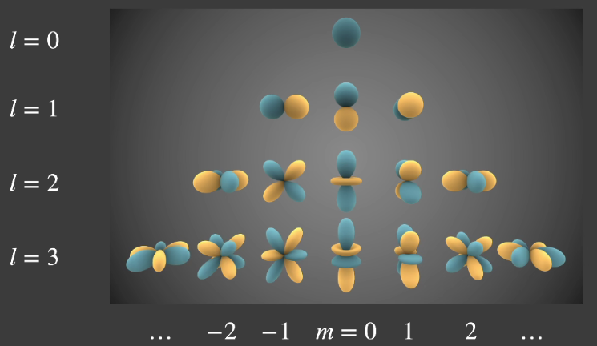
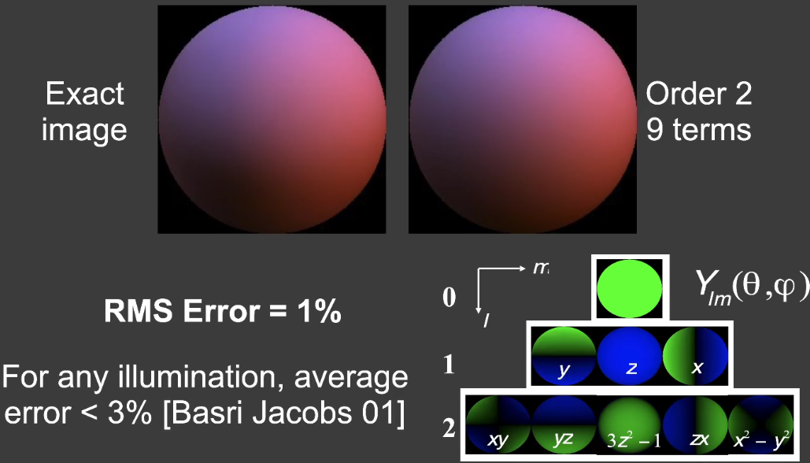

# PRT

### Spherical Harmonics (SH)

* Basis Functions: A set of orthonormal functions used to represent other functions via linear combination (like Polynomial series and Fourier series.).

* SH is A set of 2D basis functions $B_i(\omega) = Y_l^m(\theta,\phi)$ defined **on the sphere**. (as an analogue to 1D Fourier series.)

  the exact form is complicated: 
  $$
  {\displaystyle Y_{\ell }^{m}(\theta ,\ \varphi )=(-1)^{m}{\sqrt {{(2\ell +1) \over 4\pi }{(\ell -|m|)! \over (\ell +|m|)!}}}\,P_{\ell }^{m}(\cos {\theta })\,e^{im\varphi }\,\!} \\
    P_{\ell }^{m}(x)=(1-x^{2})^{{|m|/2}}\ {\frac  {d^{{|m|}}}{dx^{{|m|}}}}P_{\ell }(x)\, \\
    P_{\ell }(x)={1 \over 2^{\ell }\ell !}{d^{\ell } \over dx^{\ell }}(x^{2}-1)^{l}
  $$
  

  

* For any function $f$ defined on the sphere, we can represent it with a linear combination of SHs (usually truncated):
  

$$
\displaylines{
  f(\omega) = \sum_ic_iB_i(\omega)
}
$$

  **SH property (orthonormal)**:

$$
\displaylines{
  \int_\Omega B_i(\omega)B_j(\omega) = 0, i\ne j \\
  \int_\Omega B_i(\omega)B_j(\omega) = 1, i= j \\
}
$$

  **SH property (projection)**: the coefficient can be obtained with:

$$
\displaylines{
  c_i = \int_\Omega f(\omega)B_i(\omega)d\omega
}
$$

*  9 Parameter Approximation:

  Use the first 3 orders of SH (9 parameters) is enough for approximating diffuse BRDF.

  

  
### Precomputed Radiance Transfer

* Basic idea:

  * Assume **the scene is static**, so only light conditions can vary.

  * view the rendering function as lighting and **light transport (or bounce, in fact the visibility & BRDF)**.
    

$$
\displaylines{
    L(o) = \int_\Omega \underbrace{L(i)}_{\text{lighting}}\underbrace{V(i)\rho(i, o)\max(0, n \cdot i)}_{\text{light transport}}di
}
$$

  * approximate lighting with SH.
  
    * For the diffuse case, BRDF is constant so $\rho(i,o) = \rho$ :
      $$
      L = L(o) = \rho\int_\Omega {L(i)} V(i)\max(0, n \cdot i) di \\
            \approx \rho\int_\Omega \sum c_jB_j(i)V(i)\max(0, n \cdot i) di \\
            = \rho\sum c_j\underbrace{\int_\Omega B_j(i)V(i)\max(0, n \cdot i) di}_{T_j \text{ (pre-compute!)}} \\
            =\rho\sum c_j T_j
      $$
        We need to save a vector $T_j$ for each point.
    
        Another way to calculate it (with a more formal rendering function):
      $$
      L_o(p,o)=\int_\Omega L_i(p,i)f_r(p,i,o)\cos\theta_iV(p,i)di \\
            \approx \int_\Omega \sum_pc_pB_p(i)\sum_qd_qB_q(i)di \\
            = \sum_p\sum_qc_qd_p\int_\Omega B_p(i)B_q(i)di \\
            = \sum_jc_jd_j
      $$
    
    * For the glossy case, BRDF is not constant and is dependent on $(i,o)$.
      $$
      L(o) = \int_\Omega {L(i)} V(i)\rho(i,o)\max(0, n \cdot i) di \\
            \approx \sum_j c_jT_j(o) \\
            \approx \sum_jc_j\sum_kt_{j,k}B_k(o)
      $$
        Now we need to save a matrix for each point.

* **SH property (rotation)**: any rotated SH basis function, can be represented with a linear combination of basis functions of the same level. 

  So to rotate the lighting, we don't need to re-compute $T_j$, but apply the rotation on $T_j$.    

* With PRT, rendering at each point is reduced to a dot product between a vector and another vector (diffuse) or matrix (glossy), and can be easily implemented in real-time. 

