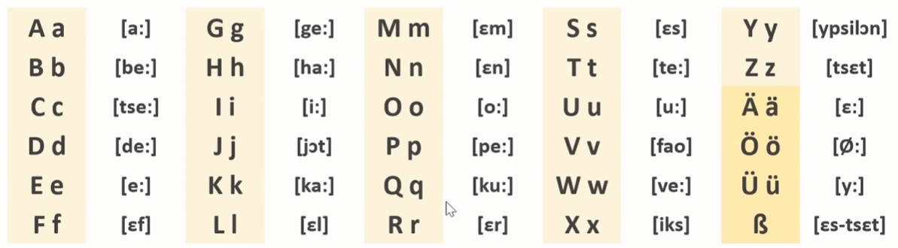

## German

### Alphabet

* CDEGPTW: add [e]
* W sounds like V, while V sounds like F.
* R is like [ehrrrr]

* S+vowel sounds like [z]

### Greetings

Hallo: Hello

Guten Tag: Good Day (formal)

Guten Morgen/Abend/Nacht: Good Morning/Evening/(Mid)Night

