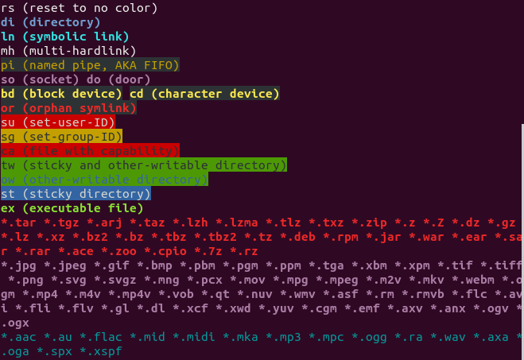

# ls color

### code to show it.

```bash
#!/bin/bash
# For LS_COLORS, print type and description in the relevant color.

declare -A descriptions=(
    [bd]="block device"
    [ca]="file with capability"
    [cd]="character device"
    [di]="directory"
    [do]="door"
    [ex]="executable file"
    [fi]="regular file"
    [ln]="symbolic link"
    [mh]="multi-hardlink"
    [mi]="missing file"
    [no]="normal non-filename text"
    [or]="orphan symlink"
    [ow]="other-writable directory"
    [pi]="named pipe, AKA FIFO"
    [rs]="reset to no color"
    [sg]="set-group-ID"
    [so]="socket"
    [st]="sticky directory"
    [su]="set-user-ID"
    [tw]="sticky and other-writable directory"
)

IFS=:
for ls_color in $LS_COLORS; do
    color="${ls_color#*=}"
    type="${ls_color%=*}"

    # Add description for named types.
    desc="${descriptions[$type]}"

    # Separate each color with a newline.
    if [[ $color_prev ]] && [[ $color != "$color_prev" ]]; then
        echo
    fi

    printf "\e[%sm%s%s\e[m " "$color" "$type" "${desc:+ ($desc)}"

    # For next loop
    color_prev="$color"
done
echo
```


### default output




### other-writable (o+w)

can be write by users other than owner.


### sticky bit

Sticky means ONLY root or owner can delete/move this file/directory.

It is usually used with 777, for example `\tmp` is set to 1777.

(All users can r/w/x their files in this directory, but cannot write other user's files.)

```bash
# add sticky bit
chmod +t <dir> 
chmod 1777 <dir>

# remove sticky bit
chmod -t <dir>
chmod 0777 <dir>
```


### change ls color

the environment variable `LS_COLORS` takes charge of this.

```bash
# default
rs=0:di=01;34:ln=01;36:mh=00:pi=40;33:so=01;35:do=01;35:bd=40;33;01:cd=40;33;01:or=40;31;01:mi=00:su=37;41:sg=30;43:ca=30;41:tw=30;42:ow=34;42:st=37;44:ex=01;32:*.tar=01;31:*.tgz=01;31:*.arc=01;31:*.arj=01;31:*.taz=01;31:*.lha=01;31:*.lz4=01;31:*.lzh=01;31:*.lzma=01;31:*.tlz=01;31:*.txz=01;31:*.tzo=01;31:*.t7z=01;31:*.zip=01;31:*.z=01;31:*.Z=01;31:*.dz=01;31:*.gz=01;31:*.lrz=01;31:*.lz=01;31:*.lzo=01;31:*.xz=01;31:*.bz2=01;31:*.bz=01;31:*.tbz=01;31:*.tbz2=01;31:*.tz=01;31:*.deb=01;31:*.rpm=01;31:*.jar=01;31:*.war=01;31:*.ear=01;31:*.sar=01;31:*.rar=01;31:*.alz=01;31:*.ace=01;31:*.zoo=01;31:*.cpio=01;31:*.7z=01;31:*.rz=01;31:*.cab=01;31:*.jpg=01;35:*.jpeg=01;35:*.gif=01;35:*.bmp=01;35:*.pbm=01;35:*.pgm=01;35:*.ppm=01;35:*.tga=01;35:*.xbm=01;35:*.xpm=01;35:*.tif=01;35:*.tiff=01;35:*.png=01;35:*.svg=01;35:*.svgz=01;35:*.mng=01;35:*.pcx=01;35:*.mov=01;35:*.mpg=01;35:*.mpeg=01;35:*.m2v=01;35:*.mkv=01;35:*.webm=01;35:*.ogm=01;35:*.mp4=01;35:*.m4v=01;35:*.mp4v=01;35:*.vob=01;35:*.qt=01;35:*.nuv=01;35:*.wmv=01;35:*.asf=01;35:*.rm=01;35:*.rmvb=01;35:*.flc=01;35:*.avi=01;35:*.fli=01;35:*.flv=01;35:*.gl=01;35:*.dl=01;35:*.xcf=01;35:*.xwd=01;35:*.yuv=01;35:*.cgm=01;35:*.emf=01;35:*.ogv=01;35:*.ogx=01;35:*.aac=00;36:*.au=00;36:*.flac=00;36:*.m4a=00;36:*.mid=00;36:*.midi=00;36:*.mka=00;36:*.mp3=00;36:*.mpc=00;36:*.ogg=00;36:*.ra=00;36:*.wav=00;36:*.oga=00;36:*.opus=00;36:*.spx=00;36:*.xspf=00;36:
```

the grammar is `<file type>=<decoration>;<fore-ground>[;<back-ground>]`

##### color code table

|                   |                               |                            |
| ----------------- | ----------------------------- | -------------------------- |
| 31 = red          | 40  = black background        | 0  = default colour        |
| 32 = green        | 41 = red background           | 1  = bold                  |
| 33 = orange       | 42 = green background         | 4  = underlined            |
| 34 = blue         | 43 = orange background        | 5  = flashing text         |
| 35 = purple       | 44 = blue background          | 7  = reverse fg/bg         |
| 36 = cyan         | 45 = purple background        | 8  = concealed (invisible) |
| 37 = grey         | 46 = cyan background          | 0  = default colour        |
| 90 = dark grey    | 47 = grey background          | 1  = bold                  |
| 91 = light red    | 100 = dark grey background    |                            |
| 92 = light green  | 101 = light red background    |                            |
| 93 = yellow       | 102 = light green background  |                            |
| 94 = light blue   | 103 = yellow background       |                            |
| 95 = light purple | 104 = light blue background   |                            |
| 96 = turquoise    | 105 = light purple background |                            |
| 97 = white        | 106 = turquoise background    |                            |
|                   | 107 = white background        |                            |

##### example (remove 777 shit green)

```bash
# ~/.bashrc
export LS_COLORS="$LS_COLORS:ow=1;34:tw=1;34:"
```

