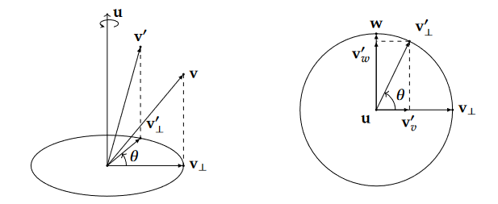
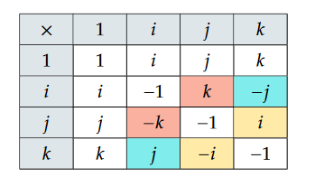
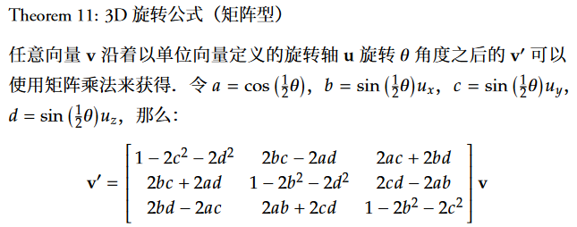
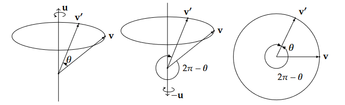

# quaternion

> Ref & Credits: https://github.com/Krasjet/quaternion


### Basics about complex number $\mathbb C$

$$
i^2 = -1 \\

z = a + bi = \begin{bmatrix}a &-b \\ b & a\end{bmatrix} \\

z_1z_2=z_2z_1 \\

||z|| = \sqrt{a^2 + b^2} = \sqrt{z \bar z}
$$


### 2D Rotation

2D rotation (counter-clockwise by $\theta$) can be represented by:
$$
\mathbf{v'} = \begin{bmatrix}\cos\theta &-\sin\theta \\ \sin\theta & \cos\theta\end{bmatrix} \mathbf{v}
$$
A complex number can represents a 2D vector.

Multiply it with a complex number equals **scaling and rotating** in the 2D plane:

let $\theta = \arccos \frac{b}{\sqrt{a^2+b^2}}, r=||z||=\sqrt{a^2+b^2}$:


$$
z = \begin{bmatrix}a &-b \\ b & a\end{bmatrix} = \sqrt{a^2+b^2} \begin{bmatrix} \frac {a} {\sqrt{a^2+b^2}} & \frac {-b} {\sqrt{a^2+b^2}} \\ \frac{b}{\sqrt{a^2+b^2}} & \frac{a} {\sqrt{a^2+b^2}}\end{bmatrix} = r \begin{bmatrix}\cos \theta  & - \sin \theta \\ \sin \theta & \cos \theta\end{bmatrix} \\ 
= r(\cos\theta + i\sin\theta) \\
= re^{i\theta}
$$

Therefore, we also have $v' = zv$ if the scaling factor $r=||z||=1$.


### 3D Rotation

3D rotation can be represented by three **Euler angles** $(\theta, \phi, \gamma)$, but it relies on the axes system and can lead to Gimbal Lock.

$$
 
\mathbf R_x(\theta) = 
\begin{bmatrix}
1&0&0&0\\
0&\cos\theta & -\sin\theta &0 \\
0&\sin\theta & \cos\theta &0 \\
0&0&0 &1
\end{bmatrix} \\

\mathbf R_y(\phi) = 
\begin{bmatrix}
\cos\phi &0 & -\sin\phi &0 \\
0&1&0&0\\
\sin\phi &0 & \cos\phi &0 \\
0&0&0 &1
\end{bmatrix} \\

\mathbf R_z(\gamma) = 
\begin{bmatrix}
\cos\gamma & -\sin\gamma &0&0 \\
\sin\gamma & \cos\gamma &0&0 \\
0&0&1&0 \\
0&0&0&1\\
\end{bmatrix} \\
$$
Another representation is **axis-angle**: rotation $\theta$ degree along axis $\textbf {u} = (x, y, z)^T$, where $||\mathbf u|| = 1$. 

(There are still only 3 Degree of Freedom)



which leads to the **Rodrigues' Rotation Formula**:
$$
\mathbf v' = \cos\theta\mathbf v + (1 - \cos\theta)(\mathbf u \cdot \mathbf v)\mathbf u + \sin\theta(\mathbf u\times\mathbf v)
$$


### Basics about Quaternion $\mathbb H$

$$
q = a + bi + cj + dk = \begin{bmatrix}a,b,c,d\end{bmatrix}^T \quad (a, b, c, d \in \mathbb R) \\
||q||=\sqrt{a^2 + b^2 + c^2 + d^2}
$$

where 
$$
i^2=j^2=k^2=ijk=-1
$$
by left-multiplying $i$ or right-multiplying $k$ to $ijk$, we have:
$$
ij=k, jk=i
$$
further left-multiplying $i$ or right-multiplying $j$ to $ij$  and similar to $jk$, we have:
$$
kj=-i, ik=-j,ji=-k
$$
lastly right-multiplying $i$ to $ji$, we have:
$$
ki=j
$$
which leads to an important difference with Complex number:
$$
q_1q_2 \neq q_2q_1
$$


The matrix formulation of multiplication:
$$
q_1 = a + bi + cj + dk, q_2=e+fi+gj+hk \\
q_1q_2=\begin{bmatrix}
a & -b  & -c & -d \\
b & a & -d & c \\
c & d & a & -b \\
d & -c & b & a
\end{bmatrix} 
\begin{bmatrix}
e \\ f \\ g \\ h
\end{bmatrix} \\
q_2q_1=\begin{bmatrix}
a & -b  & -c & -d \\
b & a & d & -c \\
c & -d & a & b \\
d & c & -b & a
\end{bmatrix}
\begin{bmatrix}
e \\ f \\ g \\ h
\end{bmatrix}
$$
A more concise form can be represented by hybrid scalar-vector form (Grafman Product):
$$
q_1 = [a, \mathbf v], q_2=[e, \mathbf{u}] \\
\mathbf v = [b, c, d]^T, \mathbf{u}=[f,g,h]^T \\
q_1q_2=[ae-\mathbf v \cdot \mathbf u,a\mathbf u+e\mathbf v+\mathbf v \times \mathbf u]
$$

#### Pure quaternion

the real part equals 0.
$$
v = [0, \mathbf v], u=[0, \mathbf u] \\
vu=[-\mathbf v\cdot\mathbf u, \mathbf v\times\mathbf u]
$$

#### Inverse

$$
qq^{-1} = q^{-1}q = 1
$$

#### Conjugate

$$
q=[s, \mathbf u] \rightarrow q^* = [s, -\mathbf u] \\
(q^*)^* = q \\
qq^*=q^*q=||q||^2=[s^2 + \mathbf u \cdot \mathbf u, 0] \\
||q||=||q^*|| \\
q_1^*q_2^*=(q_2q_1)^*
$$

And we get a method to calculate the inverse:
$$
q^{-1} = \frac {q^*} {||q||^2} = [\frac s {s^2 + \mathbf u \cdot \mathbf u}, \frac {-\mathbf{u}} {s^2 + \mathbf u \cdot \mathbf u} ]\\
$$
which also indicates:
$$
||q^{-1}|| = \frac 1 {||q||} \\
(q^{-1})^{-1} = q
$$


### Quaternion for 3D Rotation

A pure quaternion can represent a 3D vector: $v=[0, \mathbf v]$

A unit quaternion can represent a 3D rotation: $||q||=1$

And we can rewrite the Rodrigues' Rotation Formula in a new form!

To rotate $\mathbf{v}$ for $\theta$ degree along axis $\textbf {u} = (x, y, z)^T$, where $||\mathbf u|| = 1$,

define
$$
v = [0, \mathbf v], q=[\cos\frac\theta 2, \sin\frac\theta 2 \mathbf u] \\
$$
note that $$||q||=1$$, we have:
$$
v'=qvq^*=qvq^{-1}
$$

> To understand it, we still need to decompose it:
> $$
> v'=q(v_{||}+v_{\perp})q^* = qv_{||}q^*+qv_{\perp}q^*=qq^*v_{||}+qqv_\perp = v_{||}+qqv_\perp
> $$
> where 
> $$
> qq = [\cos\theta, \sin\theta \mathbf u]
> $$
> (rotate $\frac \theta 2$ twice equals rotate $\theta$)

Inversely, given a unit quaternion $q=[a, \mathbf b]$, we can get the rotation angle and axis by:
$$
\theta = 2 \arccos a\\
\mathbf u = \frac {\mathbf {b}} {\sin\theta}
$$

#### Matrix form

Very complicated form...



#### Composition of rotation

Just do it sequentially,
$$
v' = q_2(q_1vq_1^*)q_2^* = (q_2q_1)v(q_2q_1)^*
$$
First apply $q_1$ then apply $q_2$ leads to equal rotation of $q_2q_1$.

Note that the order matters! $q_1q_2 \ne q_2q_1$.


#### Double cover

One 3D rotation can be represented with TWO quaternions: $q$ and $-q$.
$$
(-q)v(-q)^*=qvq^* \\
-q = [-\cos\frac\theta 2, -\sin\frac\theta 2 \mathbf u] = [\cos(\pi - \frac\theta 2), \sin(\pi-\frac\theta 2) (-\mathbf u)]
$$




Notice that the matrix form is exactly the same for $-q$ and $q$, since all of the elements are multiplication of two coefficients!


#### Euler power form

$$
e^{\mathbf u \theta}=\cos \theta + \mathbf u\sin\theta \\
v' = e^{\mathbf u \frac\theta 2} v e^{-\mathbf u \frac \theta 2}
$$


### Implementation

```python
import torch

def norm(q):
    # q: (batch_size, 4)

    return torch.sqrt(torch.sum(q**2, dim=1, keepdim=True))

def normalize(q):
    # q: (batch_size, 4)

    return q / (norm(q) + 1e-20)

def conjugate(q):
    # q: (batch_size, 4)

    return torch.cat([q[:, 0:1], -q[:, 1:4]], dim=1)

def inverse(q):
    # q: (batch_size, 4)

    return conjugate(q) / (torch.sum(q**2, dim=1, keepdim=True) + 1e-20)


def from_vectors(a, b):
    # get the quaternion from two 3D vectors, such that b = qa.
    # a: (batch_size, 3)
    # b: (batch_size, 3)
    # note: a and b don't need to be unit vectors.

    q = torch.empty(a.shape[0], 4, device=a.device)
    q[:, 0] = torch.sqrt(torch.sum(a**2, dim=1)) * torch.sqrt(torch.sum(b**2, dim=1)) + torch.sum(a * b, dim=1)
    q[:, 1:] = torch.cross(a, b)
    q = normalize(q)

    return q

def from_axis_angle(axis, angle):
    # get the quaternion from axis-angle representation
    # axis: (batch_size, 3)
    # angle: (batch_size, 1), in radians

    q = torch.empty(axis.shape[0], 4, device=axis.device)
    q[:, 0] = torch.cos(angle / 2)
    q[:, 1:] = normalize(axis) * torch.sin(angle / 2)
    
    return q

def as_axis_angle(q):
    # get the axis-angle representation from quaternion
    # q: (batch_size, 4)

    q = normalize(q)
    angle = 2 * torch.acos(q[:, 0:1])
    axis = q[:, 1:] / torch.sin(angle / 2)

    return axis, angle

def from_matrix(R):
    # get the quaternion from rotation matrix
    # R: (batch_size, 3, 3)

    q = torch.empty(R.shape[0], 4, device=R.device)
    q[:, 0] = 0.5 * torch.sqrt(1 + R[:, 0, 0] + R[:, 1, 1] + R[:, 2, 2])
    q[:, 1] = (R[:, 2, 1] - R[:, 1, 2]) / (4 * q[:, 0])
    q[:, 2] = (R[:, 0, 2] - R[:, 2, 0]) / (4 * q[:, 0])
    q[:, 3] = (R[:, 1, 0] - R[:, 0, 1]) / (4 * q[:, 0])

    return q

def as_matrix(q):
    # get the rotation matrix from quaternion
    # q: (batch_size, 4)

    R = torch.empty(q.shape[0], 3, 3, device=q.device)
    R[:, 0, 0] = 1 - 2 * (q[:, 2]**2 + q[:, 3]**2)
    R[:, 0, 1] = 2 * (q[:, 1] * q[:, 2] - q[:, 0] * q[:, 3])
    R[:, 0, 2] = 2 * (q[:, 1] * q[:, 3] + q[:, 0] * q[:, 2])
    R[:, 1, 0] = 2 * (q[:, 1] * q[:, 2] + q[:, 0] * q[:, 3])
    R[:, 1, 1] = 1 - 2 * (q[:, 1]**2 + q[:, 3]**2)
    R[:, 1, 2] = 2 * (q[:, 2] * q[:, 3] - q[:, 0] * q[:, 1])
    R[:, 2, 0] = 2 * (q[:, 1] * q[:, 3] - q[:, 0] * q[:, 2])
    R[:, 2, 1] = 2 * (q[:, 2] * q[:, 3] + q[:, 0] * q[:, 1])
    R[:, 2, 2] = 1 - 2 * (q[:, 1]**2 + q[:, 2]**2)

    return R

def mul(q1, q2):
    # q1: (batch_size, 4)
    # q2: (batch_size, 4)
    # return: q1 * q2: (batch_size, 4)

    q = torch.empty_like(q1)
    q[:, 0] = q1[:, 0] * q2[:, 0] - q1[:, 1] * q2[:, 1] - q1[:, 2] * q2[:, 2] - q1[:, 3] * q2[:, 3]
    q[:, 1] = q1[:, 0] * q2[:, 1] + q1[:, 1] * q2[:, 0] + q1[:, 2] * q2[:, 3] - q1[:, 3] * q2[:, 2]
    q[:, 2] = q1[:, 0] * q2[:, 2] - q1[:, 1] * q2[:, 3] + q1[:, 2] * q2[:, 0] + q1[:, 3] * q2[:, 1]
    q[:, 3] = q1[:, 0] * q2[:, 3] + q1[:, 1] * q2[:, 2] - q1[:, 2] * q2[:, 1] + q1[:, 3] * q2[:, 0]

    return q

def apply(q, a):
    # q: (batch_size, 4)
    # a: (batch_size, 3)
    # return: q * a * q^{-1}: (batch_size, 3)

    q = normalize(q)
    q_inv = conjugate(q)

    return mul(mul(q, torch.cat([torch.zeros(q.shape[0], 1, device=q.device), a], dim=1)), q_inv)[:, 1:]
```

