# blender tutorial

### Rigging and deforming

* load your ready-to-rig humanoid model.

* Add (Shift-A) --> Armature --> Single Bone

  * Change to wireframe mode for easy visualization of bone-model position.
  * you may change the visibility to "always in front" so you can click your bone easily.

  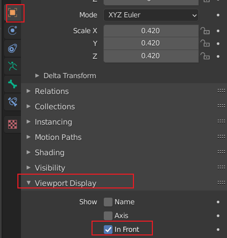

  

* Adjust the bone's size, rotation, make it as the main spine of your model.

* Go to edit mode:

  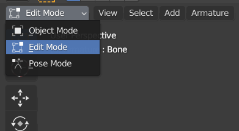

* click on the rotation ball, use E = extrude to create other connected bones:

  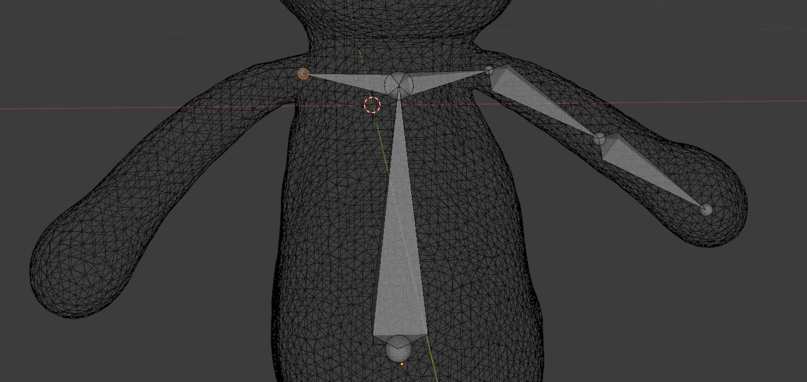

* After creating all bones, go to object mode, first click model, then shift-click bone, then Ctrl + P, choose automatic weights:

  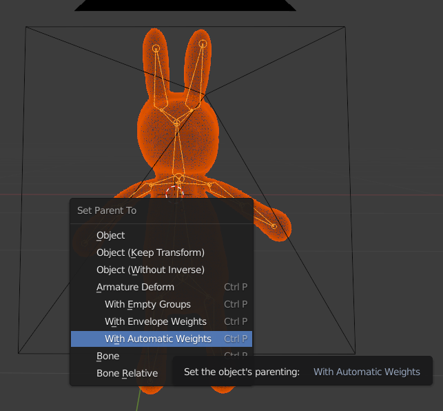

* Then go to pose mode, and you can move your bones to visualize the deformed poses!


### How to render transparent background

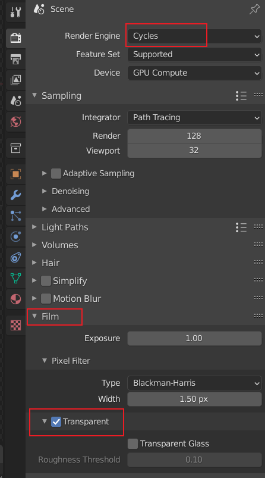

### How to rotate camera/light by parenting

* Add (`Shift + A`) a new empty object (plain axis), set its location to (0, 0, 0).
* In 3D viewport, first select camera/light (child), then select the empty object (parent).
* `Ctrl + P`, set parent to object.
* You could see in Outlier, the camera/light now belongs to the empty object.
* Rotate the empty object, and the child will rotate too!

### animation interpolation

default is some smoothing bezier curve.

In Animation pannel, choose `channel --> extrapolation mode --> linear extrapolation`.

### Render

`0` to toggle camera view. 

`F12` to render current image.

`Ctrl + F12` to render animation.

Use `ffmpeg` to concat to video:

```bash
# -pix_fmt yuv420p is neccessary to be compatible to powerpoint
ffmpeg.exe -framerate 30 -i %04d.png -vcodec libx264 -pix_fmt yuv420p out.mp4
```

Set output path:

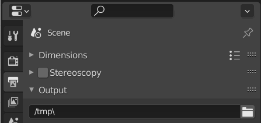

Set resolution & aspect:

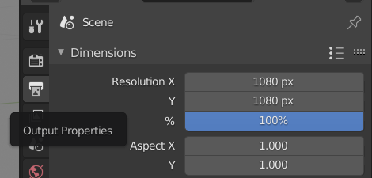

### Animation

In animation tab, set keyframe by clicking:

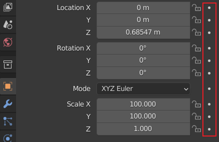

### Camera follow path animation

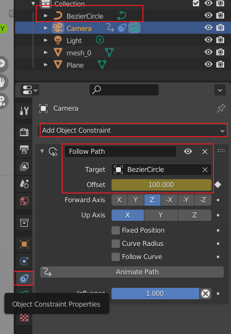

### Ambient lighting

In the world properties:

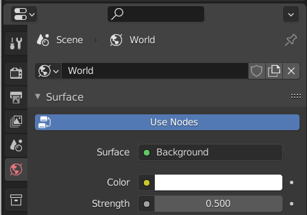


### Move object origin to mesh center (instead of global center 0,0,0)

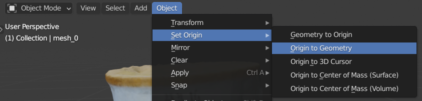


### UI and shortcut key

* Middle Button (view control)
  * `Middle Button + Drag`: rotate
  * `Alt + Middle Button + Drag`: rotate to nearest axis
  * `Ctrl + Middle Button + Drag (Vertical)` == `Middle Button Scroll`: zoom
  * `Shift + Middle Button + Drag`: pan

* Numpad (view control)
  
  * `2 / 4 / 6 / 8`: rotate 
  * `1 / 3 / 7 / 9`: rotate to axis
  * `5`: toggle perspective / orthogonal
  * `0`: toggle camera view
  
  
  
* Shift + A: add new objects
  
* Shift + Z: toggle wireframe
  
* Ctrl + Space: toggle maximize area with the current application window.
  
   
  
* Ctrl + Dragging: discrete steps

* Shift + Dragging: precise steps
  
  
  
* Ctrl + Z: undo

* Ctrl + Shift + Z: redo


* Ctrl + Alt + 0: **move camera to current view (very useful!)**

