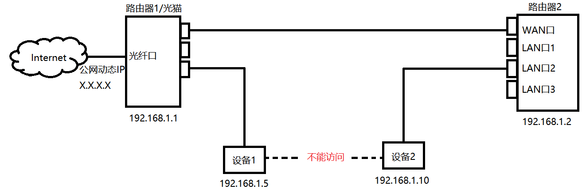
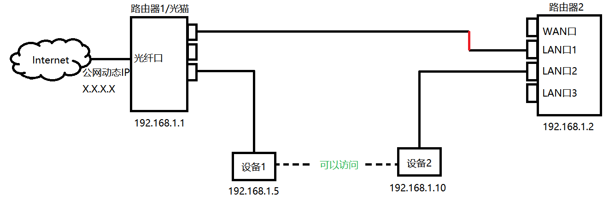

# Router

### Concepts

* WAN（Wide Area Network，广域网）

* LAN（Local Area Network，局域网），通常由物理位置划分。

* VLAN（Virtual LAN，虚拟局域网），不根据物理位置划分的局域网。按照逻辑关系分割LAN为互相隔离的多个VLAN，从而方便管理，更加安全。不同VLAN尽管使用同样的硬件，但无法互相通信，需要使用三层交换机或单臂路由实现VLAN间的通信。

* TCP/IP五层模型：

  * 物理层（中继器，集线器）
  * 链路层（根据MAC地址转发，例如网桥，二层交换机）
  * 网络层（根据IP转发，例如路由器）
  * 传输层
  * 应用层

* 交换机（Switch）：用于LAN内部的快速数据交换，功能简单，使用硬件完成。（学习地址，转发/过滤，消除回路）。通常包含较多LAN口。

  * 二层交换机：链路层设备，只根据MAC地址转发。
  * 三层交换机：网络层&链路层设备，具有简单的路由功能，同时根据IP地址以及MAC地址转发。

* 路由器（Router）：商用路由器专门用于LAN/WAN的路由转发，由于路由计算功能的复杂性，使用通用计算机加软件完成。通常包含几个WAN口和少数LAN口。

  * 不使用WAN口时，也可以作为交换机使用：

    

    

  * 软路由（软件路由器）：例如OpenWrt，相比硬件路由器（其实也是专用软件），拓展性强，性价比高。

  * 旁路由：挂靠在主路由网络下的一个旁系网络，用于分担/拓展主路由器的功能。（opp：主路由）

  * 单臂路由器（Router on a stick）：只包含WAN口。用于实现互相隔离的多个VLAN之间的路由。通常是无法购置三层交换机时的备选方案。

* 家用路由器：功能较多（路由转发，PPPoE，NAT，WiFi，DHCP），但是都比较基础。

  * 通常包含一个WAN口与四个LAN口。自动NAT，将LAN转发给PPPoE分配到公网IP。
  * PPPoE（**P**oint-to-**P**oint **P**rotocol **o**ver **E**thernet）：点对点互联网协议，目前主流的宽带接入方式，用于动态分配IP地址。
  * NAT（Network  Address Translation，网络地址转换）：用于解决IPv4不足的补救方法。用于内网多台主机共用一个公网IP地址。增加了网络结构复杂性，性能较差。（静态NAT：不支持端口映射）

> 二层、三层交换机与路由器的应用：
>
> * 二层交换机用于小型的局域网络。在小型局域网中，广播包影响不大，二层交换机的快速交换功能、多个接入端口和低价为小型网络用户提供了很完善的解决方案。
>
> * 三层交换机的最重要的功能是加快大型局域网络内部的数据的快速转发，加入路由功能也是为这个目的服务的。
>
> * 普通路由器由于接口数量有限和路由转发速度慢，将限制网络的速度和网络规模。（但是高端路由器和高端三层交换机的区别就比较小了）

* 网关（Gateway）：广义的概念，任何可以连接两个网络的设备。

* VPN（Virtual Private Network）：通过加密的方式，利用公网建立专用的网络连接。
* 内网穿透/NAT穿透：用于访问NAT设备后的特定主机（解除NAT对此主机的屏蔽）。通常需要使用一个公网IP来做端口映射。
* 静态路由：http://blog.sina.com.cn/s/blog_86d75993010109cr.html

