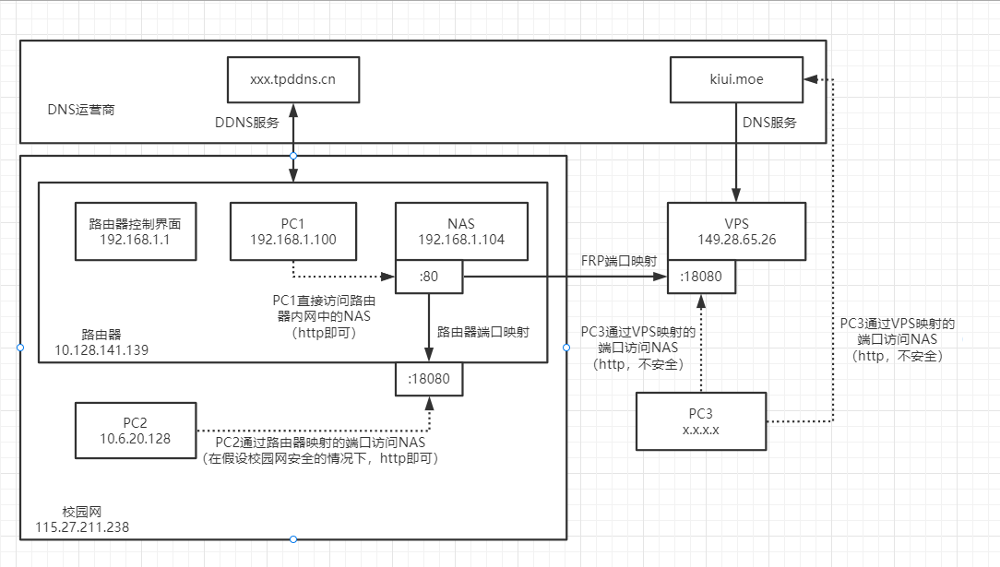

# remote access

### 路由器端口映射

将路由器LAN的端口映射到WAN的端口。

应用场景：路由器WAN固定。

* 路由器自带（虚拟服务器）

> 宿舍校园网IP分配疑似固定，适合校园网内部通过IP直接访问。

### DDNS (Dynamic DNS)

将域名解析到动态的IP地址。

应用场景：路由器WAN不固定，一个域名，支持DDNS的运营商。

* 内网主机安装DDNS客户端，向域名运营商的DDNS服务器定时发送请求更新当前IP地址。从而保证外网主机访问内网域名时，会收到当前IP地址。

> 需要借助运营商，未使用。

### Reverse Proxy

类似路由器端口映射，将内网端口映射到一个静态IP的端口。

应用场景：路由器WAN不固定，一个有静态IP的VPS（用来转发流量）。

* FRP：内网主机安装frp客户端，VPS安装frp服务端，参考TCP/HTTP配置文件，双方建立连接即可。

> 可以用来映射jellyfin、webdav服务，以通过域名直接访问。
>
> WebUI最好不要直接暴露到公网（不知道为什么，外网访问甚至没有登陆提示...）。

### P2P

以上方法都是想办法将内网主机暴露到外网，P2P则是将外网主机通过隧道连接到内网。

* FRP：路由器WAN不固定，一个有静态IP的VPS（不转发流量，只用来建立隧道）。

  在内网主机安装frp客户端，VPS安装frp服务端，**外网主机安装frp客户端**，参考P2P配置文件建立连接即可。

* WireGuard：路由器WAN固定。

  在内网主机安装WireGuard，在**外网主机安装WireGuard**，建立对等连接即可。

  （与端口映射的区别：只需要一个端口接入内网，便可安全访问内网所有服务；代价是外网主机也需要运行WireGuard。）

> 比较麻烦，但校园网不支持...

