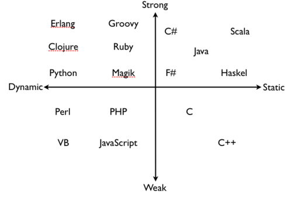

## types of languages




* Dynamic Language: type of variables are determined at runtime.

* Static Language: type of variables are determined at compilation.

* Strongly typed Language: forbid implicit type casting.

  ```python
  1 + "a" # ERROR
  ```

* Weakly typed Language: allow implicit type casting.

  ```c
  1 + 'a' // OK, cast char to int
  ```

  