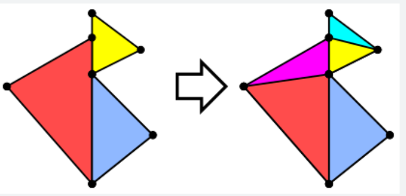
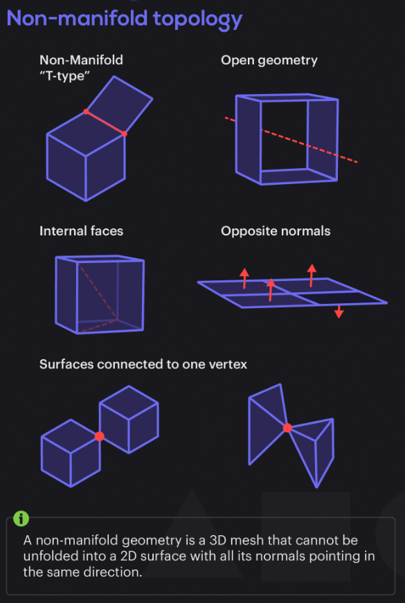

## PyMeshLab


### install

```bash
pip install pymeshlab
```


### usage

Basics:

```python
import pymeshlab as pml

# mesh set object (may contain multiple meshes)
ms = pml.MeshSet()

# load a mesh (a layer in meshlab)
ms.load_new_mesh('mesh.ply')

# number of meshes
print(len(ms)) # 1
ms.load_new_mesh('mesh2.ply')
print(len(ms)) # 2

# set current mesh (layer)
ms.set_current_mesh(0) # use id

# mesh stats
m = ms.current_mesh()
print(m.vertex_number())
print(m.edge_number())
print(m.bounding_box()) # pml.BoundingBox, bb.diagonal, bb.max(), bb.min()
print(m.id()) # id in meshset, if not added to ms, default to -1

# apply filters
ms.meshing_remove_connected_component_by_diameter(mincomponentdiag=pml.Percentage(10))

# apply filters with outputs
res = ms.get_geometric_measures()
print(res['mesh_volume'])
print(res['surface_area'])

# save mesh
ms.save_current_mesh('mesh_new.ply')

# remove all meshes
ms.clear()
```


Numpy interaction:

```python
import pymeshlab as pml
import numpy as np

ms = pml.MeshSet()

verts = np.array([...]) # [N, 3], float32
faces = np.array([...]) # [N, 3], int64

# create mesh from numpy array
m = pml.Mesh(verts, faces)

# add to meshset
ms.add_mesh(m, 'name') # NOTE: this will do COPY!

# extract to numpy array
m = ms.current_mesh() # get the correct ref
verts = m.vertex_matrix()
faces = m.face_matrix()
```


Filter script (automatic processing)

```python
import pymeshlab as pml

ms = pml.MeshSet()
ms.load_new_mesh('mesh.ply')

# apply some filters
ms.meshing_isotropic_explicit_remeshing()
ms.meshing_isotropic_explicit_remeshing()
ms.compute_scalar_by_aspect_ratio_per_face()
ms.compute_color_from_scalar_per_face()

# save all filter history in a script
ms.save_filter_script('filter.mlx')

#####################

# load filter script
ms.load_filter_script(base_path + "sample_filter_script.mlx")
# apply the same filters
ms.apply_filter_script()
```


### Useful Filters

```python
### mesh cleaning

# clean vertices
ms.meshing_remove_unreferenced_vertices() # verts not refed by any faces
ms.meshing_remove_duplicate_vertices() # verts defined by the same values
ms.meshing_merge_close_vertices(threshold=pml.Percentage(1)) # 1/10000 of bounding box diagonal

# clean faces
ms.meshing_remove_duplicate_faces() # faces defined by the same verts
ms.meshing_remove_null_faces() # faces with area == 0

# remove CC
ms.meshing_remove_connected_component_by_diameter(mincomponentdiag=pml.Percentage(10))
ms.meshing_remove_connected_component_by_face_number(mincomponentsize=25)

# repair t-vertices
# method: 0 = edge collapse, 1 = edge flip
ms.meshing_remove_t_vertices(method=0, threshold=40, repeat=True)

# repair non-manifold geometry
# method: 0 = remove faces, 1 = split vertices
ms.meshing_repair_non_manifold_edges(method=0)
ms.meshing_repair_non_manifold_vertices(vertdispratio=0)
```


[T-vertices](): Vertices in the mid of an edge. Could be fixed by tessellation.



[Non-manifold Geometry](https://blender.stackexchange.com/questions/7910/what-is-non-manifold-geometry): geometry not exist in real world, like zero-thickness area. It causes problems in 3D printing, and leads to artifacts in rendering.

