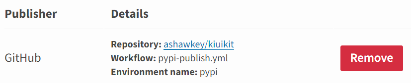

# PyPi publish


### Prepare `setup.py`

A simple example:

```python
from setuptools import setup

if __name__ == '__main__':
    setup(
        name="numpytorch",
        version='0.1.0',
        description="Monkey-patched numpy with pytorch syntax",
        long_description=open('README.md', encoding='utf-8').read(),
        long_description_content_type='text/markdown',
        url='https://github.com/ashawkey/numpytorch',
        author='kiui haw',
        author_email="ashawkey1999@gmail.com",
        packages=['numpytorch',],
        classifiers=[
            'Intended Audience :: Science/Research',
            'Programming Language :: Python :: 3 ',
            'License :: OSI Approved :: MIT License',
        ],
        keywords='tensor manipulation, machine learning, deep learning',
        install_requires=[
            'numpy>=1.20',
            'forbiddenfruit',
        ],
    )
```

`setup.cfg` is a static alternative of `setup.py`. Usually we don't need it. (although `setuptools` aims to transfer to the static one.)


### `pytest` for unit test

```python
pip install -U pytest
```

Prepare the folders as:

```bash
- pkg
	- __init__.py
	- ...
- tests
	- test_1.py
	- test_2.py
	- ...
setup.py
```

Install the package as editable (just link the package to the original location, basically meaning any changes to the original package would reflect directly in your environment.):

```bash
# -e, --editable
pip install -e .
```

Write the `test.py` as:

```python
import pkg

def test_func1():
    assert (...)

def test_func2():
    assert (...)
    
def TestClass:
    def test_method1():
        assert (...)
```

Call `pytest` at the current directory, it will automatically locate `tests/test_*.py`:

```bash
# run all tests
pytest
# quite run
pytest -q
# stop at first error
pytest -x

# test matching keyword
pytest -k func
pytest -k Class.method
```


### `.gitignore`

```
__pycache__/
.pytest_cache/
*~
*.pyc
*.DS_Store
*.egg-info
*.log
.coverage
build/
dist/
```


`LICENSE`

```
The MIT License

Copyright (c) 2013, 2019  Lincoln Clarete

Permission is hereby granted, free of charge, to any person obtaining a copy
of this software and associated documentation files (the "Software"), to deal
in the Software without restriction, including without limitation the rights
to use, copy, modify, merge, publish, distribute, sublicense, and/or sell
copies of the Software, and to permit persons to whom the Software is
furnished to do so, subject to the following conditions:

The above copyright notice and this permission notice shall be included in
all copies or substantial portions of the Software.

THE SOFTWARE IS PROVIDED "AS IS", WITHOUT WARRANTY OF ANY KIND, EXPRESS OR
IMPLIED, INCLUDING BUT NOT LIMITED TO THE WARRANTIES OF MERCHANTABILITY,
FITNESS FOR A PARTICULAR PURPOSE AND NONINFRINGEMENT. IN NO EVENT SHALL THE
AUTHORS OR COPYRIGHT HOLDERS BE LIABLE FOR ANY CLAIM, DAMAGES OR OTHER
LIABILITY, WHETHER IN AN ACTION OF CONTRACT, TORT OR OTHERWISE, ARISING FROM,
OUT OF OR IN CONNECTION WITH THE SOFTWARE OR THE USE OR OTHER DEALINGS IN
THE SOFTWARE.
```


### Publishing [deprecated! please use workflows]

First, build the distributions by:

```bash
# it will pack the package into sth like `dist/numpytorch-0.1.2.tar.gz`
python setup.py sdist
```

Then, install `twine` and register at [`PyPi`](https://pypi.org/).

```bash
pip install twine
```

Upload the distribution:

```bash
twine upload dist/numpytorch-0.1.2.tar.gz
```

Note: you cannot delete or replace published versions! To update the code, you must change the version code and rebuild the package, then upload a different version (e.g., 0.1.3).


### Add static files

By default `sdist` only bundle code files, if you have some data, like the `onnx` models, you should use `MANIFEST.in` to add them.

`MANIFEST.in`:

```in
recursive-include path/to/my/data *
recursive-include path/to/another/data *
```

Then add one line in `setup.py`:

```python
setup(
    ...,
	include_package_data=True,
    ,,,.
)
```

Now you can run `python setup.py sdist` to check whether it copies your static files.


### Automatic publishing with github workflows

**NOTE: this is updated on 2024.1.12, using pypi trusted publishers.**

First configure your pypi project (https://pypi.org/manage/projects/), click `manage --> Publishing`, and add Github as a new publisher:



Then create workflows at `.github/workflows/pypi-publish.yml`:

```yaml
name: Upload Python Package

on:
  release: # publish when releasing a new tag on github.
    types: [created]
  workflow_dispatch: # allow you to manually trigger this workflow from github.

jobs:
  deploy:

    runs-on: ubuntu-latest

    environment:
      name: pypi
      url: https://pypi.org/project/kiui/
    permissions:
      id-token: write  # IMPORTANT: this permission is mandatory for trusted publishing

    steps:
    - uses: actions/checkout@v3
    - name: Set up Python
      uses: actions/setup-python@v3
      with:
        python-version: '3.10'
    # prepare distributions in dist/
    - name: Install dependencies and Build
      run: |
        python -m pip install --upgrade pip
        pip install setuptools wheel
        python setup.py sdist bdist_wheel
    # publish by trusted publishers (need to first setup in pypi.org projects-manage-publishing!)
    # ref: https://github.com/marketplace/actions/pypi-publish
    - name: Publish package distributions to PyPI
      uses: pypa/gh-action-pypi-publish@release/v1
```

When you want to publish a new version, navigate to **release** and release a version tag.

Then github actions will build and publish current repository state automatically!


### the setup script

```python
python setup.py build # build everything
python setup.py build_ext # build c extensions
python setup.py sdist # create source distribution

python setup.py install # install package, not recommended!
pip install . # this is recommended as it will take care of dependencies and write correct metadata for upgrade/uninstall.

python setup.py develop # editable install 
pip install -e . # ditto
```

