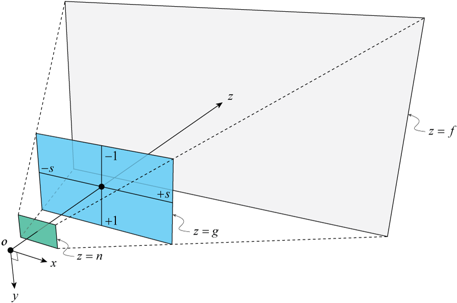

### Relationship between view / projection & intrinsic / extrinsic

* The Extrinsic Matrix is equivalent to the View Matrix.

* The Intrinsic Matrix and the (perspective) projection matrix both describes a perspective projection, but there are some differences:

  * The Intrinsic Matrix use pixel height / width / focal, e.g. `H ~ [0, 1024), W ~ [0, 1024), focal = 1236 `, and face at `+z`.
    
$$
K = \begin{bmatrix}
    f_x & s & x_0 & 0 \\
    0 & f_y  & y_0 & 0 \\
    0 & 0 & 1 & 0
    \end{bmatrix}
$$


* The Projection Matrix use NDC, e.g., `H ~ [-1, 1], W ~ [-1, 1], near = 0.1`, and face at `-z`:
  
$$
    Persp = Ortho\cdot P = Ortho \cdot \begin{bmatrix}
    near & 0 & 0 & 0 \\
    0 & near & 0 & 0 \\
    0 & 0 & near+far & near * far \\
    0 & 0 & -1 & 0
    \end{bmatrix}
    
$$

    And here the $P$ can be seen as a modified $K$:

  * if we use the near plane as the focal plane, then $near = f_x = f_y$
    * if we set principle to $(0, 0)$, then $x_0 = 0, y_0 = 0$
    * revert z-axis, so $1 \rightarrow -1$
    * inserting a third row about the information of `far` plane.

  However, in most cases, the focal plane is not the near plane:





### implementation

```python

# Pinhole camera
# support principle not at center, and intrinsic matrix.
class Camera:
    def __init__(self):
        ### view-related (or exintrics)
        self.center = np.array([0, 0, 1])
        self.target = np.array([0, 0, 0])
        self.up = np.array([0, 1, 0]) # world up, usually the y-axis.

        ### projection-related
        self.is_persp = True
        self.fovy = np.radians(45)
        # we use [-near, -far], so 0 < near < far
        self.near = 0.1
        self.far = 100
        
        ### intrinsics
        # define of the image plane:
        #   0
        # 0 +-----------------------> x / width
        #   |                   |
        #   |       image       |
        #   |                   |
        #   |-------------------+ (W, H)
        #   v
        #   y / height
        self.width = 1024 # x
        self.height = 1024 # y
        self.principle = np.array([512, 512]) # centered (width, height)
        self.skew = 0

    @property
    def cameraDirection(self):
        return normalize(self.center - self.target) # Note: it's target --> camera (or inverse cameraDirection)

    @property
    def cameraRight(self):
        return normalize(np.cross(self.up, self.cameraDirection))

    @property
    def cameraUp(self):
        return np.cross(self.cameraDirection, self.cameraRight)

    @property
    def aspect(self):
        return self.width / self.height
    
    # focal is similar to near, but in imaginary pixels !
    # see: http://ksimek.github.io/2013/06/03/calibrated_cameras_in_opengl/
    @property
    def focal(self):
        return self.height / (2 * np.tan(self.fovy / 2))

    # the physical physical_height of the near plane
    @property
    def physical_height(self):
        return 2 * self.near * np.tan(self.fovy / 2)
    
    @property
    def physical_width(self):
        return self.aspect * self.physical_height

    @property
    def left(self):
        return - self.physical_width * (self.principle[0] / self.width)

    @property
    def right(self):
        return self.physical_width * (1 - self.principle[0] / self.width)

    @property
    def top(self):
        return self.physical_height * (self.principle[1] / self.height)

    @property
    def bottom(self):
        return - self.physical_height * (1 - self.principle[1] / self.height)

    # The Intrinsic Matrix
    @property
    def intrinsic(self):
        return np.array([
            [self.focal, self.skew,  self.principle[0], 0],
            [0,          self.focal, self.principle[1], 0],
            [0,          0,          1,                 0],
        ])

    # The LookAt / View / Exintric / Pose Matrix.
    @property
    def view(self):
        # rotation
        R = np.eye(4)
        R[0, :3] = self.cameraRight
        R[1, :3] = self.cameraUp
        R[2, :3] = self.cameraDirection
        # translation
        T = np.eye(4)
        T[:3, 3] = -self.center
        # compose
        V = R @ T
        return V

    # The Projection Matrix.
    @property
    def projection(self):
        if not self.is_persp:
            ortho = np.array([
                [2 / (self.right - self.left), 0,                            0,                           - (self.right + self.left) / (self.right - self.left)],
                [0,                            2 / (self.top - self.bottom), 0,                           - (self.top + self.bottom) / (self.top - self.bottom)],
                [0,                            0,                            -2 / (self.far - self.near), - (self.far + self.near) / (self.far - self.near)    ],
                [0,                            0,                            0,                           1                                                    ],
            ])
            return ortho
        
        else:
            persp = np.array([
                [2 * self.near / (self.right - self.left), 0,                                        (self.right + self.left) / (self.right - self.left), 0                                                 ],
                [0,                                        2 * self.near / (self.top - self.bottom), (self.top + self.bottom) / (self.top - self.bottom), 0                                                 ],
                [0,                                        0,                                        - (self.near + self.far) / (self.far - self.near),   -2 * self.near * self.far / (self.far - self.near)],
                [0,                                        0,                                        -1,                                                  0                                                 ],
            ])
            return persp

```


### references

* http://ksimek.github.io/2013/06/03/calibrated_cameras_in_opengl/
* http://www.songho.ca/opengl/gl_projectionmatrix.html