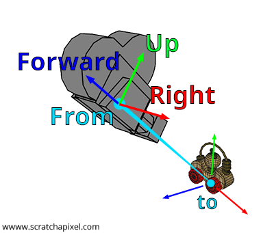

# Camera Pose

Very good reference: https://ksimek.github.io/2012/08/22/extrinsic/

### Homogeneous Coordinates


$$

\text{2D:} \quad [u, v, 1]^T  \\
\text{3D:} \quad [x, y, z, 1]^T  \\

$$


### Projection from 3D to 2D

We usually first transform the 3D points to the camera coordinate system by the camera pose, then project the 3D points to 2D image plane by the camera matrix:

$$

z_c\begin{bmatrix}
u \\ v \\ 1 \\
\end{bmatrix}
=
\mathbf K \begin{bmatrix}\mathbf R & \mathbf T \\ 0&  1\end{bmatrix}

\cdot
\begin{bmatrix}
x_w \\ y_w \\ z_w \\ 1 \\
\end{bmatrix}

$$

3D Point in the world coordinate system: $[x_w, y_w,z_w, 1]^T$ (relative to a defined origin position.)

3D Point in the camera coordinate system: $[x_c, y_c, z_c, 1]^T$ (relative to the camera center position.)

2D Point in the image plane: $[u,v,1]^T$

Camera Intrinsic (determined only by the camera itself): $\mathbf K \in \mathbb R^{3 \times 4}$.

Camera Extrinsic (describes the transformation from **world to camera**, inversion of camera pose): $\begin{bmatrix}\mathbf R& \mathbf T \\ 0&  1 \end{bmatrix} \in \mathbb R ^ {4 \times 4}$.


### Intrinsic

A $3 \times 4$ matrix used to **project** 3D points to 2D coordinates:

$$

z_c\begin{bmatrix}
u \\ v \\ 1 \\
\end{bmatrix}
 = 
\mathbf K
\begin{bmatrix}
x_c \\ y_c \\ z_c \\ 1 \\
\end{bmatrix}
 =
\begin{bmatrix}
\alpha_x & \gamma & u_0 & 0 \\
0 &\alpha_y & v_0 &  0 \\
0 & 0 & 1 & 0 \\
\end{bmatrix}
\cdot
\begin{bmatrix}
x_c \\ y_c \\ z_c \\ 1 \\
\end{bmatrix}

$$

$\alpha_x, \alpha_y$ are the **focal length in pixels**. (e.g., $\alpha_x = f\cdot m_x$, where $f$ is the focal length in distance, and $m_x$ is the inverse width of a pixel)

$\gamma$ is the skew coefficient, usually 0.

$(u_0, v_0)$ are the **principal point (camera center)**, ideally the center of the image, i.e., $(H/2, W/2)$


### Extrinsic (w2c)

A $4 \times 4$ matrix, a regular **3D transformation from world coordinate system to camera coordinate system**.

$$

\begin{bmatrix}\mathbf R_{3\times3}& \mathbf T_{3\times1} \\ 0_{1\times3}&  1 \end{bmatrix}
=
\begin{bmatrix}\mathbf I& \mathbf T \\ 0&  1 \end{bmatrix}
\begin{bmatrix}\mathbf R& 0 \\ 0&  1 \end{bmatrix}
=
\begin{bmatrix}\mathbf R& 0 \\ 0&  1 \end{bmatrix}
\begin{bmatrix}\mathbf I& -\mathbf C \\ 0&  1 \end{bmatrix}

$$

It can be decomposed as:

* first rotate with $\mathbf R$, then translate with $\mathbf T$, or
* first translate with $-\mathbf C$, then rotate with $\mathbf R$.

$\mathbf R$ is a rotation matrix. (orthogonal, $\mathbf R^T = \mathbf R^{-1}$)

$\mathbf T$ is the position of **the world origin in the camera coordinate system**,

**NOT the camera position in the world coordinate system!** 

instead, the position of the camera center in the world coordinate system, $\mathbf C=[x_0, y_0, z_0]$ should be calculated as:

$$

\begin{bmatrix}
0 \\ 0 \\ 0 \\ 1
\end{bmatrix}
=
\begin{bmatrix}\mathbf R& \mathbf T \\ 0&  1 \end{bmatrix} 
\cdot
\begin{bmatrix}
x_0 \\ y_0 \\ z_0 \\ 1
\end{bmatrix}

$$

thus, $\mathbf C = -\mathbf R^{-1}\mathbf T$

this also gives a way to calculate $\mathbf{T} = -\mathbf{RC}$.


### Pose (c2w)

Also a $4 \times 4$ matrix, but it describes the **3D transformation from camera to world**.

Obviously, **camera pose (c2w) is the inversion of extrinsic (w2c)**.

$$

\begin{bmatrix}\mathbf R_{3\times3}^T& \mathbf C_{3\times1} \\ 0_{1\times3}&  1 \end{bmatrix} = 
\begin{bmatrix}\mathbf R_{3\times3}& \mathbf T_{3\times1} \\ 0_{1\times3}&  1 \end{bmatrix}^{-1}

$$


### Construct by `LookAt`



Assume you know the camera position $\mathbf{C}$, and target position $\mathbf{O}$.

To construct the camera pose matrix, you can calculate the normalized **forward, right, and up vector**, then simply concatenate them：

$$

\begin{bmatrix}
x_w \\ y_w \\ z_w \\ 1
\end{bmatrix}
=
\begin{bmatrix}
\text{right}_x & \text{up}_x & \text{forward}_x & \text{C}_x \\ 
\text{right}_y & \text{up}_y & \text{forward}_y & \text{C}_y \\ 
\text{right}_z & \text{up}_z & \text{forward}_z & \text{C}_z \\ 
0 & 0 & 0 & 1 
\end{bmatrix} 

\cdot

\begin{bmatrix}
x_c \\ y_c \\ z_c \\ 1
\end{bmatrix}

$$


```python
import numpytorch as np

def normalize(vectors):
    return vectors / (np.linalg.norm(vectors, axis=-1, keepdims=True) + 1e-10)

### batched example
# centers: [B, 3], C
# targets: [B, 3], O

# forward is simple, notice that it is in fact the inversion of camera direction!
forward_vector = normalize(centers - targets)
# pick a temp up_vector, usually [0, 1, 0]
up_vector = np.array([0, 1, 0], dtype=np.float32).unsqueeze(0).torch_repeat(B, 1)
# cross(up, forward) --> right
right_vector = normalize(np.cross(up_vector, forward_vector, axis=-1))
# rectify up_vector, by cross(forward, right) --> up
up_vector = normalize(np.cross(forward_vector, right_vector, axis=-1))

### construct c2w
poses = np.eye(4, dtype=np.float32).unsqueeze(0).torch_repeat(B, 1, 1)
poses[:, :3, :3] = np.stack((right_vector, up_vector, forward_vector), axis=-1)
poses[:, :3, 3] = centers

### transform points (P @ x)
# cam_points: [B, 4, 1], assume COL vector!
world_points = poses @ cam_points
```


Or the camera extrinsic similarly:

$$

\begin{bmatrix}
x_c \\ y_c \\ z_c \\ 1
\end{bmatrix}
=
\begin{bmatrix}
\text{right}_x & \text{right}_y & \text{right}_z & 0 \\ 
\text{up}_x & \text{up}_y & \text{up}_z & 0 \\ 
\text{forward}_x & \text{forward}_y & \text{forward}_z & 0 \\ 
0 & 0 & 0 & 1 
\end{bmatrix} 

\cdot

\begin{bmatrix}
1 & 0 & 0 & -C_x \\ 
0 & 1 & 0 & -C_y \\ 
0 & 0 & 1 & -C_z \\ 
0 & 0 & 0 & 1 
\end{bmatrix} 


\cdot

\begin{bmatrix}
x_w \\ y_w \\ z_w \\ 1
\end{bmatrix}

$$


**Note**: some times, the forward vector maybe defined differently (e.g., in OpenGL, and most nerf datasets...)

we need to take the negative of forward (usually called **camera direction**) as the forward here.

```python
forward_vector = - normalize(centers - targets) # camera direction (OpenGL convention!)
up_vector = np.array([0, 1, 0], dtype=np.float32).unsqueeze(0).torch_repeat(size, 1)
right_vector = normalize(np.cross(forward_vector, up_vector, axis=-1))
up_vector = normalize(np.cross(right_vector, forward_vector, axis=-1))

poses = np.eye(4, dtype=np.float32).unsqueeze(0).torch_repeat(size, 1, 1)
poses[:, :3, :3] = np.stack((right_vector, up_vector, forward_vector), axis=-1)
poses[:, :3, 3] = centers
```


### Visualize poses

```python
import trimesh
import numpy as np

def visualize_poses(poses, size=0.1):
    # poses: [B, 4, 4]

    axes = trimesh.creation.axis(axis_length=4)
    objects = [axes]

    for pose in poses:
        # a camera is visualized with 8 line segments.
        pos = pose[:3, 3]
        a = pos + size * pose[:3, 0] + size * pose[:3, 1] + size * pose[:3, 2]
        b = pos - size * pose[:3, 0] + size * pose[:3, 1] + size * pose[:3, 2]
        c = pos - size * pose[:3, 0] - size * pose[:3, 1] + size * pose[:3, 2]
        d = pos + size * pose[:3, 0] - size * pose[:3, 1] + size * pose[:3, 2]

        segs = np.array([[pos, a], [pos, b], [pos, c], [pos, d], [a, b], [b, c], [c, d], [d, a]])
        segs = trimesh.load_path(segs)
        objects.append(segs)

    trimesh.Scene(objects).show()
```


### Orbit Camera Model

```python


class OrbitCamera:
    def __init__(self, W, H, r=2, fovy=60):
        self.W = W
        self.H = H
        self.radius = r # camera distance from center
        self.fovy = fovy # in degree
        self.center = np.array([0, 0, 0], dtype=np.float32) # look at this point
        self.rot = R.from_quat([1, 0, 0, 0]) # init camera matrix: [[1, 0, 0], [0, -1, 0], [0, 0, 1]] (to suit ngp convention)
        self.up = np.array([0, 1, 0], dtype=np.float32) # need to be normalized!

    # pose
    @property
    def pose(self):
        # first move camera to radius
        res = np.eye(4, dtype=np.float32)
        res[2, 3] -= self.radius
        # rotate
        rot = np.eye(4, dtype=np.float32)
        rot[:3, :3] = self.rot.as_matrix()
        res = rot @ res
        # translate
        res[:3, 3] -= self.center
        return res
    
    # intrinsics
    @property
    def intrinsics(self):
        res = np.eye(3, dtype=np.float32)
        focal = self.H / (2 * np.tan(np.radians(self.fovy) / 2))
        res[0, 0] = res[1, 1] = focal
        res[0, 2] = self.W // 2
        res[1, 2] = self.H // 2
        return res
    
    def orbit(self, dx, dy):
        # rotate along camera up/side axis!
        side = self.rot.as_matrix()[:3, 0] # the right_vector
        rotvec_x = self.up * np.radians(-0.1 * dx)
        rotvec_y = side * np.radians(-0.1 * dy)
        self.rot = R.from_rotvec(rotvec_x) * R.from_rotvec(rotvec_y) * self.rot

        # wrong: rotate along global x/y axis
        #self.rot = R.from_euler('xy', [-dy * 0.1, -dx * 0.1], degrees=True) * self.rot
    
    def scale(self, delta):
        self.radius *= 1.1 ** (-delta)

    def pan(self, dx, dy, dz=0):
        # pan in camera coordinate system (careful on the sensitivity!)
        self.center += 0.001 * self.rot.as_matrix()[:3, :3] @ np.array([dx, dy, dz])

        # wrong: pan in global coordinate system
        #self.center += 0.001 * np.array([-dx, -dy, dz])
    
```

