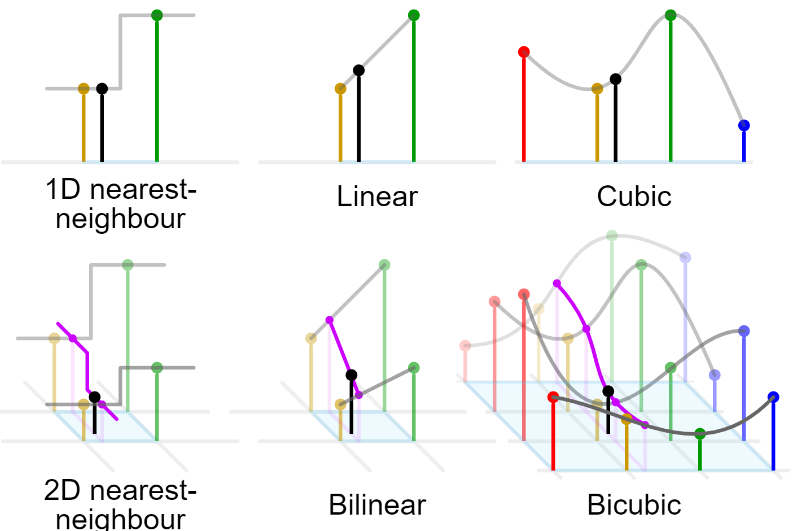

# Image Interpolation

### Interpolation Method




### Align Corners

https://zhuanlan.zhihu.com/p/87572724


### Up-sampling


### Down-sampling

```bash
----- x -----
[[ 0.  1.  2.  3.]
 [ 4.  5.  6.  7.]
 [ 8.  9. 10. 11.]
 [12. 13. 14. 15.]]
----- cv2.resize(..., cv2.INTER_NEAREST) -----
[[ 0.  2.]
 [ 8. 10.]]
----- skimage.transform.resize(..., order=0, anti_aliasing=False) -----
[[ 5.  7.]
 [13. 15.]]
----- Image.resize(..., Image.NEAREST) -----
[[ 5.  7.]
 [13. 15.]]
----- F.interpolate(..., mode="nearest") -----
[[ 0.  2.]
 [ 8. 10.]]

----- cv2.resize(..., cv2.INTER_LINEAR) -----
[[ 2.5  4.5]
 [10.5 12.5]]
----- skimage.transform.resize(..., order=1, anti_aliasing=False) -----
[[ 2.5  4.5]
 [10.5 12.5]]
----- Image.resize(..., Image.BILINEAR) -----
[[ 3.5714288  5.142857 ]
 [ 9.857143  11.428572 ]]
----- F.interpolate(..., mode="bilinear", align_corners=False) -----
[[ 2.5  4.5]
 [10.5 12.5]]
----- F.interpolate(..., mode="bilinear", align_corners=True) -----
[[ 0.  3.]
 [12. 15.]]

----- cv2.resize(..., cv2.INTER_CUBIC) -----
[[ 2.03125  4.21875]
 [10.78125 12.96875]]
----- skimage.transform.resize(..., order=3, anti_aliasing=False) -----
[[ 1.875  4.125]
 [10.875 13.125]]
----- Image.resize(..., Image.BICUBIC) -----
[[ 2.9338841  4.7603307]
 [10.239669  12.066115 ]]
----- F.interpolate(..., mode="bicubic", align_corners=False) -----
[[ 2.03125  4.21875]
 [10.78125 12.96875]]
----- F.interpolate(..., mode="bicubic", align_corners=True) -----
[[ 0.  3.]
 [12. 15.]]

```


### PIL resize problem

`PIL.resize` behaves differently compared to `cv2.resize`.

https://github.com/python-pillow/Pillow/issues/2718