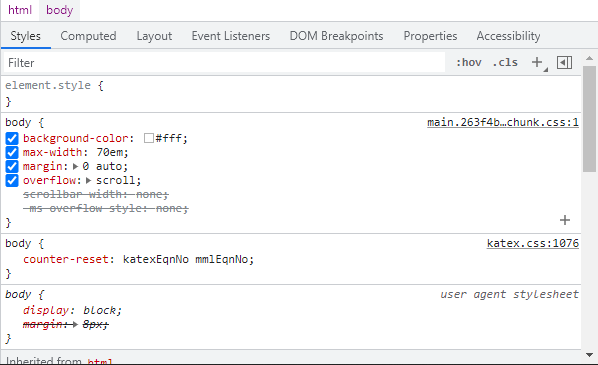

# chrome F12 debugger

### Inspect

`Ctrl+Shift+C` then click the element. Or right click the element and `inspect`.

### 

### CSS editor

In the bottom of `elements` tab, it has a `style` tab that shows the CSS rules applied.

It is just so helpful QwQ.

### Pitfalls

* JS caching: chrome will cache the `javascript` code by default, use `Ctrl + F5` FULL refresh to make sure the code is up to date.

