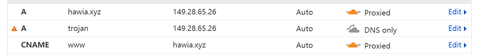

# Trojan with Nginx 

### Server

* Get trojan (as root)

  ```bash
  bash -c "$(curl -fsSL https://raw.githubusercontent.com/trojan-gfw/trojan-quickstart/master/trojan-quickstart.sh)"
  ```

  ```bash
  #!/bin/bash
  set -euo pipefail
  
  function prompt() {
      while true; do
          read -p "$1 [y/N] " yn
          case $yn in
              [Yy] ) return 0;;
              [Nn]|"" ) return 1;;
          esac
      done
  }
  
  if [[ $(id -u) != 0 ]]; then
      echo Please run this script as root.
      exit 1
  fi
  
  if [[ $(uname -m 2> /dev/null) != x86_64 ]]; then
      echo Please run this script on x86_64 machine.
      exit 1
  fi
  
  NAME=trojan
  VERSION=$(curl -fsSL https://api.github.com/repos/trojan-gfw/trojan/releases/latest | grep tag_name | sed -E 's/.*"v(.*)".*/\1/')
  TARBALL="$NAME-$VERSION-linux-amd64.tar.xz"
  DOWNLOADURL="https://github.com/trojan-gfw/$NAME/releases/download/v$VERSION/$TARBALL"
  TMPDIR="$(mktemp -d)"
  INSTALLPREFIX=/usr/local
  SYSTEMDPREFIX=/etc/systemd/system
  
  BINARYPATH="$INSTALLPREFIX/bin/$NAME"
  CONFIGPATH="$INSTALLPREFIX/etc/$NAME/config.json"
  SYSTEMDPATH="$SYSTEMDPREFIX/$NAME.service"
  
  echo Entering temp directory $TMPDIR...
  cd "$TMPDIR"
  
  echo Downloading $NAME $VERSION...
  curl -LO --progress-bar "$DOWNLOADURL" || wget -q --show-progress "$DOWNLOADURL"
  
  echo Unpacking $NAME $VERSION...
  tar xf "$TARBALL"
  cd "$NAME"
  
  echo Installing $NAME $VERSION to $BINARYPATH...
  install -Dm755 "$NAME" "$BINARYPATH"
  
  echo Installing $NAME server config to $CONFIGPATH...
  if ! [[ -f "$CONFIGPATH" ]] || prompt "The server config already exists in $CONFIGPATH, overwrite?"; then
      install -Dm644 examples/server.json-example "$CONFIGPATH"
  else
      echo Skipping installing $NAME server config...
  fi
  
  if [[ -d "$SYSTEMDPREFIX" ]]; then
      echo Installing $NAME systemd service to $SYSTEMDPATH...
      if ! [[ -f "$SYSTEMDPATH" ]] || prompt "The systemd service already exists in $SYSTEMDPATH, overwrite?"; then
          cat > "$SYSTEMDPATH" << EOF
  [Unit]
  Description=$NAME
  Documentation=https://trojan-gfw.github.io/$NAME/config https://trojan-gfw.github.io/$NAME/
  After=network.target network-online.target nss-lookup.target mysql.service mariadb.service mysqld.service
  
  [Service]
  Type=simple
  StandardError=journal
  ExecStart="$BINARYPATH" "$CONFIGPATH"
  ExecReload=/bin/kill -HUP \$MAINPID
  LimitNOFILE=51200
  Restart=on-failure
  RestartSec=1s
  
  [Install]
  WantedBy=multi-user.target
  EOF
  
          echo Reloading systemd daemon...
          systemctl daemon-reload
      else
          echo Skipping installing $NAME systemd service...
      fi
  fi
  
  echo Deleting temp directory $TMPDIR...
  rm -rf "$TMPDIR"
  
  echo Done!
  ```

  This will install trojan at `/usr/local/bin/trojan`, 

  with the config at `/usr/local/etc/trojan/config.json`,

  and it will generate system unit at `/etc/systemd/system/trojan.service`.

* Config

  ```json
  {
      "run_type": "server",
      "local_addr": "127.0.0.1", # modified (why? default is 0.0.0.0)
      "local_port": 443, # if use stream, keep the same as nginx trojan upstream (e.g., 10241)
      "remote_addr": "127.0.0.1",
      "remote_port": 80, # if use stream, keep the same as nginx fake upstream (e.g., 10242)
      "password": [
          "password" # modified
      ],
      "log_level": 1,
      "ssl": {
          "cert": "/path/to/certificate.crt", # modified
          "key": "/path/to/private.key", # modified
          "key_password": "",
          "cipher": "ECDHE-ECDSA-AES128-GCM-SHA256:ECDHE-RSA-AES128-GCM-SHA256:ECDHE-ECDSA-AES256-GCM-SHA384:ECDHE-RSA-AES256-GCM-SHA384:ECDHE-ECDSA-CHACHA20-POLY1305:ECDHE-RSA-CHACHA20-POLY1305:DHE-RSA-AES128-GCM-SHA256:DHE-RSA-AES256-GCM-SHA384",
          "cipher_tls13": "TLS_AES_128_GCM_SHA256:TLS_CHACHA20_POLY1305_SHA256:TLS_AES_256_GCM_SHA384",
          "prefer_server_cipher": true,
          "alpn": [
              "http/1.1"
          ],
          "reuse_session": true,
          "session_ticket": false,
          "session_timeout": 600,
          "plain_http_response": "",
          "curves": "",
          "dhparam": ""
      },
      "tcp": {
          "prefer_ipv4": false,
          "no_delay": true,
          "keep_alive": true,
          "reuse_port": false,
          "fast_open": false,
          "fast_open_qlen": 20
      },
      "mysql": {
          "enabled": false,
          "server_addr": "127.0.0.1",
          "server_port": 3306,
          "database": "trojan",
          "username": "trojan",
          "password": "",
          "key": "",
          "cert": "",
          "ca": ""
      }
  }
  ```

* DNS

  Add an A-record for a prefix URL that trojan uses.

  ```bash
  A-record trojan [server_ip] 1min # trojan.your_url.domain
  ```

* Nginx config if we let trojan to handle https.

  use when trojan set `local_port == 443`. So trojan will listen to 443 and handle all the requests, check whether it is a trojan request:

  * if it is, trojan handles it.
  * if not, trojan redirect it to `remote_port` to let Nginx handle it.

  ```nginx
  # fake website
  # handle the non-trojan requets rejected by trojan (specified by remote_port = 80).
  server {
      listen 80 default_server;
      server_name <your.domain.name>;
  	
      # the camouflage website to redirect
      location / {
          proxy_pass https://bilibili.com;
      }
  
  }
  
  # redirect http to https
  server {
      listen 80;
      listen [::]:80;
  
      server_name _; # catch-all, any other server_name will use this.
  
      location / {
          return 301 https://$host$request_uri;
      }
  }
  ```
  
  
  
* Nginx stream reuse 443

  this happens if we also use Nginx to host other websites.

  Nginx listens to 443 and stream the requests according to server names.

  ```nginx
  ...
  
  # add this
  stream {
      map $ssl_preread_server_name $backend_name {
          hawia.xyz web;
          trojan.hawia.xyz trojan; # map trojan.hawia.xyz to upstream trojan
          default web;
      }
  
      upstream web {
          server 127.0.0.1:10240; # web should listen to this
      }
  
      upstream trojan {
          server 127.0.0.1:10241; # trojan should listen to this
      }
  	
      # stream server
      server {
          listen 443 reuseport;
          listen [::]:443 reuseport;
          proxy_pass $backend_name;
          ssl_preread on;
      }
  }
  
  http {
  	...
  }
  ```

  change web servers to the new port:

  ```nginx
  # trojan http --> https
  server {
      listen 80;
      listen [::]:80;
      server_name x.kiui.moe;
      return 301 https://x.kiui.moe$request_uri;
  }
  
  # trojan remote_port (fake web)
  server {
      listen 10242;
      server_name x.kiui.moe;
  
      location / {
          proxy_pass https://bilibili.com;
      }
  }
  
  # web http --> https
  server {
      listen 80;
      listen [::]:80;
      server_name kiui.moe;
      return 301 https://kiui.moe$request_uri;
  }
  
  # web https
  server {
  
      listen 10240 ssl; # modified from 443
      listen [::]:10240 ssl; # modified from 443
  
      server_name hawia.xyz;
  
      ssl_certificate www.hawia.xyz.pem;
      ssl_certificate_key www.hawia.xyz.key;
  
      ssl_session_timeout 5m;
      ssl_ciphers ECDHE-RSA-AES128-GCM-SHA256:ECDHE:ECDH:AES:HIGH:!NULL:!aNULL:!MD5:!ADH:!RC4;
      ssl_protocols TLSv1 TLSv1.1 TLSv1.2;
      ssl_prefer_server_ciphers on;
  
      location / {
          root /root/home;
      }
  
      location /blogs {
          root /root;
      }
  
      location /nonsense {
          root /root;
      location /umbra {
          root /root;
      }
  
      location /api/ {
          include uwsgi_params;
          uwsgi_pass 127.0.0.1:8000;
      }
  
      location /api/nonsense/ {
          include uwsgi_params;
          uwsgi_pass 127.0.0.1:8001;
      }
  
      location /api/umbra/ {
          include uwsgi_params;
          uwsgi_pass 127.0.0.1:8002;
      }
  }
  ```

* Start it!

  ```bash
  #systemctl start nginx
  nginx -s reload
  systemctl start trojan
  systemctl status trojan
  ```

* If use Cloudflare CDN:

  change the trojan record to `DNS Only` status. (do not proxy)
  
  


### Client

* Get trojan

  ```bash
  wget https://github.com/trojan-gfw/trojan/releases/download/v1.15.1/trojan-1.15.1-linux-amd64.tar.xz
  tar -xvf trojan-1.15.1-linux-amd64.tar.xz
  ```

* Config

  ```bash
  vi trojan/config.json
  ```

  ```json
  {
      "run_type": "client", # modified
      "local_addr": "0.0.0.0",
      "local_port": 1080,
      "remote_addr": "trojan.hawia.xyz", # modified
      "remote_port": 443, # may need to modify
      "password": [
          "password" # modified
      ],
      "log_level": 1,
      "ssl": {
          "verify": false, # modified
          "verify_hostname": false, # modified
          "cert": "", # modified
          "key": "", # modified
          "key_password": "",
          "cipher": "ECDHE-ECDSA-AES128-GCM-SHA256:ECDHE-RSA-AES128-GCM-SHA256:ECDHE-ECDSA-AES256-GCM-SHA384:ECDHE-RSA-AES256-GCM-SHA384:ECDHE-ECDSA-CHACHA20-POLY1305:ECDHE-RSA-CHACHA20-POLY1305:DHE-RSA-A
          "cipher_tls13": "TLS_AES_128_GCM_SHA256:TLS_CHACHA20_POLY1305_SHA256:TLS_AES_256_GCM_SHA384",
          "prefer_server_cipher": true,
          "alpn": [
              "http/1.1"
          ],
          "alpn_port_override": {
              "h2": 81
          },
          "reuse_session": true,
          "session_ticket": false,
          "session_timeout": 600,
          "plain_http_response": "",
          "curves": "",
          "dhparam": ""
      },
      "tcp": {
          "prefer_ipv4": false,
          "no_delay": true,
          "keep_alive": true,
          "reuse_port": false,
          "fast_open": false,
          "fast_open_qlen": 20
      },
      "mysql": {
          "enabled": false,
          "server_addr": "127.0.0.1",
          "server_port": 3306,
          "database": "trojan",
          "username": "trojan",
          "password": "",
          "cafile": ""
      }
  }
  
  ```

* Run trojan service!

  ```bash
  trojan -c config.json -l trojan.log
  ```

  Or make a system unit.

  ```bash
  cat > /etc/systemd/system/trojan.service <<-EOF
  [Unit]
  Description=trojan
  After=network.target
  
  [Service]
  Type=simple
  PIDFile=/usr/src/trojan/trojan.pid
  ExecStart=/usr/src/trojan/trojan -c /usr/src/trojan/config.json -l /usr/src/trojan/trojan.log
  ExecReload=/bin/kill -HUP \$MAINPID
  Restart=on-failure
  RestartSec=1s
  
  [Install]
  WantedBy=multi-user.target
  
  EOF
  ```

  ```bash
  systemctl start trojan
  systemctl status trojan
  systemctl enable trojan
  ```

* Proxychains

  ```bash
  apt install proxychains
  ```

  Config:

  ```bash
  vi /etc/proxychains.conf
  ```

  ```
  ...
  # socks4 ...
  socks5 127.0.0.1 1080
  ```

* test

  ```bash
  curl -4 ip.sb
  proxychains curl -4 ip.sb
  ```

* Privoxy for http proxy

  since trojan only supports socks5 proxy, you should use `privoxy` to forward it to `http` proxy:

  ```bash
  sudo apt install privoxy
  ```

  edit config `/etc/privoxy/config`, add the following lines:

  ```bash
  listen-address 0.0.0.0:1081 # http proxy port
  toggle  1
  enable-remote-toggle 1
  enable-remote-http-toggle 1
  enable-edit-actions 0
  enforce-blocks 0
  buffer-limit 4096
  forwarded-connect-retries  0
  accept-intercepted-requests 0
  allow-cgi-request-crunching 0
  split-large-forms 0
  keep-alive-timeout 5
  socket-timeout 60
  
  forward-socks5 / 0.0.0.0:1080 . # trojan's socks5 proxy port
  ```

  restart the service:

  ```bash
  sudo systemctl restart privoxy
  ```

  Now you can check the proxy via:

  ```bash
  sudo netstat -antp
  ```

  