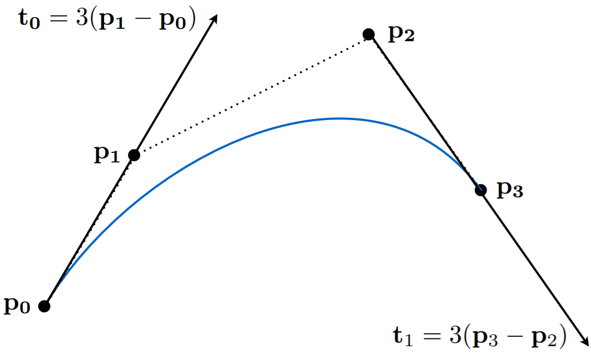
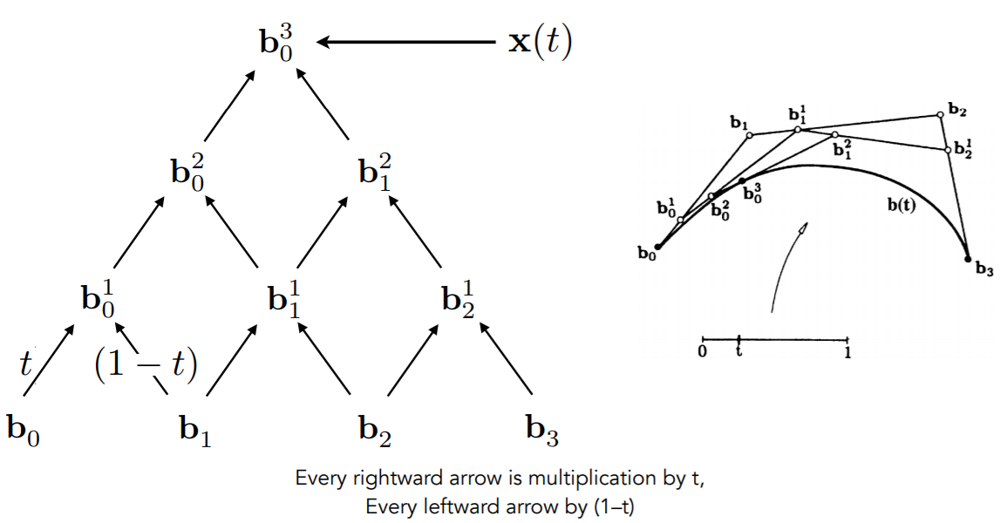
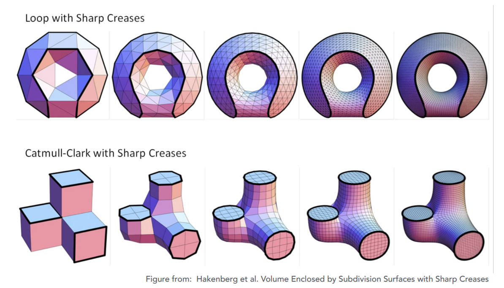
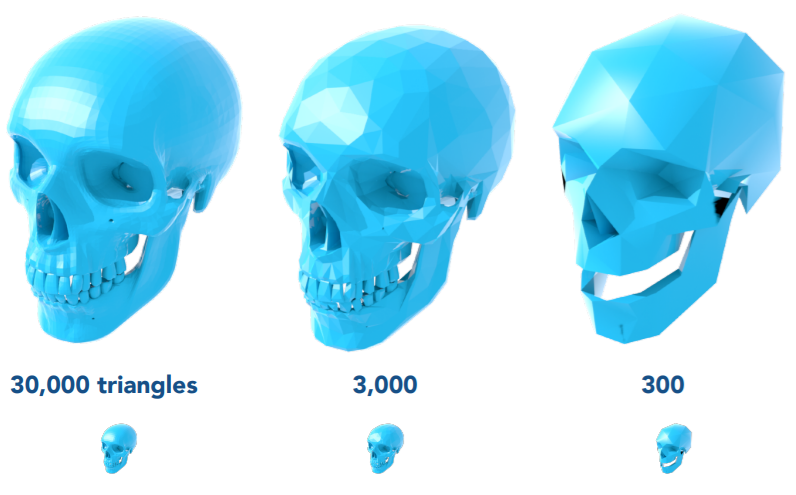
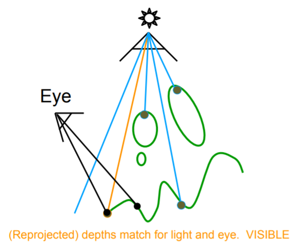

# Geometry

 ### Representation

##### Implicit

abstract functions. (Signed Distance Function, SDF)
$$
f(x, y, z) = 
\begin{cases}
\le0, \text{inside} \\
>0, \text{outside}
\end{cases}
$$
easy to test inside/outside, but hard to sample.

##### Explicit

directly given as Meshes, Point Clouds, Voxels.

Or 2d parameter maps ($f(u,v)\rightarrow (x,y,z)$)

easy to sample, but hard to test inside/outside.

### Bezier Curves

##### De Casteljau Algorithm:

Given 4 control points, an interpolation parameter $t$, and order $n$, recursively linear interpolate each segment to generate new segments for $n$ times.

Bernstein form:
$$
\mathbf b^n(t) = \sum_{j=0}^n\mathbf b_j B^n_j(t) \\
B_i^n(t) = C_n^it^i(1-t)^{n-i}
$$
Piece-wise cubic Bezier is the most common technique to represent curves.

B-Splines (Basis Splines) is superset of Bezier Curves.

Bezier Curve can be extended to Bezier Surface in 3D, and use separable 1D de Casteljau to solve.

### Mesh Operations

##### Subdivision (Magnification)

Loop and add vertices.

##### Simplification

Collapse edges and minimize quadric error.

### Shadow

A pixel NOT in shadow must be seen both by the light and camera.

##### Two pass search algorithm:

* compute depth from light to object.
* compute depth from camera to object.
* project camera-visible area to light. (shadow: light-occluded, not shadow: light-visible)

problem: soft-shadow (penumbra) vs hard-shadow (umbra)