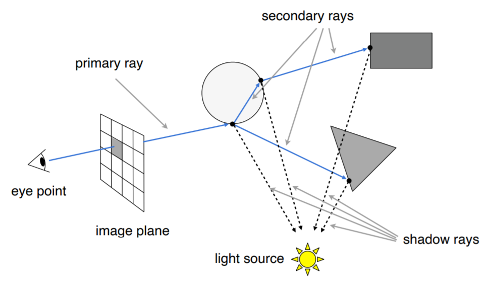
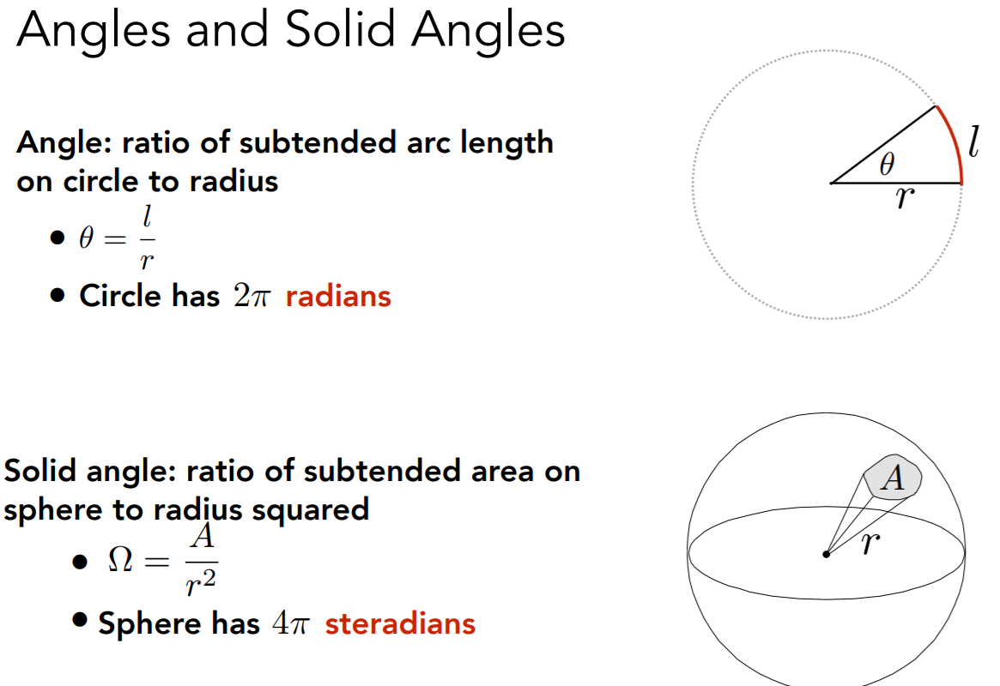
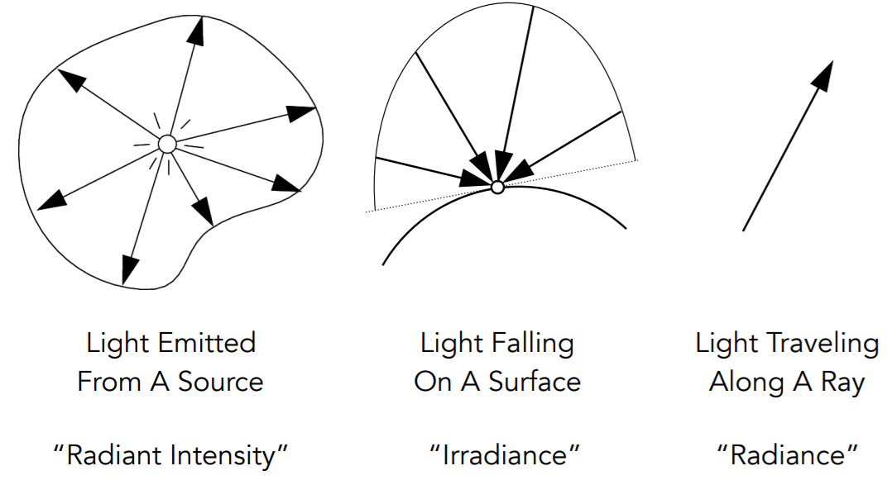
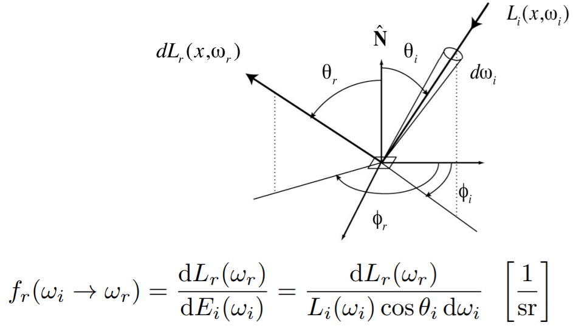
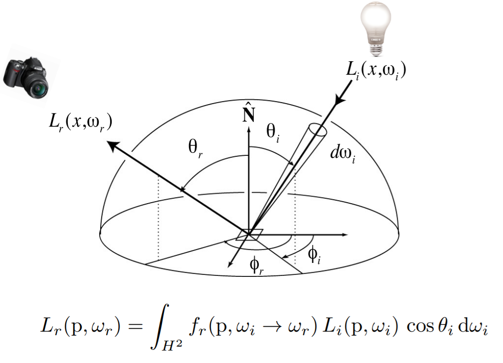
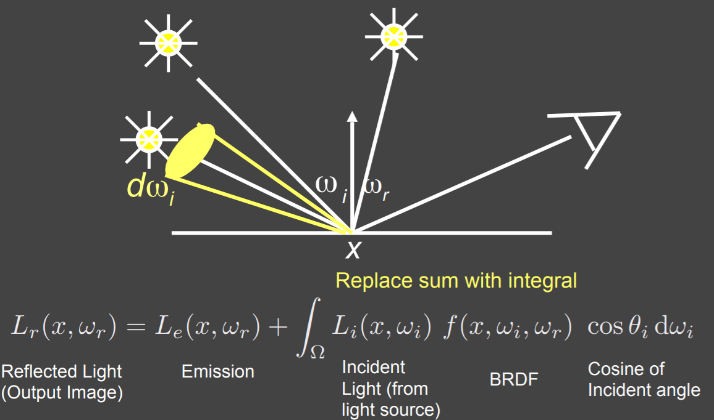

# Ray Tracing

### Why?

Rasterization Shading cannot handle global effect (e.g., soft shadow, multiple light sources, glossy reflection, indirect illumination).

Ray-tracing is slow, but can generate high quality shades.

### Whitted-Style Ray Tracing

Cast ray and trace the route recursively.

A ray is defined by origin $\mathbf o$ and direction $\mathbf d$ as a function of time $t \ge 0$:
$$
\mathbf r(t) = \mathbf o + t\mathbf d
$$
Ray-Surface intersection algorithm:

* Naïve: Check intersection with each triangles. (slow!)

* AABB (Axis-Aligned Bounding Boxes): 

  first check if ray hit object bounding box, then check intersection with the object triangles.

  Need to pre-compute bounding boxes by spatial partitioning (uniform grid, KD-tree) / object partitioning (bounding volume hierarchy).

  

  

### Basic Radiometry

Physically correct manner of light calculation.

**Radiant Energy**: $Q [J=Joule]$

**Radiant Flux**: $\Phi = \frac  {dQ} {dt} [W] [lm=lumen]$

**Radiant Intensity**: $I(\omega) = \frac {d\Phi} {d\omega} [W/sr] [cd=candela]$, power per solid angle.

**Irradiance**: $E(x) = \frac {d\Phi(x)} {dA} [W/m^2] [lux]$ power per unit area incident on  a surface point.

**Radiance/Luminance**: $L(p, \omega) = \frac {d^2\Phi(p, \omega)} {d\omega dA\cos\theta} [W/sr\ m^2] [nit]$ , power per unit solid angle per projected unit area. (or Irradiance per solid angle, or Intensity per projected unit area)

* Incident Radiance
* Exiting Radiance

Irradiance vs radiance: 

**Bidirectional Reflectance Distribution Function (BRDF)**: how much light is reflected into each outgoing direction from each incoming direction.

The Reflection Equation:

The Rendering Equation:

### Path Tracing

Whitted-Style Ray Tracing's assumptions are too simple (in fact wrong).

We can approximate the rendering function by Monte Carlo Integration.

