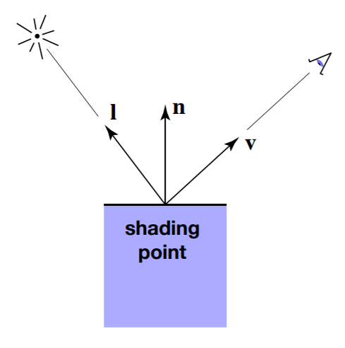
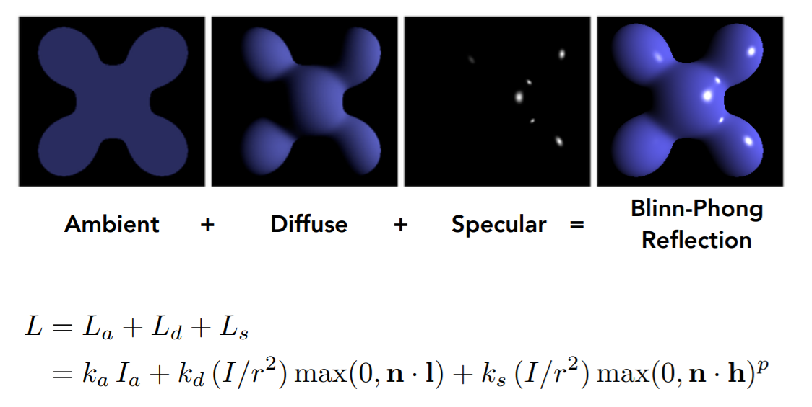
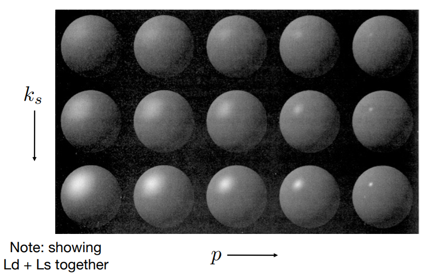
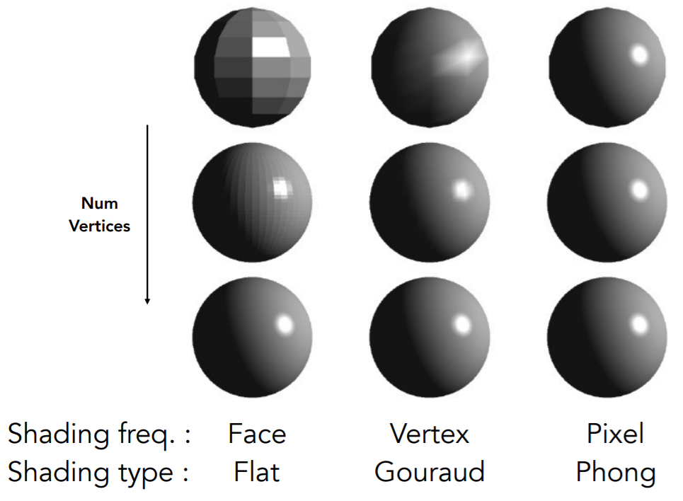
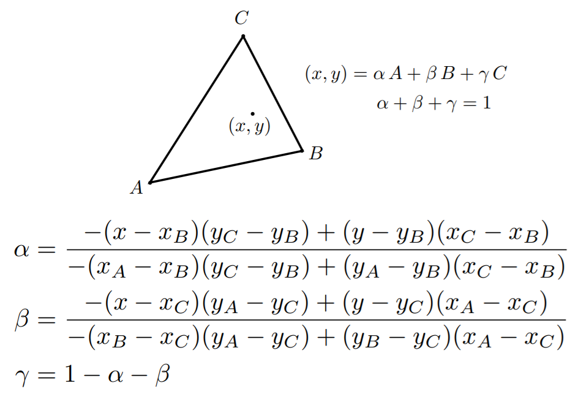
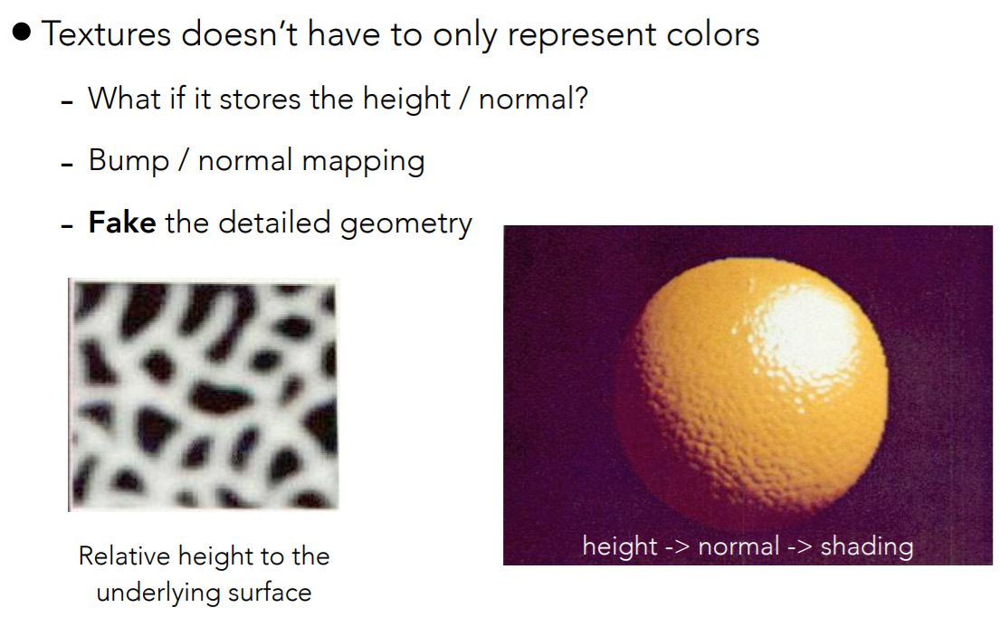

# Shading

### Blinn-Phong reflectance model

##### Ambient Term

Not depend on anything. Just a constant environment light.
$$
L_a = k_aI_a
$$

##### Diffuse Term (Lambertian) 

depend on light direction, independent of view direction.
$$
L_d = k_d\frac I {r^2} \max(0, \mathbf n\cdot \mathbf l)
$$
where $k_d$ is a coefficient, $\frac I {r^2}$ is the energy received at radius $r$. $\mathbf n\cdot \mathbf l = \cos \alpha$ (assume unit vector.)

##### Specular Term (Blinn-Phong, the highlight)

depends on both light direction and view direction.

Brighter near Mirror reflection direction (defined as $r$)
$$
\mathbf h = \frac {\mathbf v + \mathbf l} {||\mathbf v + \mathbf l||} \\
L_s = k_s \frac I {r^2} \max(0, \mathbf n\cdot \mathbf h)^p
$$
where $p$ is a coefficient..

note we have $2<n, h> = <v, r>$.

### Shading Frequency

##### Flat shading: Each Triangle

Direct shade each triangle. Not smooth.

##### Gouraud Shading: Each Vertex

DEF: **vertex normal** is defined as the average of surrounding face normals.

* compute vertex normals.
* compute color for each vertex.
* interpolate **color** for each pixel inside each triangle.

##### Phong Shading: Each Pixel

* compute vertex normals.
* interpolate **normals** for each pixel inside each triangle.
* compute color for each pixel.

##### Barycentric Interpolation

Interpolate by area. suppose $X = (x, y)$:
$$
\alpha = \frac {S_{XBC}} {S_{ABC}}\\
\beta = \frac {S_{XAC}} {S_{ABC}} \\
\gamma = \frac {S_{XAB}} {S_{ABC}}
$$
A practical version:

### Texture Mapping

Each triangle copies a piece of texture image (2d, uv-space) to the surface (3d).

* Compute UV coordinate for each vertex.
* Interpolate UV coordinate for each pixel. (barycentric)
* Interpolate color at UV, and assign it to the pixel. (nearest, bilinear, bicubic)

##### Texture can affect shading:

