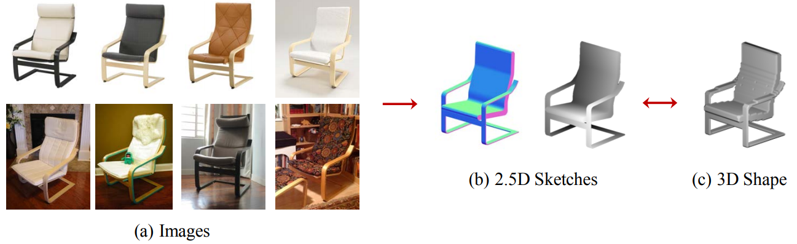
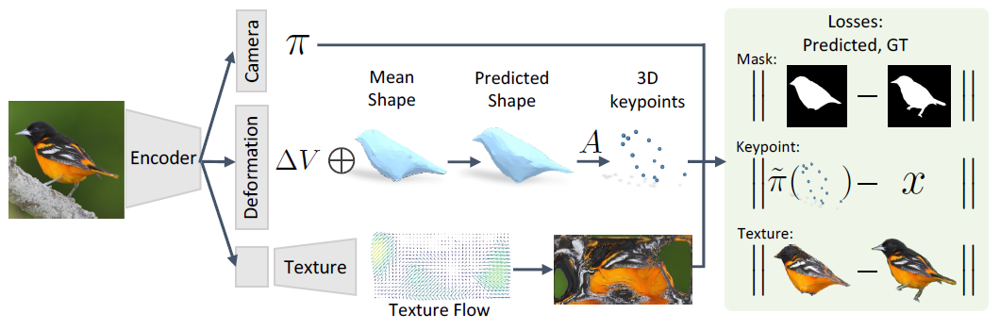
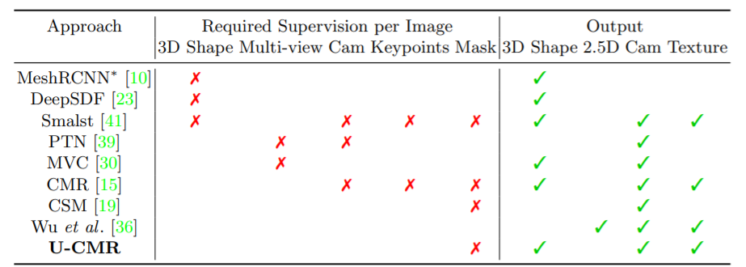
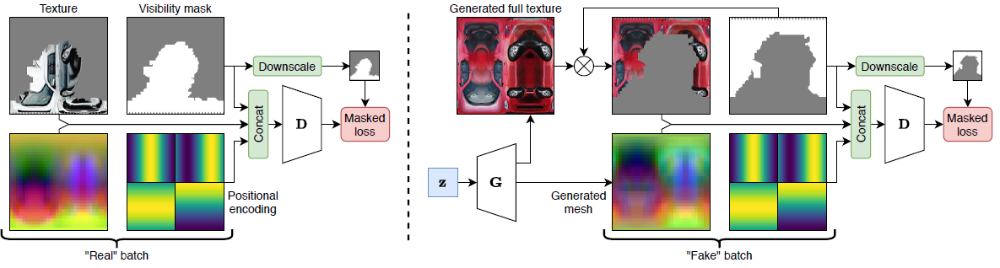
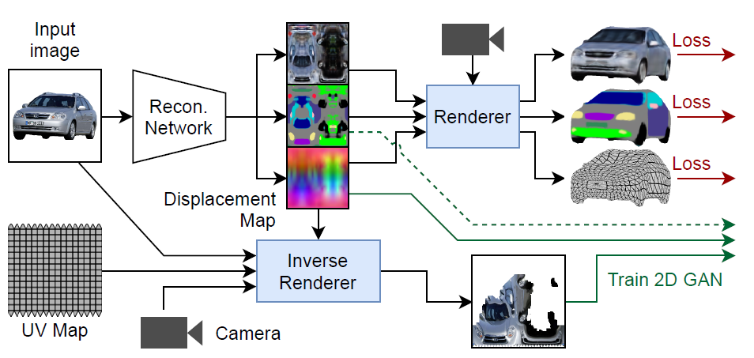

# Single-/Multi- view 3D Reconstruction and Generation


We focus on the problem of 3D reconstruction / generation from single or multiple (but not too many) RGB (D)s.

The problem is usually ill-posed (ambiguous), and needs to guess / generate some content.


## Object Level

> Category:
>
> * Inference:
>
>   * Single-view RGB (D)
>   * Multiple-view RGB (D)
> * Train in addition:
>
>    * 3D GT
>     * Multiple-view RGB
>     * semantic / instance segmentation (can be generated from pretrained Mask R-CNN)
>     * camera pose 
>
> * Output Representation: 
>
>   * Voxels
>   * Point Cloud
>   * Implicit Function (Signed Distance Function, Radiance Field)
>   * Mesh
>
> 
>
> Trend:
>
> * Input: Multi-view --> Single view
> * Input: RGBD --> RGB
> * Train: w/ 3D GT --> w/o 3D GT
> * Train: w/ camera pose --> w/o camera pose
> * Output: Voxels --> Point Cloud / Implicit Function / Mesh


#### [ECCV 2016] 3D-R2N2: 3D Recurrent Reconstruction Neural Network

```
@inproceedings{Choy20163DR2N2AU,
  title={3D-R2N2: A Unified Approach for Single and Multi-view 3D Object Reconstruction},
  author={C. Choy and Danfei Xu and JunYoung Gwak and Kevin Chen and S. Savarese},
  booktitle={ECCV},
  year={2016}
}
```

[paper](http://arxiv.org/abs/1604.00449) | [code](https://github.com/chrischoy/3D-R2N2)

##### Problem

* Input: RGB Image (Single or Multiple View), Instance Segmentation + 3D GT
* Output: Voxels

##### Contributions

* LSTM framework for single or multiple view 3d reconstruction.

* Minimal supervision, no segmentation, no camera pose, no class label.


#### [3DV 2017] Hierarchical Surface Prediction for 3D Object Reconstruction

[paper](https://arxiv.org/abs/1704.00710)

##### Problem

* Input: Single-view RGB Image / Depth Image / Partial Volume + 3D GT
* Output: Voxels


#### [ICCVW 2017] 3D Object Reconstruction from a Single Depth View with Adversarial Learning

[paper](https://arxiv.org/abs/1708.07969)


#### [ICCV 2017] Octree Generating Networks: Efficient Convolutional Architectures for High-resolution 3D Outputs

[paper](https://arxiv.org/abs/1703.09438) | [code](https://github.com/lmb-freiburg/ogn)


#### [NIPS 2017] MarrNet: 3D Shape Reconstruction via 2.5D Sketches

[paper](https://arxiv.org/abs/1711.03129) 




#### [CVPR 2017] A point set generation network for 3d object reconstruction from a single image.

[paper](https://arxiv.org/pdf/1612.00603.pdf)

##### Problem

* Input: Single RGB Image, Instance Segmentation, Camera Pose + 3D GT
* Output: Point Cloud


#### [ECCV 2018] Pixel2Mesh: Generating 3D Mesh Models from Single RGB Images

[paper](https://arxiv.org/pdf/1804.01654.pdf) | [code](https://github.com/nywang16/Pixel2Mesh)

##### Problem

* Input: Single RGB Image, Camera Intrinsics + 3D GT
* Output: Mesh


#### [ECCV 2018] Learning Category-Specific Mesh Reconstruction from Image Collections. 

```
@inproceedings{Kanazawa2018LearningCM,
  title={Learning Category-Specific Mesh Reconstruction from Image Collections},
  author={A. Kanazawa and Shubham Tulsiani and Alexei A. Efros and Jitendra Malik},
  booktitle={ECCV},
  year={2018}
}
```

[paper](https://arxiv.org/abs/1803.07549) | [code](https://github.com/akanazawa/cmr) 

##### Problem

* Input: Single RGB Image. Instance Segmentation, Semantic Key-points
* Output: Camera Pose, Mesh, Texture.

##### Contribution

* Deformable Mesh Representation (need categorical mean shape as mesh template)
* Only need Single-view RGB (w/o Multi-view or 3D GT)
* Able to infer texture.




#### [ECCV 2014] OpenDR: An approximate differentiable renderer.

[paper](https://files.is.tue.mpg.de/black/papers/OpenDR.pdf)

Inverse graphics: reverse-engineer the physical process that produced a real image.

##### Problem

* body shape estimation from image and range data.

##### Contributions

* We define a differentiable renderer (DR) as a process that (1) supplies pixels as a function of model parameters to simulate a physical imaging system and (2) supplies derivatives of the pixel values with respect to those parameters. To be practical, the DR also has to be fast; this means it must have hardware support. Consequently we work directly with OpenGL. Because we make it publicly available, we call our framework OpenDR (http://open-dr.org).

* Our goal is not rendering, but inverse rendering

  

#### [CVPR 2018] Neural 3D mesh renderer.

[paper](http://arxiv.org/abs/1711.07566)

##### Problem

* single-image unsupervised 3D mesh reconstruction
* 2D-to-3D style transfer

##### Contributions

* we propose an approximate gradient for rasterization that enables the integration of rendering into neural networks.


#### [ICCV 2019] Soft Rasterizer: A differentiable renderer for image-based 3d reasoning.

[paper](https://arxiv.org/abs/1904.01786) | [code](https://github.com/ShichenLiu/SoftRas)

##### Problem

* 3D unsupervised single-view reconstruction
* image-based shape fitting

##### Contributions

* Unlike the state-of-the-art differentiable renderers [opendr, neural 3d mesh renderer], which only approximate the rendering gradient in the back propagation, we propose a truly differentiable rendering framework that is able to (1) directly render colorized mesh using differentiable functions and (2) back-propagate efficient supervision signals to mesh vertices and their attributes from various forms of image representations, including silhouette, shading and color images.

* The key to our framework is a novel formulation that views rendering as an aggregation function that fuses the probabilistic contributions of all mesh triangles with respect to the rendered pixels.


#### [NIPS 2019] Learning to predict 3d objects with an interpolation-based differentiable renderer

[paper](https://arxiv.org/pdf/1908.01210.pdf) | [code](https://github.com/nv-tlabs/DIB-R)

##### Problem

* Input: Mesh, Texture, Camera Pose
* Output: rendered Image & gradient 

##### Contribution

* Key to our approach is to view foreground rasterization as a weighted interpolation of local properties and background rasterization as a distance-based aggregation of global geometry


#### [NIPS 2019] DISN: Deep Implicit Surface Network for High-quality Single-view 3D Reconstruction

[paper](https://arxiv.org/pdf/1905.10711.pdf) | [code](https://github.com/laughtervv/DISN)

##### Problem

* Input: Single RGB Image + 3D GT
* Output: Implicit Function


#### [ECCV 2020] Shape and viewpoint without keypoints.

[paper](https://arxiv.org/abs/2007.10982) | [code](https://github.com/shubham-goel/ucmr)

##### Problem

* Input: Single RGB Image, Instance Segmentation, categorical mesh templates
* Output: Camera Pose, Mesh, Texture

##### Contribution

* keypoint-free, by using a canonical mesh template for each category, and estimate pose by fitting silhouette. (template based)





#### [ECCV 2020] Self-supervised single-view 3d reconstruction via semantic consistency
[paper](https://arxiv.org/pdf/2003.06473.pdf)

##### Problem

* Input: Single RGB Image, Part Segmentation
* Output: Camera Pose, Mesh, Texture

##### Contribution

* keypoint-free, by using self-supervised part segmentations (SCOPS) to infer a 3d semantic template. (semantic based)
* Leverage the semantic part invariance property of object instances of a category as a deformable parts model
* Learn a category-level 3D shape template from scratch via iterative learning


#### [CVPR 2020] From Image Collections to Point Clouds with Self-supervised Shape and Pose Networks

```
@inproceedings{navaneet2020ssl3drecon,
 author = {Navaneet, K L and Mathew, Ansu and Kashyap, Shashank and Hung, Wei-Chih and Jampani, Varun and Babu, R Venkatesh},
 booktitle = {IEEE Conference on Computer Vision and Pattern Recognition (CVPR)},
 title = {From Image Collections to Point Clouds with Self-supervised Shape and Pose Networks},
 year = {2020}
}
```

[paper](https://arxiv.org/pdf/2005.01939.pdf) | [code](https://github.com/klnavaneet/ssl_3d_recon)

##### Problem

* Input: Single RGB Image
* Output: Camera Pose, Point Cloud


#### [NIPS 2020] Convolutional Generation of Textured 3D Meshes

```
@article{Pavllo2020ConvolutionalGO,
  title={Convolutional Generation of Textured 3D Meshes},
  author={Dario Pavllo and Graham Spinks and T. Hofmann and Marie-Francine Moens and Aur{\'e}lien Lucchi},
  journal={ArXiv},
  year={2020},
  volume={abs/2006.07660}
}
```

[paper](https://arxiv.org/abs/2006.07660) | [code](https://github.com/dariopavllo/convmesh)

##### Problem

* Input: Single-view RGB Image, class label / caption (for GAN text conditioning), Instance Segmentation, Camera Pose.
* Output: Mesh, Texture

##### Contribution

* Displacement Map for a smooth convolutional mesh representation
* GAN for producing textured mesh.
* Conditional Generation of mesh from text.





#### [Arxiv 2021] Learning Generative Models of Textured 3D Meshes from Real-World Images

```
@inproceedings{Pavllo2021LearningGM,
  title={Learning Generative Models of Textured 3D Meshes from Real-World Images},
  author={Dario Pavllo and J. Kohler and T. Hofmann and Aur{\'e}lien Lucchi},
  year={2021}
}
```

[paper](https://arxiv.org/pdf/2103.15627.pdf)

##### Problem

* Input: Single view RGB image, categorical mesh template.
* Output: Camera Pose, Mesh, Texture

##### Contributions

* keypoint-free, combines template-based and semantic-based approaches.
* single GAN for all categories.





#### [Arxiv 2021] NeuTex: Neural Texture Mapping for Volumetric Neural Rendering

```
@article{Xiang2021NeuTexNT,
  title={NeuTex: Neural Texture Mapping for Volumetric Neural Rendering},
  author={Fanbo Xiang and Zexiang Xu and Milovs Havsan and Yannick Hold-Geoffroy and Kalyan Sunkavalli and Hao Su},
  journal={ArXiv},
  year={2021},
  volume={abs/2103.00762}
}
```

[paper](https://arxiv.org/abs/2103.00762)

##### Problem

* Input: Multi-view RGB Images, Camera Pose, point cloud from COLMAP.
* Output: Radiance Field, Texture.

##### Contribution

* Disentangled NeRF ($F_{\sigma}: \mathbf{x} \rightarrow \sigma, F_{\mathbf c}: (\mathbf{x}, \mathbf d) \rightarrow \mathbf c$)
* regress coordinate ($u,v$) of a Texture map ($F_{\mathbf c}(\mathbf{x}, \mathbf d) = F_{tex}(F_{uv}(x), \mathbf d)$)
* Inverse Mapping $F_{uv}^{-1}$: can refine the COLMAP point cloud.


#### [Arxiv 2021] Putting NeRF on a Diet: Semantically Consistent Few-Shot View Synthesis 

[paper](https://arxiv.org/pdf/2104.00677.pdf)

##### Contributions

*  Scenes share high-level semantic properties across viewpoints, and pre-trained 2D visual encoders can extract these semantics. *"An X is an X from any viewpoint."*


> Remaining Problems:
>
> * Avoid using topologically fixed Mesh Template
>   * BSP-Net: but it is a global model inborn, maybe hard to model complicated scenes.
>   * Piecewise Bezier Surface ? 
> * Extract mesh from implicit functions --> Marching Cubes
>   * Faster Extraction.
>   * How to extract mesh from NeRF? (view-dependent to independent)


## Scene Level


#### [CVPR 2018] ScanComplete: Large-Scale Scene Completion and Semantic Segmentation for 3D Scans

```
@article{Dai2018ScanCompleteLS,
  title={ScanComplete: Large-Scale Scene Completion and Semantic Segmentation for 3D Scans},
  author={Angela Dai and Daniel Ritchie and Martin Bokeloh and Scott E. Reed and J{\"u}rgen Sturm and M. Nie{\ss}ner},
  journal={2018 IEEE/CVF Conference on Computer Vision and Pattern Recognition},
  year={2018},
  pages={4578-4587}
}
```

[paper](https://arxiv.org/pdf/1712.10215.pdf)

##### Problem

* Input: Multi-view RGBD Images (Scan) --> TSDF + 3D GT
* Output: Voxels, Semantics

##### Contributions

* In fact Multi-view SSC.


#### [CVPR 2020] SynSin: End-to-end View Synthesis from a Single Image

[paper](https://arxiv.org/abs/1912.08804) | [code](https://github.com/facebookresearch/synsin)

##### Problem

* Input: Single-view RGB, Camera Pose + Multiple-view RGB
* Output: Novel-view RGB

##### Contribution

* differentiable point cloud render


#### [CVPR 2020] SG-NN: Sparse Generative Neural Networks for Self-Supervised Scene Completion of RGB-D Scans

```
@article{Dai2020SGNNSG,
  title={SG-NN: Sparse Generative Neural Networks for Self-Supervised Scene Completion of RGB-D Scans},
  author={Angela Dai and Christian Diller and M. Nie{\ss}ner},
  journal={2020 IEEE/CVF Conference on Computer Vision and Pattern Recognition (CVPR)},
  year={2020},
  pages={846-855}
}
```

[paper]()

##### Problem

* Input: Multi-view Depth Images (Scan) --> TSDF
* Output: Voxels

##### Contributions

* Self-supervised Scene Completion.


#### [TPAMI 2020] Semantic Scene Completion using Local Deep Implicit Functions on LiDAR Data

[paper](https://arxiv.org/abs/2011.09141)

##### Problem

* Input: Single view LiDAR --> Point Cloud
* Output: Implicit Function with semantics.


#### [Arxiv 2021] SPSG: Self-Supervised Photometric Scene Generation from RGB-D Scans

```
@article{Dai2020SPSGSP,
  title={SPSG: Self-Supervised Photometric Scene Generation from RGB-D Scans},
  author={Angela Dai and Yawar Siddiqui and Justus Thies and Julien P. C. Valentin and M. Nie{\ss}ner},
  journal={ArXiv},
  year={2020},
  volume={abs/2006.14660}
}
```

[paper](https://arxiv.org/pdf/2006.14660)

##### Problem

* Input: Multi-view RGBD Images (Scan) --> TSDF
* Output: Voxels (with color, high resolution)

##### Contributions

* Self-supervised Geometry and Color Completion
* 2D view guided synthesis for RGB, by rendering TSDF to the original views. (a differentiable TSDF render)
* GAN model.


> Remaining Problems:
>
> * Self-supervised SSC
>   * Input: Single/Multi view RGB (+D ?), Output: still in voxels
>   * How: 
>     * Novel View Synthesis
>       * Single-view: unsupervised (pixel-NeRF)
>       * Multiple-view: supervised (SynSin)
>     * Use the novel views (and depths) to reconstruct voxel volumes.
>     * Semantic Cues is crucial for success. How ?
> * Generative model
>   * Single view SSC is highly ill-posed. 
>   * How to generate high resolution voxels / Mesh ?
>   * GAN prefers 2D data, differentiable rendering ?
> * Mesh Representation
>   * Low-resolution Voxels are unable for rendering purpose (e.g. RGB, light).
>   * Hard. It's better to divide and conquer, by first detecting objects and layout.


-------


#### []

``

[paper]()

##### Problem

* Input: 
* Output: 

##### Contributions