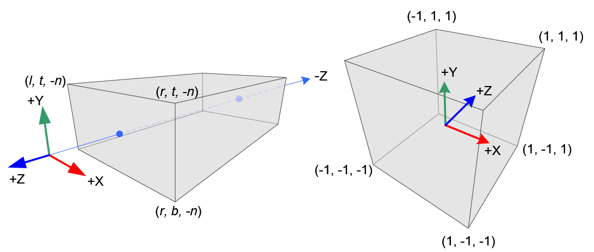

# Transformations

### Affine transformation

#### 2D

The transformation matrix is **translate (and scale) then rotate.**
$$
\begin{bmatrix}
\cos\theta & -\sin\theta & t_x \\
\sin\theta &  \cos\theta & t_y \\
0&0&1 \\
\end{bmatrix}
=
\begin{bmatrix}
1 & 0 & t_x \\
0 & 1 & t_y \\
0&0&1 \\
\end{bmatrix}
\begin{bmatrix}
\cos\theta & -\sin\theta & 0 \\
\sin\theta &  \cos\theta & 0 \\
0&0&1 \\
\end{bmatrix}
$$

#### 3D

Main difference from 2D is the three rotation matrices **along three axes**:
$$
\mathbf R_x(\alpha) = 
\begin{bmatrix}
1&0&0&0\\
0&\cos\alpha & -\sin\alpha &0 \\
0&\sin\alpha & \cos\alpha &0 \\
0&0&0 &1
\end{bmatrix} \\

\mathbf R_y(\alpha) = 
\begin{bmatrix}
\cos\alpha &0 & -\sin\alpha &0 \\
0&1&0&0\\
\sin\alpha &0 & \cos\alpha &0 \\
0&0&0 &1
\end{bmatrix} \\

\mathbf R_z(\alpha) = 
\begin{bmatrix}

\cos\alpha & -\sin\alpha &0&0 \\
\sin\alpha & \cos\alpha &0&0 \\
0&0&1&0 \\
0&0&0&1\\
\end{bmatrix} \\
$$
With the final form:
$$
\mathbf R_{xyz}(\alpha) = \mathbf R_x(\alpha)\mathbf R_y(\alpha)\mathbf R_z(\alpha)
$$
Rodrigues' Rotation Formula for rotation along any axis $\mathbf n$:
$$
\mathbf R(\mathbf n, \alpha) = \cos\alpha\mathbf I + (1 - \cos\alpha)\mathbf n\mathbf n^T + \sin\alpha
\begin{bmatrix}
0 & -n_x &n_y \\
n_z & 0 & -n_x \\
-n_y & n_x & 0
\end{bmatrix}
$$

### Right-handed system

It is a convention.

>- Stretch your right-arm along the positive y-axis with your hand up top.
>- Let your thumb point to the right.
>- Let your pointing finger point up.
>- Now bend your middle finger downwards 90 degrees.

### Global Picture of transformations

### View/Camera Transformation

It transform both the camera and objects, until **the camera is at the origin, up at Y axis and look at -Z axis.** (from world coordinate system to camera coordinate system)

We should first apply this view transformation before we further apply projection transformation.
$$
V_{camera} = \mathbf M_{view} \cdot V_{world} \\
$$

### Projection Transformation

It projects 3D objects into a Clip space, such that we can transform it to the final 2D plane. 
$$
V_{clip} =  \mathbf M_{projection} \cdot V_{camera} \\
$$
First, we project the objects (from camera coordinate system) into a canonical cuboid $[-1,1]^3$ (the normalized device coordinate system, NDC). Coordinates outside $[-1, 1]$ will be clipped, so the space is called Clip space.

Second, we perform viewport transform, i.e., simply look at -Z direction and get the 2D projection plane.

#### Orthographic projection

* Ignore Z axis.
* Translate & Scale X/Y axes to $[-1,1]^2$

In implementation, we simply **linear** translate & scale the object's bounding box **from $[l,r]\times[b,t]\times[-n,-f]$ into $[-1, 1]^3$**:
$$
\mathbf M_{ortho} = 
\begin{bmatrix}
\frac 2 {r-l} & 0 & 0 & -\frac{r+l}{r-l} \\
0 & \frac 2 {t-b} & 0 & -\frac{t+b}{t-b} \\
0 & 0 & \frac {-2} {f-n} & -\frac{f+n}{f-n} \\
0 & 0 & 0 & 1
\end{bmatrix}
$$
(Note: since we look at -Z, we use $-n$ and $-f$ for near and far plane, so that $0<n<f$.)

#### Perspective projection

Further objects should look smaller!

* **squish the frustum into a cuboid.**
* do orthographic projection.

In implementation, we should find the relationship between the transformed points and original points:
$$
y' = \frac n z y\\
x' = \frac n z x\\
$$
For Z axis, we observe:

* any point on the near plane will not change.
* any point's z on the far plane will not change.

Solve the equations and we have:
$$
\mathbf M_{persp\rightarrow ortho} = 
\begin{bmatrix}
n & 0 & 0 & 0 \\ 
0 & n & 0 & 0 \\
0 & 0 & n+f & nf\\
0 & 0 & -1 & 0 \\
\end{bmatrix}
$$
And finally:
$$
\mathbf M_{persp} = \mathbf{M}_{ortho}\mathbf M_{persp\rightarrow ortho} = \\
\begin{bmatrix}
\frac{2n}{r-l} & 0 & \frac{r+l}{r-l} & 0 \\
0 & \frac {2n} {t-b} & \frac{t+b}{t-b} & 0 \\
0 & 0 & -\frac{f+n}{f-n} & -\frac{2fn}{f-n} \\
0 & 0 & -1 & 0
\end{bmatrix}
$$

In cases the view is symmetric ($l= -r, b = -t$), we have the most commonly used form:
$$
\mathbf M_{persp} = 
\begin{bmatrix}
\frac{n}{r} & 0 & 0 & 0 \\
0 & \frac {n} {t} & 0 & 0 \\
0 & 0 & -\frac{f+n}{f-n} & -\frac{2fn}{f-n} \\
0 & 0 & -1 & 0
\end{bmatrix}
$$
